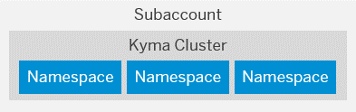

<!-- loio8ed4a705efa0431b910056c0acdbf377 -->

<link rel="stylesheet" type="text/css" href="../css/sap-icons.css"/>

# Account Model

Learn more about the different types of accounts on SAP BTP and how they relate to each other.

Accounts are structured according to global accounts, subaccounts, and directories.

To learn more about managing your account model, see [Account Administration](../50-administration-and-ops/account-administration-5d62ec8.md).

<a name="loioc165d95ee700407eb181770901caec94"/>

<!-- loioc165d95ee700407eb181770901caec94 -->

## Global Accounts

A **global account** is the realization of a contract you or your company has made with SAP.

A global account is used to manage subaccounts, members, entitlements and quotas. You receive entitlements and quotas to use platform resources per global account and then distribute the entitlements and quotas to the subaccount for actual consumption. There are two types of commercial models for global accounts: consumption-based model and subscription-based model. See [Commercial Models](commercial-models-263d400.md) .

Global accounts are region- and environment-independent. Within a global account, you manage all of your subaccounts, which in turn are specific to one region.

<a name="loio8d6e3a0fa4ab43e4a421d3ed08128afa"/>

<!-- loio8d6e3a0fa4ab43e4a421d3ed08128afa -->

## Subaccounts

In **subaccounts**, you deploy applications, use services, and manage your subscriptions. You can use them to manage members, authorizations, and entitlements.

A global account can contain one or more subaccounts in which you deploy applications, use services, and manage your subscriptions. Subaccounts in a global account are independent from each other. This is important to consider with respect to security, member management, data management, data migration, integration, and so on, when you plan your landscape and overall architecture.

Each subaccount is associated with a region, which is the physical location where applications, data, or services are hosted. The specific region is relevant when you deploy applications and access the SAP BTP cockpit using the corresponding cockpit URL. The region assigned to your subaccount doesn't have to be directly related to your location. You could be located in the United States, for example, but operate your subaccount in Europe.

The entitlements and quotas that have been purchased for a global account have to be assigned to the individual subaccounts.

Global accounts and subaccounts are completely independent of user accounts. For more information, see [User and Member Management](user-and-member-management-cc1c676.md).

**Subaccounts, Cloud Foundry Orgs and Kyma Clusters**

-   When you enable the Cloud Foundry environment in one of your subaccounts, the system automatically creates a Cloud Foundry org for you. The subaccount and the org have a 1:1 relationship and the same navigation level in the cockpit \(even though they may have different names\). You can create spaces within that Cloud Foundry org. Spaces let you further break down your account model and use services and functions in the Cloud Foundry environment.

    

    For more information about Cloud Foundry orgs and spaces, see the Cloud Foundry documentation at [https://docs.cloudfoundry.org/concepts/roles.html](https://docs.cloudfoundry.org/concepts/roles.html).

-   When you enable the Kyma environment in one of your subaccounts, you can provision one or more Kubernetes clusters equipped with the latest version of the open-source project "Kyma". The subaccount and the Kyma cluster have a 1:n relationship - you can choose to create more than one cluster right away, or add clusters later.

    Within each Kyma cluster, you can create namespaces to organize your workloads and control access to resources. Namespaces let you further break down your account model and use services and functions in the Kyma environment. For more information, see the Kubernetes documentation at [https://kubernetes.io/docs/concepts/overview/working-with-objects/namespaces/](https://kubernetes.io/docs/concepts/overview/working-with-objects/namespaces/).

    

<a name="loioa92721fc75524ec09a7a7255997dbd94"/>

<!-- loioa92721fc75524ec09a7a7255997dbd94 -->

## Directories

With **directories**, you can organize and manage your subaccounts according to your technical and business needs.

A directory can contain directories and subaccounts to create a hierarchy. Using directories to group other directories and subaccounts is optional - you can still create subaccounts directly under your global account.

You can create a hierarchical structure that is up to 7 levels deep. The highest level of a given path is always the global account and the lowest is a subaccount, which means that you can have up to 5 levels of directories between the global account and the lowest level subaccount.

Directories enable you to:

-   Group and filter directories and subaccounts

-   Monitor usage and costs for contracts that use the consumption-based commercial model

Optionally, you can also enable the following features in your directories:

-   Manage Entitlements: Enables the assignment of a quota for services and applications to the directory from the global account quota, for distribution to the directory's subaccounts.

    When you assign entitlements to a directory, you express the entitlements and maximum quota that can be distributed across its children subaccounts. You also have the option to choose the auto-assignment of a set amount of quota to all subaccounts created or moved to that directory. Subaccounts that are already in the directory when you select that option will not be auto-assigned quota.

    > ### Note:  
    > If you've enabled the Manage Entitlements feature for a given directory, you must first assign the necessary entitlements and maximum allowed quota from the global account to that directory. Then you can distribute this "reserved" quota to any of the directory's child subaccounts.

-   Manage Authorizations: Enables authorization management for the directory. For example, it allows certain users to manage directory entitlements. You can only use this feature in combination with the *Manage Entitlements* feature.

**Related Information**  

[Manage the Account Explorer Hierarchy](../50-administration-and-ops/manage-the-account-explorer-hierarchy-2e2a5b6.md "Create an account structure by creating a hierarchy of directories and subaccounts using the SAP BTP cockpit. Add, move, and delete subaccounts and directories in your structure.")

[Configure Entitlements and Quotas for Directories](../50-administration-and-ops/configure-entitlements-and-quotas-for-directories-37f8871.md "Distribute entitlements that are available in your global account to directories by adding service plans and their allowed quotas by using SAP BTP cockpit.")

[Configure Entitlements and Quotas for Subaccounts](../50-administration-and-ops/configure-entitlements-and-quotas-for-subaccounts-5ba357b.md "Distribute the entitlements that are available in your global account by adding service plans and their allowed quotas to your subaccounts using SAP BTP cockpit.")

[Getting a Global Account](../20-getting-started/getting-a-global-account-d61c281.md#loiod61c2819034b48e68145c45c36acba6e "SAP BTP offers two types of global accounts: Trial accounts (completely free of charge) and enterprise accounts. Within an enterprise account, you can use both free and paid plans.")

[Setting Up Your Account Model](https://help.sap.com/viewer/df50977d8bfa4c9a8a063ddb37113c43/Cloud/en-US/2db81f42f5194454beecde6cd4994dda.html "Learn how to set up your account model with global accounts and subaccounts, and how to use directories, spaces and namespaces to match your business and development needs.") :arrow_upper_right:

[Managing Global Accounts Using the Cockpit](../50-administration-and-ops/managing-global-accounts-using-the-cockpit-667f34b.md "Your SAP BTP global account is the entry point for managing the resources, landscape, and entitlements for your departments and projects in a self-service manner.")

[Managing Directories Using the Cockpit](../50-administration-and-ops/managing-directories-using-the-cockpit-f495ac1.md "Learn how to organize and manage your subaccounts according to your technical and business needs by using directories in the SAP BTP cockpit.")

[Managing Subaccounts Using the Cockpit](../50-administration-and-ops/managing-subaccounts-using-the-cockpit-55d0b6d.md "Learn how to structure a global account according to your organization’s and project’s requirements with regard to members, authorizations, and entitlements by managing subaccounts.")

[Working with Global Accounts, Directories, and Subaccounts Using the btp CLI](../50-administration-and-ops/working-with-global-accounts-directories-and-subaccounts-using-the-btp-cli-85a683e.md "Use the SAP BTP command line interface (btp CLI) to manage operations with global accounts, directories, and subaccounts.")

[Account Administration Using APIs of the SAP Cloud Management Service](../50-administration-and-ops/account-administration-using-apis-of-the-sap-cloud-management-service-17b6a17.md "Provides information about using the APIs of the SAP Cloud Management service for SAP BTP (technical name: cis) to manage some of the administrative operations in your accounts.")

<a name="loio20828fc639954939890d3d74a22c5f66"/>

<!-- loio20828fc639954939890d3d74a22c5f66 -->

## Relationship Between Global Accounts, Subaccounts, and Directories

A global account can group together different directories and subaccounts that an administrator makes available to users. Administrators can assign the available entitlements and quotas of a global account to its different subaccounts and move it between subaccounts that belong to the same global account.

The hierarchical structure of global accounts, directories, and subaccounts lets you define an account model that accurately fits your business and development needs. For example, if you want to separate development, testing, and productive usage for different departments in your organization, you can create a directory for each department, and within each directory, you group subaccounts for development, testing, and production.

<a name="loioe8663c08ead648faa673b0d63c5b478e"/>

<!-- loioe8663c08ead648faa673b0d63c5b478e -->

## Labels

Labels are user-defined words or phrases that you can assign to various entities in SAP BTP to categorize them in your global account, to identify them more easily.

For example, in the *Account Explorer* page in the cockpit, you can quickly filter for directories and subaccounts by label.

You can assign labels to these entities when you create or edit them using the SAP BTP cockpit, command line interface \(btp CLI\), or REST APIs:

-   Directories

-   Subaccounts

-   Multitenant application subscriptions

-   Service instances

-   Environment instances

    > ### Note:  
    > For environment instances, these custom labels are user defined and apply only to SAP BTP. They are not the same labels that might be defined by your environment broker.

Labels are made up of a *label name* \(also referred to as a *key*\) and up to 10 *values* associated with the label. You can apply label names and values in any way that suits your business and technical needs.

**Types of labels and examples**

<table>
<tr>
<th valign="top">

Types of Labels

</th>
<th valign="top">

Examples

</th>
</tr>
<tr>
<td valign="top">

Single-value labels are useful for labels that have an identifier, or for labels with fixed lists.

</td>
<td valign="top">

-   Label Name: `Cost Object`

    Value: The ID of a cost center number or internal order that is associated with the entity, such as: `000001134789`

-   Label Name: `Status`

    Value: `Active` or `Inactive`

-   Label Name: `Landscape`

    Value: `Dev` or `Test` or `Production`

</td>
</tr>
<tr>
<td valign="top">

Multi-value labels make them useful for labels that typically have more than one value assigned to them.

</td>
<td valign="top">

-   Label Name: `Contacts`

    Value: The e-mail addresses or names of users that are responsible for the entity, such as: `admin-1@example.com` and `admin-2@example.com`

</td>
</tr>
<tr>
<td valign="top">

Labels can also be assigned with a name only and no value. In such cases, the label behaves like tag.

Note that currently for service instances, labels must have at least value.

</td>
<td valign="top">

-   Label Name: `For demo only`

-   Label Name: `Audited`

-   Label Name: `Flagged for deletion`

</td>
</tr>
</table>

> ### Note:  
> Labels replace what were previously called "custom properties". Custom properties supported only single values per label and were available only to directories and subaccounts. As a result of the move to labels, all relevant commands in the SAP BTP command line interface \(btp CLI\) and in the relevant REST APIs in the SAP Cloud Management service have been updated accordingly. The `custom-properties` parameter in the btp CLI and the `customProperties` field in the relevant REST APIs are deprecated.

You can assign labels when you create an entity, and then later add, change, or remove labels by editing the entity.

> ### Tip:  
> -   In the *Account Explorer* and *Instances and Subscriptions* pages in the SAP BTP cockpit, assigned labels are shown in the *Labels* column. To display the column if it is not shown, click :gear:.
> 
> -   In the *Account Explorer* page, you can view the labels that are assigned to a directory or subaccount by choosing the *More Info* option of each directory and subaccount.
> 
>     Assigned labels are also listed under the *Labels* tab when you display the *Overview* page of every directory and subaccount.
> 
> -   In the *Account Explorer* and *Instances and Subscriptions* pages, you can filter the displayed entities by their assigned labels in the *Search* field.
> 
> -   In the *Instances and Subscriptions* page, you can also view the labels that are assigned to a subscription or instance by expanding its details panel.

When working with labels, consider the following aspects:

-   In the cockpit, each entity can have up to 10 labels assigned to it.

-   You cannot add the same label name more than once to the same entity.

-   Existing label names and values are offered as suggestions when you or anyone else assigns a label to other entities of the same type in your global account.

    When you view a subaccount in the cockpit, the subaccount also shows the labels that are assigned to its parent directory and to other directories that are above it in the same path in your account structure. And in the *Account Explorer*, when you filter by labels that are assigned to a directory, the subaccounts in that directory path are also listed. We refer to these as inherited labels.

-   Label names and values are case-sensitive, which means you can create variants of the same label name with a different casing; for example, `My Label` and `My label` can coexist as separate labels. We recommend that you avoid using different casing or styling to create variants of the same names or values.

<a name="loioe8663c08ead648faa673b0d63c5b478e__section_css_zg4_rrb"/>

## Related Links

-   [Create a Subaccount](../50-administration-and-ops/create-a-subaccount-05280a1.md)
-   [Change Subaccount Details](../50-administration-and-ops/change-subaccount-details-567d4a8.md)
-   [Create a Directory](../50-administration-and-ops/create-a-directory-b8ef1c4.md)
-   [Commands in the btp CLI](../50-administration-and-ops/commands-in-the-btp-cli-a03a555.md)
-   [Account Administration Using APIs of the SAP Cloud Management Service](../50-administration-and-ops/account-administration-using-apis-of-the-sap-cloud-management-service-17b6a17.md)
-   [Managing Service Resources Using the APIs of the SAP Service Manager](../50-administration-and-ops/managing-service-resources-using-the-apis-of-the-sap-service-manager-ee4f871.md)
-   [Creating Service Instances](https://help.sap.com/viewer/09cc82baadc542a688176dce601398de/Cloud/en-US/fad874a99a434ae58c59d7340a528bdc.html)
-   [Working with Environment Instances](https://help.sap.com/viewer/09cc82baadc542a688176dce601398de/Cloud/en-US/1d6897d22f90443c8a3f9f6c8bb41bb8.html#loio1d6897d22f90443c8a3f9f6c8bb41bb8__section_usz_bfz_qrb)
-   [Subscribe to Multitenant Applications Using the Cockpit](../50-administration-and-ops/subscribe-to-multitenant-applications-using-the-cockpit-7a3e396.md)

