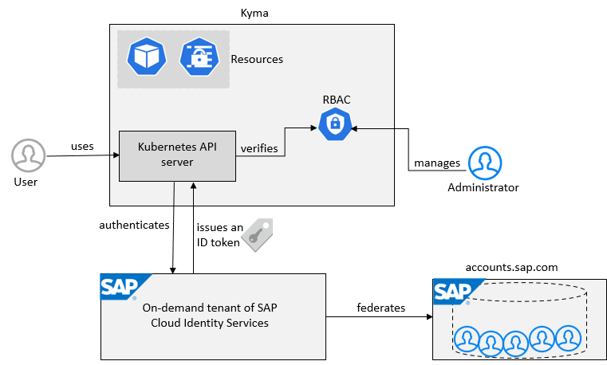

<!-- loio73beb06e127f4e47b849aa95344aabe1 -->

# Basic Platform Concepts

SAP BTP offers users the ability to turn data into business value, compose end-to-end business processes, and build and extend SAP applications quickly.

The services and solutions of SAP BTP are available on multiple cloud infrastructure providers. The **multi-cloud foundation** supports different environments, such as Cloud Foundry, ABAP, and Kyma, as well as multiple different regions, and a broad choice of programming languages.

The central point of entry to the cloud platform is the **SAP BTP cockpit**, where you can access your accounts and applications and manage all activities associated with them.

  
  
**Relationship between SAP BTP Accounts and Associated Activities**

  

<a name="loio73beb06e127f4e47b849aa95344aabe1__section_i1x_ks4_smb"/>

## Solutions and Services

SAP BTP offers fast in-memory processing, sustainable, agile **solutions** and **services** to integrate data and extend applications, and fully embedded analytics and intelligent technologies. 

**Services** enable, facilitate, or accelerate the development of business applications and other platform services on SAP BTP. 

For a complete list of services and capabilities, see [SAP Discovery Center: Services](https://discovery-center.cloud.sap/serviceCatalog).

For more information, see [Solutions and Services](solutions-and-services-7613d9c.md#loio7613d9ce711e1014839a8273b0e91070).

<a name="loio73beb06e127f4e47b849aa95344aabe1__section_gxg_ns4_smb"/>

## Regions

You can deploy applications in different **regions**. Each region represents a geographical location \(for example, Europe, US East\) where applications, data, or services are hosted. 

Regions are provided either by SAP or by our Infrastructure-as-a-Service \(IaaS\) partners Amazon Web Services \(AWS\), Microsoft Azure, Google Cloud, and Alibaba Cloud. The third-party region providers operate the infrastructure layer of the regions, whereas SAP operates the platform layer and Cloud Foundry.

A region is chosen at the subaccount level. For each subaccount, you select exactly one region \(that is one data center\).

For more information, see [Regions](regions-350356d.md).

<a name="loio73beb06e127f4e47b849aa95344aabe1__section_ojv_yn1_tbb"/>

## Environments

Environments constitute the actual platform-as-a-service offering of SAP BTP that allows for the development and administration of business applications. Environments are anchored in SAP BTP on subaccount level.

SAP BTP provides the following environments:

-   [Cloud Foundry Environment](cloud-foundry-environment-9c7092c.md#loio9c7092c7b7ae4d49bc8ae35fdd0e0b18)

    The Cloud Foundry environment enables you to develop new business applications and business services, supporting multiple runtimes, programming languages, libraries, and services. You can leverage a multitude of buildpacks, including community innovations and self-developed buildpacks.

-   [ABAP Environment](abap-environment-11d6265.md)

    Within the Cloud Foundry environment, you can create a new space for ABAP development. This is what we refer to as the ABAP environment. It allows you to create extensions for ABAP-based products, such as SAP S/4HANA Cloud, and develop new cloud applications. You can transform existing ABAP-based custom code or extensions to the cloud.

-   [Kyma Environment](kyma-environment-468c2f3.md#loio468c2f3c3ca24c2c8497ef9f83154c44)

    The Kyma environment is a fully managed Kubernetes runtime based on the open-source project "Kyma" that allows developers to extend SAP solutions with serverless functions and combine them with containerized microservices.

-   [Neo Environment](neo-environment-0f79436.md)

    The Neo environment lets you develop HTML5, Java, and SAP HANA extended application services \(SAP HANA XS\) applications. You can also use the UI Development Toolkit for HTML5 \(SAPUI5\) to develop rich user interfaces for modern web-based business applications.

<a name="loio73beb06e127f4e47b849aa95344aabe1__section_hyt_ps4_smb"/>

## Enterprise and Trial Accounts

SAP BTP provides different types of global accounts, **enterprise** and **trial**. The type you choose determines pricing, conditions of use, resources, available services, and hosts.

-   A **trial account** lets you try out the platform for free. Access is open to everyone. Trial accounts are intended for personal exploration, and not for production use or team development. They allow restricted use of the platform resources and services.

    For more information, see [Trial Accounts and Free Tier](trial-accounts-and-free-tier-046f127.md).

-   An **enterprise account** is usually associated with one SAP customer or partner and contains their purchased entitlements to platform resources and services. It groups together different subaccounts that an administrator makes available to users for deploying applications.

    For more information, see [Enterprise Accounts](enterprise-accounts-171511c.md).

<a name="loio73beb06e127f4e47b849aa95344aabe1__section_qbs_ktp_smb"/>

## Commercial Models

SAP BTP offers two different commercial models:

-   **Consumption-based commercial model:** Your organization receives access to all current and future services that are eligible for this model. You have complete flexibility to turn services on and off and to switch between services as your business requires throughout the duration of your contract. This commercial model is available in two flavors: Cloud Platform Enterprise Agreement \(CPEA\) and Pay-As-You-Go for SAP BTP.

    For more information, see [What Is the Consumption-Based Commercial Model?](what-is-the-consumption-based-commercial-model-7047eb4.md)

-   **Subscription-based commercial model:** Your organization subscribes only to the services that you plan to use. You can then use these services at a fixed cost, irrespective of consumption.

    For more information, see [What Is the Subscription-Based Commercial Model?](what-is-the-subscription-based-commercial-model-239b6e0.md)

<a name="loio73beb06e127f4e47b849aa95344aabe1__section_bl5_hmk_1qb"/>

## Account Model Feature Set A

The SAP BTP cockpit is structured according to global accounts and subaccounts:

-   A **global account** is the realization of a contract you or your company has made with SAP. A global account is used to manage subaccounts, members, entitlements and quotas. You receive entitlements and quotas to use platform resources per global account and then distribute the entitlements and quotas to the subaccount for actual consumption. There are two types of commercial models for global accounts: consumption-based model and subscription-based model. See [Commercial Models](commercial-models-263d400.md)

-   **Subaccounts** let you structure a global account according to your organization’s and project’s requirements with regard to members, authorizations, and entitlements.

    In the Cloud Foundry environment, the subaccount is divided into one or more spaces, which is where application development, deployment, and maintenance take place.

For more information, see [Account Model](account-model-8ed4a70.md#loio8ed4a705efa0431b910056c0acdbf377).

<a name="loio73beb06e127f4e47b849aa95344aabe1__section_trt_ny5_smb"/>

## Account Model Feature Set B

The SAP BTP cockpit is structured according to global accounts, directories, and subaccounts:

-   A **global account** is the realization of a contract you or your company has made with SAP. A global account is used to manage subaccounts, members, entitlements and quotas. You receive entitlements and quotas to use platform resources per global account and then distribute the entitlements and quotas to the subaccount for actual consumption. There are two types of commercial models for global accounts: consumption-based model and subscription-based model. See [Commercial Models](commercial-models-263d400.md)

-   **Directories** allow you to organize and manage your subaccounts according to your technical and business needs.

-   **Subaccounts** let you structure a global account according to your organization’s and project’s requirements with regard to members, authorizations, and entitlements.

    In the Cloud Foundry environment, the subaccount is divided into one or more spaces, which is where application development, deployment, and maintenance take place.

For more information, see [Account Model](account-model-8ed4a70.md#loio8ed4a705efa0431b910056c0acdbf377).

<a name="loio73beb06e127f4e47b849aa95344aabe1__section_ihv_qs4_smb"/>

## Entitlements and Quotas

When you purchase an enterprise account, you’re entitled to use a specific set of resources, such as the amount of memory that can be allocated to your applications.

-   On SAP BTP, all external dependencies such as databases, messaging systems, files systems, and so on, are **services**. In this context, multitenant applications and environments are considered services.

    Each service has one or more **service plans** available. A service plan is the representation of the costs and benefits for a given variant of a particular service. For instance, a database may be configured with various "T-shirt sizes", each of which is a different service plan.

-   An **entitlement** is your right to provision and consume a resource. In other words, entitlements are **the service plans** that you're entitled to use.

-   A **quota** represents the numeric quantity that defines the maximum allowed consumption of a resource. In other words, **how much** of a service plan you're entitled to use.

For more information, see [Entitlements and Quotas](entitlements-and-quotas-00aa2c2.md).

<a name="loio73beb06e127f4e47b849aa95344aabe1__section_epk_rs4_smb"/>

## User and Member Management

On SAP BTP, member management happens at all levels from global account to environment, while user management is done for business applications.

**User accounts** enable users to log on to SAP BTP and access subaccounts and use services according to the permissions given to them. We distinguish between two types of users:

-   **Platform users** are usually developers, administrators or operators who deploy, administer, and troubleshoot applications and services on SAP BTP.

-   **Business users** use the applications that are deployed to SAP BTP. For example, the end users of SaaS apps or services, such as SAP Workflow service or SAP Cloud Integration, or end users of your custom applications are business users.

**Member management** refers to managing permissions for platform users. A member is a user who is assigned to an SAP BTP global account or subaccount. Administrators can add users to global accounts and subaccounts and assign roles to them as needed. You can use predefined roles, for example the administrator role for managing subaccount members.

**User management** refers to managing authentication and authorization for your business users.

For more information, see [User and Member Management](user-and-member-management-cc1c676.md).

<a name="loio73beb06e127f4e47b849aa95344aabe1__section_tnb_ss4_smb"/>

## Tools, Programming Models, Programming Languages, and APIs

SAP BTP provides various programming languages and tools for your development project:

-   SAP BTP includes many tools to help you develop and manage applications, and connect them to your on-premise systems. For more information, see [Tools](tools-abcae5b.md).

-   SAP BTP supports many different programming languages; the availability of each depends on the development environment you're using. For more information, see [Programming Languages](programming-languages-730d82d.md).

-   The Cloud Application Programming Model offers a consistent end-to-end programming model that includes languages, libraries, and APIs that are tailored for full-stack development on SAP BTP. For more information, see [Cloud Application Programming Model](cloud-application-programming-model-042061d.md).

-   Depending on your use case, you can choose between different offerings for continuous integration and delivery. For more information, see [Continuous Integration and Delivery \(CI/CD\)](continuous-integration-and-delivery-ci-cd-fe74df5.md).

-   Discover and consume APIs to manage, build, and extend the core capabilities of SAP BTP. For more information, see [APIs](apis-d1d1107.md).

