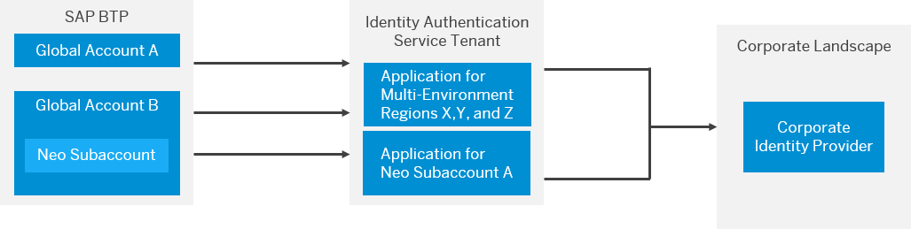

<!-- loio8980b91c14f9474a9d7c7d831bbad8e9 -->

# Bringing Your Corporate Identity Provider for Platform Users Feature Set B

SAP BTP supports the use of your own identity provider for platform users.

> ### Note:  
> The content in this section is only relevant for cloud management tools feature set B. For more information, see [Cloud Management Tools - Feature Set Overview](https://help.sap.com/viewer/65de2977205c403bbc107264b8eccf4b/Cloud/en-US/caf4e4e23aef4666ad8f125af393dfb2.html).

Platform users perform technical development, deployment, and administration tasks. They perform subaccount administration in the SAP BTP cockpit or access the BTP CLI. By hosting these users in your own identity provider, you gain a number of advantages over hosting them in SAP ID service.

-   Integrate the management of these users with your broader identity management strategy, hosted on your own identity providers. You control your own user lifecycle and single sign-on strategies throughout the entire landscape.

-   Enforce your own password and authentication policies, such as stronger passwords or multifactor authentication.

The following figure illustrates the architecture required for platform users. This configuration is independent of the default configuration with SAP ID service. You can continue to use SAP ID service in parallel for platform users.

   
  
<a name="loio8980b91c14f9474a9d7c7d831bbad8e9__fig_ycv_3jz_4mb"/>Architecture Required for Custom User Base of Platform Users

 

  

In the preceding figure, you enable trust between the SAP BTP global account and your corporate identity provider over your tenant of SAP Cloud Identity Services - Identity Authentication. For each global baccount, you choose the Identity Authentication tenant to use as the platform identity provider. You can only have one identity authentication tenant per global account. Global accounts can share the same identity authentication tenant. When you log on to a platform resource, such as the cockpit, you indicate the identity authentication tenant you want to log on with. For example, to log on to the cockpit, use a URL parameter to identify the tenant:

`https://cockpit.<region>.hana.ondemand.com/cockpit/?idp=<sample>.accounts.ondemand.com`.

 SAP BTP uses the connection between subaccount and Identity Authentication application to identify your corporate identity provider to perform the authentication.Once you’ve logged on, the cockpit displays any global accounts and subaccounts your platform user is a member of.

> ### Note:  
> A user identifier alone isn’t enough information for the system to detect account membership. Typically, a user is identified by email and origin \(your alias for the identity provider\). This applies to global accounts, directories, multi-environment subaccounts, Cloud Foundry orgs and spaces. For Neo subaccounts a user is uniquely identified by the user base \(identity provider\) and a configurable user identifier. For multi-environment subaccounts, the identifier is the origin \(your Cloud Foundry-specific alias for the identity provider\) and e-mail address. For example, you can have a platform user in the default identity provider, SAP ID service, and another user in your corporate identity provider with the same e-mail address. This principle also applies to Neo user IDs. You can log on to the cockpit with both, but the cockpit displays different user information. This difference is because you’ve logged on with different identity providers.
> 
> You also see this difference when assigning roles. You must provide the origin or user base in addition to the e-mail address or user ID of the user. All your users must remember the origin when they use the Cloud Foundry command-line interface or service dashboards.. You can choose your own origin for multi-environment accounts, but the origin must be unique across all SAP customers. We recommend using the subdomain of your Identity Authentication tenant or your organization's name. All your users must be able to remember or type the origin when they use the Cloud Foundry command-line interface or service dashboards. A string of random characters isn't useful.
> 
> In Identity Authentication, there is one application that represents SAP BTP overall. So, if you have multiple global accounts with the same Identity Authentication tenant, they all share the same application in your Identity Authentication tenant. Please note one exception: Neo subaccounts are represented by separate applications either for individual subaccounts or data centers. Keep the configuration of all these applications the same as far as possible.

To use a corporate identity provider for platform users of a multi-environment subaccount, you need a Neo subaccount set up for the same corporate identity provider. This requirement exists, because logon to the cockpit is dependent on a Neo subaccount. You’re extending the existing configuration of your identity authentication tenant to add the trust of your corporate identity provider to your multi-environment subaccounts.

For Neo subaccounts, there’s a 1:1 relationship between its applications in your Identity Authentication tenant. Multi-environment subaccounts are handled differently. During configuration, you submit a support ticket in which you state all the regions you want to apply this corporate identity provider configuration. This trust then applies to **all** your multi-environment subaccounts in those regions. So, all your multi-environment subaccounts share the same application in your Identity Authentication tenant.

Configuring platform users for multi-environment subaccounts has no impact on your existing Neo configuration. You need the Neo configuration to log on to resources like the cockpit.

> ### Recommendation:  
> While support of multiple corporate identity providers is possible, we recommend using your Identity Authentication tenant as a proxy and use conditional authentication to separate them.

**Related Information**  

[Establish Trust and Federation of Custom Identity Providers for Platform Users in Multi-Environment Subaccounts \[Feature Set A\]](../50-administration-and-ops/establish-trust-and-federation-of-custom-identity-providers-for-platform-users-in-multi-8600afb.md "By default, platform users in multi-environment subaccounts are users in SAP ID service. The use of your own identity provider requires integration between the user bases of multi-environment and Neo subaccounts.")

[Log On with a Custom Identity Provider to the Cloud Foundry Environment Using the Cloud Foundry Command-Line Interface](../50-administration-and-ops/log-on-with-a-custom-identity-provider-to-the-cloud-foundry-environment-using-the-cloud-d477618.md "Learn how to use different methods to log on to Cloud Foundry using a custom identity provider (IdP).")

