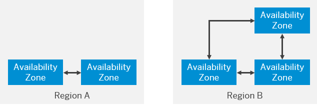

<!-- loio9c7092c7b7ae4d49bc8ae35fdd0e0b18 -->

# Cloud Foundry Environment

The Cloud Foundry environment allows you to create polyglot cloud applications in Cloud Foundry. It contains the SAP BTP, Cloud Foundry runtime service, which is based on the open-source application platform managed by the Cloud Foundry Foundation.

The Cloud Foundry environment enables you to develop new business applications and business services, supporting multiple runtimes, programming languages, libraries, and services. You can leverage a multitude of buildpacks, including community innovations and self-developed buildpacks. It also integrates with SAP HANA extended application services, advanced model.

For more information about Cloud Foundry, see the official Cloud Foundry documentation at [https://docs.cloudfoundry.org/](https://docs.cloudfoundry.org/).

**Related Information**  

[Getting Started in the Cloud Foundry Environment](../20-getting-started/getting-started-in-the-cloud-foundry-environment-b328cc8.md "Get onboarded in the Cloud Foundry environment of SAP BTP. Follow the workflows for trial or customer accounts or subscribe to business applications.")

[Development in the Cloud Foundry Environment](../30-development/development-in-the-cloud-foundry-environment-40a8f8f.md "Learn more about developing applications on the SAP BTP, Cloud Foundry environment.")

[Administration and Operations in the Cloud Foundry Environment](../50-administration-and-ops/administration-and-operations-in-the-cloud-foundry-environment-a6b3b81.md "Learn about the different account administration and application operation tasks which you can perform in the Cloud Foundry environment.")

<a name="loiof8a351c8d81544a2942c911dccaba3c7"/>

<!-- loiof8a351c8d81544a2942c911dccaba3c7 -->

## Supported and Unsupported Cloud Foundry Features

Find out which Cloud Foundry features the Cloud Foundry environment on SAP BTP supports and doesn't support.

<table>
<tr>
<th valign="top">

Supported Features

</th>
<th valign="top">

Unsupported Features

</th>
</tr>
<tr>
<td valign="top">

-   Diego runtime. See [https://docs.cloudfoundry.org/concepts/diego/diego-architecture.html](https://docs.cloudfoundry.org/concepts/diego/diego-architecture.html).

-   SSH. See [https://docs.cloudfoundry.org/devguide/deploy-apps/app-ssh-overview.html](https://docs.cloudfoundry.org/devguide/deploy-apps/app-ssh-overview.html).
-   Custom Domains. See [https://docs.cloudfoundry.org/devguide/deploy-apps/routes-domains.html\#domains](https://docs.cloudfoundry.org/devguide/deploy-apps/routes-domains.html#domains).
-   Docker. See [https://docs.cloudfoundry.org/adminguide/docker.html](https://docs.cloudfoundry.org/adminguide/docker.html).
-   Running Tasks. See [https://docs.cloudfoundry.org/devguide/using-tasks.html](https://docs.cloudfoundry.org/devguide/using-tasks.html).
-   Request Tracing

    -   Zipkin Tracing. See [https://docs.cloudfoundry.org/adminguide/zipkin\_tracing.html](https://docs.cloudfoundry.org/adminguide/zipkin_tracing.html).

-   Websockets. See [https://docs.cloudfoundry.org/adminguide/supporting-websockets.html](https://docs.cloudfoundry.org/adminguide/supporting-websockets.html).
-   Space-Scoped Service Brokers. See [https://docs.cloudfoundry.org/services/managing-service-brokers.html](https://docs.cloudfoundry.org/services/managing-service-brokers.html).
-   Route Services \(only user-provided and fully-brokered services\). See [https://docs.cloudfoundry.org/services/route-services.html](https://docs.cloudfoundry.org/services/route-services.html).
-   Sharing Service Instances \(not all services support instance sharing\). See [https://docs.cloudfoundry.org/devguide/services/sharing-instances.html](https://docs.cloudfoundry.org/devguide/services/sharing-instances.html).
-   HTTP/2. See [https://docs.cloudfoundry.org/adminguide/supporting-http2.html\#application](https://docs.cloudfoundry.org/adminguide/supporting-http2.html#application).
-   Streaming Logs to Log Management Services. See [https://docs.cloudfoundry.org/devguide/services/log-management.html](https://docs.cloudfoundry.org/devguide/services/log-management.html).

</td>
<td valign="top">

-   Container-to-Container Networking. See [https://docs.cloudfoundry.org/concepts/understand-cf-networking.html](https://docs.cloudfoundry.org/concepts/understand-cf-networking.html) .

-   Isolation Segments. See [https://docs.cloudfoundry.org/adminguide/isolation-segments.html](https://docs.cloudfoundry.org/adminguide/isolation-segments.html).
-   TCP Routing. See [https://docs.cloudfoundry.org/adminguide/enabling-tcp-routing.html](https://docs.cloudfoundry.org/adminguide/enabling-tcp-routing.html).
-   Secure Service Credential Delivery \(with Credhub\). See [https://docs.cloudfoundry.org/credhub/index.html](https://docs.cloudfoundry.org/credhub/index.html) or [https://github.com/cloudfoundry/credhub/blob/main/docs/secure-service-credentials.md](https://github.com/cloudfoundry/credhub/blob/main/docs/secure-service-credentials.md)

</td>
</tr>
</table>

<a name="loio9809fa4f02cb4696baea5c23d6eaac94"/>

<!-- loio9809fa4f02cb4696baea5c23d6eaac94 -->

## SAP BTP-Specific Configurations

The following technical configurations are specific to SAP BTP and differ from the default configuration:

-   SAP BTP supports the Cloud Foundry command line interface \(CF CLI\) version 8 or newer. Older versions of the CF CLI are not supported.

-   By default, a newly pushed \(or started\) Cloud Foundry application needs to respond to a health check within the first 60 seconds, otherwise the application is considered to have failed. For more information, see [https://docs.cloudfoundry.org/devguide/deploy-apps/healthchecks.html\#health\_check\_timeout](https://docs.cloudfoundry.org/devguide/deploy-apps/healthchecks.html#health_check_timeout). On SAP BTP, however, you can override this timeout to up to 10 minutes. For instructions, see [https://docs.cloudfoundry.org/devguide/deploy-apps/large-app-deploy.html](https://docs.cloudfoundry.org/devguide/deploy-apps/large-app-deploy.html).

-   On SAP BTP, application SSH access is disabled by default. For more information on SSH, see [https://docs.cloudfoundry.org/devguide/deploy-apps/app-ssh-overview.html](https://docs.cloudfoundry.org/devguide/deploy-apps/app-ssh-overview.html).

-   SAP BTP supports the Cloud Foundry API version 3. The Cloud Foundry API v2 has been deprecated and is no longer supported. For more information, see [https://v3-apidocs.cloudfoundry.org/](https://v3-apidocs.cloudfoundry.org/).

-   On SAP BTP, the Cloud Foundry API is protected by a rate limit against misuse. The limit is in the range of a few 10k requests per hour per user on average. The rate limit for the deprecated Cloud Foundry API v2 is in the range of a few hundred requests per hour per user.

-   In addition to the general rate limit on the Cloud Foundry API, requests for certain API endpoints related to services face a separate limit on concurrent requests. The Cloud Foundry API responds with HTTP status code `429` if a rate limit is reached and provides a Retry-After Header suggesting when the client can attempt a retry. For more information, see [https://docs.cloudfoundry.org/running/rate-limit-cloud-controller-api.html\#Rate%20Limit%20Responses:%20Service%20Brokers](https://docs.cloudfoundry.org/running/rate-limit-cloud-controller-api.html#Rate%20Limit%20Responses:%20Service%20Brokers).

-   In the SAP BTP, Cloud Foundry environment, the total HTTP Request Header and HTTP Response Header size is limited to 64 KB to protect against misuse.

-   In the SAP BTP, Cloud Foundry environment, for both HTTP Request Headers and HTTP Response Headers the total amount of Headers is limited to 101.

-   In the SAP BTP, Cloud Foundry environment, the limit of concurrent HTTP connections between client and application is 3000 per application container.

-   In the SAP BTP, Cloud Foundry environment, the HTTP `keep-alive` timeout towards the client is set to 60s to protect against misuse. 60s is the maximum time span allowed to wait for a new HTTP request to appear if `keep-alive` is enabled.

-   In the SAP BTP, Cloud Foundry environment, an internal HTTP `keep-alive` is set to 90s. A higher value must be set on application-side to avoid intermittent disruptions. For more information, see step 4 of [3406978](https://me.sap.com/notes/3406978).

-   In the Cloud Foundry environment, there’s a logging rate limit to guard against malicious applications. By default, the limit is 4000 logs per second per application instance, but in exceptional high load scenarios it may be lowered by the platform. If this limit is exceeded, additional logs from the application instance are dropped and a warning message is injected into the application instance’s log stream every second. This message also contains the exact current log rate limit.

-   Applications requiring sent envelopes to be delivered to external Log Management Services should use the Cloud Foundry syslog drain capability. See [https://docs.cloudfoundry.org/devguide/services/log-management.html](https://docs.cloudfoundry.org/devguide/services/log-management.html).

-   In the SAP BTP, Cloud Foundry environment, the time between signaling a container to shut down gracefully and forcefully stopping it is set to 60 seconds. The default in Cloud Foundry is 10 seconds, see [https://docs.cloudfoundry.org/devguide/deploy-apps/app-lifecycle.html\#shutdown](https://docs.cloudfoundry.org/devguide/deploy-apps/app-lifecycle.html#shutdown). This time interval will not be taken into account if there are no explicit kernel signal handlers implemented in the application.

-   In the SAP BTP, Cloud Foundry environment, applications get a guaranteed CPU share of ¼ core per GB instance memory. As the maximum instance memory per application is 16 GB, this allows for vertical scaling up to 4 CPUs.

    If applications running on the same virtual machine don't use their guaranteed CPU, other applications might get more CPU. This isn’t guaranteed and might be subject to change in the future. If you encounter performance problems, scale up your application or increase the application start timeout.

    The number of running threads per application instance is limited to 10,420. Reaching this limit can cause performance issues.

-   When pushing or scaling your application, you can define a `disk_quota` that can be up to 10 GB. For more information, see [https://docs.cloudfoundry.org/devguide/deploy-apps/manifest-attributes.html\#disk-quota](https://docs.cloudfoundry.org/devguide/deploy-apps/manifest-attributes.html#disk-quota).

-   When deploying applications on SAP BTP, the maximum application package size is 1.5 GB. If your application is larger than that, the deployment fails. For more information, see [https://docs.cloudfoundry.org/devguide/deploy-apps/large-app-deploy.html](https://docs.cloudfoundry.org/devguide/deploy-apps/large-app-deploy.html).

-   In the SAP BTP, Cloud Foundry environment, the hard limit for open file descriptors is 32,768 \(32K\) per container.

-   In global accounts that support the consumption-based commercial model you might see a quota limit for certain services. This is a technical limit only, not a business limit. If you need to increase this limit, report an incident to [SAP support](https://support.sap.com/en/index.html) for component BC-NEO-CIS.

-   In the SAP BTP, Cloud Foundry environment, the SAP HANA database supports up to 1000 simultaneous connections per database.

-   In the SAP BTP, Cloud Foundry environment, each application can be mapped to approximately 1000 routes \(128 KB\). The total length of the routing information must not exceed this limit.

-   Cloud Foundry Audit Events have a retention period of 14 days. For more information on Audit Events, see [https://docs.cloudfoundry.org/running/managing-cf/audit-events.html](https://docs.cloudfoundry.org/running/managing-cf/audit-events.html).

<a name="loiob6a7e11c3a58416a9ab1175bba17193a"/>

<!-- loiob6a7e11c3a58416a9ab1175bba17193a -->

## Availability Zones in the Cloud Foundry Environment

The Cloud Foundry environment follows the recommendations of our partner IaaS providers by leveraging the availability zones \(AZ\) concept.

<a name="loiob6a7e11c3a58416a9ab1175bba17193a__section_nty_twt_wjb"/>

## About Availability Zones

**Availability zones** \(AZ\) are single failure domains within a single geographical region and are separate physical locations with independent power, network, and cooling. Multiple AZs exist in one region and are connected with each other through a low-latency network.

  
  
**2-AZ and 3-AZ Deployments**

To achieve better fault-tolerance, our partners recommend deploying services across multiple AZs, which improves the availability of a service if there are issues with the region infrastructure of one AZ.

<a name="loiob6a7e11c3a58416a9ab1175bba17193a__section_av2_yvs_mmb"/>

## High Availability at Platform and Application Level

The SAP BTP Cloud Foundry environment follows these recommendations to support high availability at the platform and application level:

-   **High availability of the platform components:**

    -   The building blocks of Cloud Foundry and the virtual machines on which the Cloud Foundry application instances are scheduled run in a high availability setup. Their instances are distributed across different AZs.

    -   The technology that manages the deployment of the Cloud Foundry environment monitors the health of the platform. If there are infrastructure failures, it re-creates the faulty components.

-   **High availability on the application level:**

    -   We recommend running multiple application instances to increase availability. For more information, see [Run Multiple Instances to Increase Availability](https://docs.cloudfoundry.org/devguide/deploy-apps/prepare-to-deploy.html#increase-availability). On SAP BTP, there are three ways to increase application instances:

        -   Scaling your application using the application manifest. The `manifest.yml` allows you to make and save configurations for your application. To scale, you can configure the instance count in the manifest and push the application again with the new configuration. See [App Manifest Attribute Reference](https://docs.cloudfoundry.org/devguide/deploy-apps/manifest-attributes.html#instances). To avoid downtimes when updating your application configuration, you can also consider using rolling application deployments. See [Rolling App Deployments](https://docs.cloudfoundry.org/devguide/deploy-apps/rolling-deploy.html).
        -   Scaling your application using the `cf scale` command in the Cloud Foundry command line interface \(CF CLI\). See [Scaling an App Using cf scale](https://docs.cloudfoundry.org/devguide/deploy-apps/cf-scale.html).
        -   Scaling your application using the SAP BTP cockpit. See [Add or Remove Application Instances](https://help.sap.com/products/BTP/65de2977205c403bbc107264b8eccf4b/75836f1b68ce439e9c169b05597f97e4.html?q=high%20available).

    -   The Cloud Foundry container scheduler takes care of distributing the different instances of one application on virtual machines in different AZs. For more information, see [How Diego Balances App Processes](https://docs.cloudfoundry.org/concepts/diego/diego-auction.html).

    -   Cloud Foundry is constantly monitoring the health state of application instances and restarts instances that are considered unhealthy. See [Using App Health Checks](https://docs.cloudfoundry.org/devguide/deploy-apps/healthchecks.html).

    -   When the number of desired instances doesn't match the number of actually running instances, Cloud Foundry reschedules the missing instances, for example, when the virtual machines that an application instance was initially scheduled on become unresponsive.

    For more information on high availability configuration, see [High Availability in Cloud Foundry](https://docs.cloudfoundry.org/concepts/high-availability.html#overview).

    For more information on application stability and resilience, see [Developing Resilient Applications](https://help.sap.com/docs/BTP/0c8c1db388f645159e134a005aaabbcf/b1b929a5aea64571b2f74e810b622568.html?locale=en-US&state=PRODUCTION&version=Cloud).

<a name="loio1c6cba872ce24f2ba24f53feb6dbce6d"/>

<!-- loio1c6cba872ce24f2ba24f53feb6dbce6d -->

## Additional Information About Cloud Foundry

Links to additional information about Cloud Foundry that is useful to know but not necessarily directly connected to the SAP BTP, Cloud Foundry environment.

<table>
<tr>
<th valign="top">

Content

</th>
<th valign="top">

Location

</th>
</tr>
<tr>
<td valign="top">

BOSH

</td>
<td valign="top">

[http://bosh.cloudfoundry.org](http://bosh.cloudfoundry.org) 

</td>
</tr>
<tr>
<td valign="top">

BOSH documentation

</td>
<td valign="top">

[http://bosh.io/docs](http://bosh.io/docs) 

</td>
</tr>
<tr>
<td valign="top">

Buildpacks

</td>
<td valign="top">

[http://docs.cloudfoundry.org/buildpacks](http://docs.cloudfoundry.org/buildpacks) 

</td>
</tr>
<tr>
<td valign="top">

Components of Cloud Foundry 

</td>
<td valign="top">

[http://docs.cloudfoundry.org/concepts/architecture/](http://docs.cloudfoundry.org/concepts/architecture/) 

</td>
</tr>
<tr>
<td valign="top">

Cloud Foundry Concepts

</td>
<td valign="top">

[http://docs.cloudfoundry.org/concepts/](http://docs.cloudfoundry.org/concepts/) 

</td>
</tr>
<tr>
<td valign="top">

Deployment of Cloud Foundry 

</td>
<td valign="top">

[http://docs.cloudfoundry.org/deploying](http://docs.cloudfoundry.org/deploying) 

</td>
</tr>
<tr>
<td valign="top">

Developer Guide for Cloud Foundry 

</td>
<td valign="top">

[http://docs.cloudfoundry.org/devguide](http://docs.cloudfoundry.org/devguide) 

</td>
</tr>
<tr>
<td valign="top">

Diego Application Process Balancing

</td>
<td valign="top">

[https://docs.cloudfoundry.org/concepts/diego/diego-auction.html](https://docs.cloudfoundry.org/concepts/diego/diego-auction.html) 

</td>
</tr>
<tr>
<td valign="top">

Glossary for Cloud Foundry 

</td>
<td valign="top">

[http://docs.cloudfoundry.org/concepts/glossary.html](http://docs.cloudfoundry.org/concepts/glossary.html) 

</td>
</tr>
<tr>
<td valign="top">

Overview of Cloud Foundry 

</td>
<td valign="top">

[http://docs.cloudfoundry.org/concepts/overview.html](http://docs.cloudfoundry.org/concepts/overview.html) 

</td>
</tr>
<tr>
<td valign="top">

Sample applications for Cloud Foundry 

</td>
<td valign="top">

[https://github.com/cloudfoundry-samples](https://github.com/cloudfoundry-samples) 

</td>
</tr>
<tr>
<td valign="top">

Security settings for Cloud Foundry 

</td>
<td valign="top">

[http://docs.cloudfoundry.org/concepts/security.html](http://docs.cloudfoundry.org/concepts/security.html) 

</td>
</tr>
<tr>
<td valign="top">

Cloud Foundry Services

</td>
<td valign="top">

[http://docs.cloudfoundry.org/services](http://docs.cloudfoundry.org/services)

[http://docs.cloudfoundry.org/devguide/services/user-provided.html](http://docs.cloudfoundry.org/devguide/services/user-provided.html)

</td>
</tr>
<tr>
<td valign="top">

Considerations for designing and running an application in the cloud

</td>
<td valign="top">

[http://docs.cloudfoundry.org/devguide/deploy-apps/prepare-to-deploy.html](http://docs.cloudfoundry.org/devguide/deploy-apps/prepare-to-deploy.html) 

</td>
</tr>
<tr>
<td valign="top">

Installing the Cloud Foundry command line interface

</td>
<td valign="top">

[http://docs.cloudfoundry.org/devguide/installcf/install-go-cli.html](http://docs.cloudfoundry.org/devguide/installcf/install-go-cli.html) 

</td>
</tr>
<tr>
<td valign="top">

Blog about Cloud Foundry 

</td>
<td valign="top">

[http://blog.cloudfoundry.org/](http://blog.cloudfoundry.org/) 

</td>
</tr>
</table>

<a name="loio8d41fa40e47b45bf90d38e393a989c4c"/>

<!-- loio8d41fa40e47b45bf90d38e393a989c4c -->

## Commercial Information for Cloud Foundry Runtime

This page explains the relationship between the service plans in the SAP Discovery Center and those in the SAP BTP cockpit, and provides information to help you understand how the service is billed.

<a name="loio8d41fa40e47b45bf90d38e393a989c4c__service"/>

## Service

### Overview

The diagram below shows how the service plans listed in the [SAP Discovery Center](https://discovery-center.cloud.sap/serviceCatalog/cloud-foundry-runtime?region=all&tab=service_plan) correspond to the plans you choose in the [SAP BTP cockpit](https://cockpit.btp.cloud.sap), depending on the commercial model of your enterprise global account. For more information about the commercial models offered by SAP, see [Commercial Models](commercial-models-263d400.md).

![A diagram depicting the relationship between service plans in the SAP Discovery Center, service plans in the SAP BTP cockpit, environment plans in the SAP BTP cockpit, and the metric GB Memory. Consumption-based commercial model, line 1 of 2: Service Plan (SAP Discovery Center) - Standard; Service Plan (SAP BTP Cockpit) - not applicable; Environment Plan (SAP BTP Cockpit) - standard; Metrics - GB Memory; SKU - 8008837. Consumption-based commercial model, line 2 of 2: Service Plan (SAP Discovery Center) - Free; Service Plan (SAP BTP Cockpit) - free (Environment); Environment Plan (SAP BTP Cockpit) - free; Metrics - GB Memory; SKU - 8011138. Subscription-based commercial model, line 1 of 1: Service Plan (SAP Discovery Center) - Standard; Service Plan (SAP BTP Cockpit) - MEMORY, the plan is associated with a standalone service Cloud Foundry Runtime (technical name: APPLICATION_RUNTIME); Environment Plan (SAP BTP Cockpit) - standard; Metrics - GB Memory; SKU - 8008837.](images/SAP_BTP_Cloud_Foundry_Runtime_Commercial_Information_Plans_-_2024_V2_67db7c4.png)

### Diagram captions: Service plans and environment plans in SAP BTP cockpit \[Show/Hide\]

<dl>
<dt><b>

Service Plan \(SAP BTP Cockpit\)

</b></dt>
<dd>

The plan that the global account administrator can assign to a subaccount or a directory on the *Entitlements* page by choosing *Edit* \> *Add Service Plans*.  
  
**Screenshot: Assigning a service plan to a subaccount in SAP BTP cockpit \[Show/Hide\]**

> ### Tip:  
> Open image in new tab for the full-screen version.

For more information about the procedure, see [Configure Entitlements and Quotas for Subaccounts](../50-administration-and-ops/configure-entitlements-and-quotas-for-subaccounts-5ba357b.md) or [Configure Entitlements and Quotas for Directories](../50-administration-and-ops/configure-entitlements-and-quotas-for-directories-37f8871.md).

</dd><dt><b>

Environment Plan \(SAP BTP Cockpit\)

</b></dt>
<dd>

The plan that the subaccount administrator can select on the *Overview* page of a subaccount when choosing *Enable Cloud Foundry*.  
  
**Screenshot: Selecting an environment plan for the subaccount in SAP BTP cockpit \[Show/Hide\]**

> ### Tip:  
> Open image in new tab for the full-screen version.

For more information about the procedure, see [Create Orgs](../50-administration-and-ops/create-orgs-a9b1f54.md).

> ### Note:  
> An environment plan is a service plan associated with an environment. For more information about services and service plans, see [Entitlements and Quotas](entitlements-and-quotas-00aa2c2.md).

</dd>
</dl>

### Service Plans

The tables below provide details about the plans for SAP BTP, Cloud Foundry runtime. They can give you more context for understanding the diagram in the **Overview** section.

**Table 1: Plans for Consumption-Based Commercial Model \[Show/Hide\]**

<table>
<tr>
<th valign="top" align="center">

Service Plan \(SAP Discovery Center\)

</th>
<th valign="top" align="center">

Service \(SAP BTP Cockpit: *Entitlements*\)

</th>
<th valign="top" align="center">

Service Plan \(SAP BTP Cockpit: *Entitlements*\)

</th>
<th valign="top" align="center">

Environment Plan \(SAP BTP Cockpit: *Enable Cloud Foundry*\)

</th>
<th valign="top" align="center">

Explanation

</th>
</tr>
<tr>
<td valign="top">

Standard

</td>
<td valign="top" align="center">

\-

</td>
<td valign="top" align="center">

\-

</td>
<td valign="top">

standard

</td>
<td valign="top">

This is a **paid** plan for productive use. In the consumption-based commercial model, you are charged based on how much runtime memory has been consumed by your applications running in the Cloud Foundry environment. For details, see [Service Specifics](cloud-foundry-environment-9c7092c.md#loio8d41fa40e47b45bf90d38e393a989c4c__service_specifics).

> ### Caution:  
> With this plan, you get a technical quota of 200 GB of runtime memory per Cloud Foundry org. This doesn't mean that you can use the runtime memory for free. The technical quota represents a **limit** on how much runtime memory all the spaces in the org can use at any given time. To increase this limit, create a case on the [SAP Support Portal](https://support.sap.com) using the component `BC-NEO-CIS`.

The plan is available for all subaccounts by default and can be enabled by a subaccount administrator.

</td>
</tr>
<tr>
<td valign="top">

Free

</td>
<td valign="top">

Cloud Foundry Environment \(`cloudfoundry`\)

</td>
<td valign="top">

free \(Environment\)

</td>
<td valign="top">

free

</td>
<td valign="top">

This is a **free tier** plan that allows you to try out and evaluate the service. For more information, see [Using Free Service Plans](using-free-service-plans-524e108.md).

With this plan, you get a free quota of runtime memory for your Cloud Foundry org. The amount of such free quotas per global enterprise account is limited.

The plan must be assigned to the subaccount by a global account administrator \(or a directory administrator\), before it can be enabled by a subaccount administrator.

> ### Note:  
> Only community support is available for free tier service plans and these are not subject to SLAs. Use of free tier service plans is subject to additional terms and conditions as provided in the [Business Technology Platform Supplemental Terms and Conditions](https://www.sap.com/about/trust-center/agreements/cloud/cloud-services.html?sort=latest_desc&search=Supplement%20Business%20Technology%20Platform&tag=language%3Aenglish&pdf-asset=c8e624f5-bc7e-0010-bca6-c68f7e60039b&page=1).

</td>
</tr>
<tr>
<td valign="top">

See [SAP Build Code](https://discovery-center.cloud.sap/serviceCatalog/sap-build-code?region=all&tab=service_plan)

</td>
<td valign="top">

Cloud Foundry Environment \(`cloudfoundry`\)

</td>
<td valign="top">

build-code

</td>
<td valign="top">

build-code

</td>
<td valign="top">

This plan is only for using the SAP BTP, Cloud Foundry runtime as part of SAP Build Code. For more information, see [What Is SAP Build Code](https://help.sap.com/docs/build_code/d0d8f5bfc3d640478854e6f4e7c7584a/504854f457cc4fbf9f79136dbc773618.html).

> ### Note:  
> The plan is not depicted on the diagram in the **Overview** section.

</td>
</tr>
</table>

**Table 2: Plans for Subscription-Based Commercial Model \[Show/Hide\]**

<table>
<tr>
<th valign="top" align="center">

Service Plan \(SAP Discovery Center\)

</th>
<th valign="top" align="center">

Service \(SAP BTP Cockpit: *Entitlements*\)

</th>
<th valign="top" align="center">

Service Plan \(SAP BTP Cockpit: *Entitlements*\)

</th>
<th valign="top" align="center">

Environment Plan \(SAP BTP Cockpit: *Enable Cloud Foundry*\)

</th>
<th valign="top" align="center">

Explanation

</th>
</tr>
<tr>
<td valign="top">

Standard

</td>
<td valign="top">

Cloud Foundry Runtime \(`APPLICATION_RUNTIME`\)

</td>
<td valign="top">

MEMORY 

</td>
<td valign="top">

standard

</td>
<td valign="top">

This is a **paid** plan for productive use. In the subscription-based commercial model, you pay for runtime memory quota in advance.

The runtime memory quota purchased with your subscription must be entitled to subaccounts through the service plan MEMORY. This service plan is associated with the service Cloud Foundry Runtime \(`APPLICATION_RUNTIME`\), which is specific to the subscription-based commercial model.

The plan **standard** is available for all subaccounts by default and can be enabled by a subaccount administrator. The runtime memory quota can be entitled to the subaccount only by a global account administrator \(or a directory administrator\). These steps are independent, but both of them are required to run applications in the Cloud Foundry environment.

</td>
</tr>
<tr>
<td valign="top">

See [SAP Build Code](https://discovery-center.cloud.sap/serviceCatalog/sap-build-code?region=all&tab=service_plan)

</td>
<td valign="top">

Cloud Foundry Environment \(`cloudfoundry`\)

</td>
<td valign="top">

build-code

</td>
<td valign="top">

build-code

</td>
<td valign="top">

This plan is only for using the SAP BTP, Cloud Foundry runtime as part of SAP Build Code. For more information, see [What Is SAP Build Code](https://help.sap.com/docs/build_code/d0d8f5bfc3d640478854e6f4e7c7584a/504854f457cc4fbf9f79136dbc773618.html).

> ### Note:  
> The plan is not depicted on the diagram in the **Overview** section.

</td>
</tr>
</table>

<a name="loio8d41fa40e47b45bf90d38e393a989c4c__metrics"/>

## Metrics

The table below provides details about the metrics for SAP BTP, Cloud Foundry runtime. It includes the names of services, with which the metrics are associated on the pages *Usage* \(accessed from the global account level\) and *Usage Analytics* \(accessed from the subaccount level\) in the SAP BTP cockpit.

<table>
<tr>
<th valign="top" align="center">

Service

</th>
<th valign="top" align="center">

Metric

</th>
<th valign="top" align="center">

Definition

</th>
<th valign="top" align="center">

Additional Information

</th>
</tr>
<tr>
<td valign="top">

Cloud Foundry Runtime

</td>
<td valign="top">

GB Memory

</td>
<td valign="top" rowspan="2">

Temporary memory bank where computers store data that needs to be retrieved and processed quickly.

The memory represents the size of the data that can be processed and CPU represents the speed at which the data can be retrieved.

</td>
<td valign="top">

For billing purposes, the metric GB Memory is calculated as the total hourly usage of Cloud Foundry runtime memory across all spaces in the global account over a calendar month, divided by 730 hours and rounded up to the next full GB. For an example of such calculation, see [Consumption Monitoring](https://help.sap.com/docs/cf-runtime/cloud-foundry-runtime/monitoring-and-troubleshooting?version=Cloud#consumption-monitoring).

> ### Note:  
> In the Cloud Foundry environment, applications get a guaranteed CPU share of ¼ core per GB of runtime memory quota reserved for an application instance. For more information, see [SAP BTP-Specific Configurations](cloud-foundry-environment-9c7092c.md#loio9809fa4f02cb4696baea5c23d6eaac94).

</td>
</tr>
<tr>
<td valign="top">

SAP Build Code

</td>
<td valign="top">

CF Runtime

</td>
<td valign="top">

The metric CF Runtime is intended only for monitoring the usage of SAP BTP, Cloud Foundry runtime when it's used as part of SAP Build Code. For more information, see [What Is SAP Build Code](https://help.sap.com/docs/build_code/d0d8f5bfc3d640478854e6f4e7c7584a/504854f457cc4fbf9f79136dbc773618.html).

> ### Note:  
> The metric is not depicted on the diagram in [Service](cloud-foundry-environment-9c7092c.md#loio8d41fa40e47b45bf90d38e393a989c4c__service).

</td>
</tr>
</table>

<a name="loio8d41fa40e47b45bf90d38e393a989c4c__service_specifics"/>

## Service Specifics

In the context of SAP BTP, Cloud Foundry runtime, the terms **consumption** \(or **consume**\) and **usage** \(or **use**\) refer to the runtime memory quota **reserved** by the platform for each application instance. This quota serves as the basis for calculating the billable consumption, as explained in [Consumption Monitoring](https://help.sap.com/docs/cf-runtime/cloud-foundry-runtime/monitoring-and-troubleshooting?version=Cloud#consumption-monitoring).

> ### Caution:  
> From a billing standpoint, it doesn't matter how much of the reserved runtime memory quota is utilized when the application is running. Billable consumption is calculated based on the full amount of runtime memory reserved, regardless of how much runtime memory actually gets utilized.

> ### Note:  
> If an application is stopped, it doesn't reserve any runtime memory and, therefore, doesn't contribute to runtime memory consumption.

There are two application settings that define how much runtime memory an application uses at any given time:

-   Runtime memory quota reserved for each application instance \(default: 1024 MB\)

-   Number of running application instances \(default: 1\)

You can specify custom values for these settings when deploying an application in the Cloud Foundry environment. You can also change them for an application that has already been deployed without having to redeploy it.

### How to set runtime memory quota and number of instances when deploying applications

-   **Option 1:** Create a manifest YAML file and specify the following application attributes:

    -   <code><a href="https://docs.cloudfoundry.org/devguide/deploy-apps/manifest-attributes.html#memory">memory</a></code>: runtime memory quota per application instance
    -   <code><a href="https://docs.cloudfoundry.org/devguide/deploy-apps/manifest-attributes.html#instances">instances</a></code>: number of application instances

    For more information about the manifest formatting, see [https://docs.cloudfoundry.org/devguide/deploy-apps/manifest-attributes.html](https://docs.cloudfoundry.org/devguide/deploy-apps/manifest-attributes.html).

    You can then deploy your application with the manifest in one of two ways:

    -   Using the SAP BTP cockpit: [Deploy an Application](../50-administration-and-ops/deploy-an-application-09fdb9b.md)
    -   Using the Cloud Foundry CLI: [https://docs.cloudfoundry.org/devguide/deploy-apps/manifest.html](https://docs.cloudfoundry.org/devguide/deploy-apps/manifest.html)

-   **Option 2:** In the SAP BTP cockpit, choose *Deploy Application*, deselect *Use Manifest* and specify the following:

    -   *Instance Memory \(MB\)*: runtime memory quota per application instance
    -   *Number of Instances*: number of application instances

    For more information about the procedure, see [Deploy an Application](../50-administration-and-ops/deploy-an-application-09fdb9b.md).

-   **Option 3:** In the Cloud Foundry CLI, use the command `cf push` with the following flags:

    -   `-m`: runtime memory quota per application instance
    -   `-i`: number of application instances

    For more information about the procedure, see [https://docs.cloudfoundry.org/devguide/deploy-apps/deploy-app.html\#custom-push](https://docs.cloudfoundry.org/devguide/deploy-apps/deploy-app.html#custom-push).

### How to change runtime memory quota and number of instances for already deployed applications

-   **Option 1:** In the SAP BTP cockpit, on the *Overview* page of the application you can:

    -   Change the runtime memory quota per application instance under *Change Instance Details* \> *Instance Memory \(MB\)*
    -   Change the number of application instances as described in [Add or Remove Application Instances](../50-administration-and-ops/add-or-remove-application-instances-75836f1.md)

-   **Option 2:** In the Cloud Foundry CLI, you can use the command `cf scale` with the following flags:

    -   `-m`: change the runtime memory quota per application instance
    -   `-i`: change the number of application instances

    For more information about the procedure, see [https://docs.cloudfoundry.org/devguide/deploy-apps/cf-scale.html](https://docs.cloudfoundry.org/devguide/deploy-apps/cf-scale.html).

You can use the **Application Autoscaler** to automatically increase or decrease the number of application instances based on the policies you have defined. For more information, see [What Is Application Autoscaler](https://help.sap.com/viewer/7472b7d13d5d4862b2b06a730a2df086/Cloud/en-US/45341f37cf6e4738a4b7cd20f18350de.html "Automatically scale your applications to meet their dynamic resource needs.") :arrow_upper_right:.

> ### Tip:  
> For tips on how to optimize the consumption of runtime memory, see the blog post [Optimise your SAP BTP, Cloud Foundry runtime costs](https://blogs.sap.com/2022/02/11/optimise-your-sap-btp-cloud-foundry-runtime-costs/). Note that while the general principles outlined in the blog post still apply, some of the UI texts and parameter names may have changed.

<a name="loio8d41fa40e47b45bf90d38e393a989c4c__supplemental_terms_and_conditions"/>

## Supplemental Terms and Conditions

For more information, see the section **SAP BTP, Cloud Foundry Runtime** in the [SAP Business Technology Platform Service Description Guide](https://www.sap.com/about/trust-center/agreements/cloud/cloud-services.html?%3Bpage=1&%3Bpdf-asset=82ce6fed-917e-0010-bca6-c68f7e60039b&%3Btag=language%3Aenglish&search=SAP%20Business%20Technology%20Platform%20Service%20Description%20Guide&sort=latest_desc&pdf-asset=9a48fd54-c97e-0010-bca6-c68f7e60039b&page=7).

<a name="loio8d41fa40e47b45bf90d38e393a989c4c__glossary"/>

## Glossary

[Commercial Information Glossary](https://help.sap.com/docs/help/5d771150f8f547c6bc604c7d674cf30d/7014f9db099148f1897c1bda5db21f39.html)

