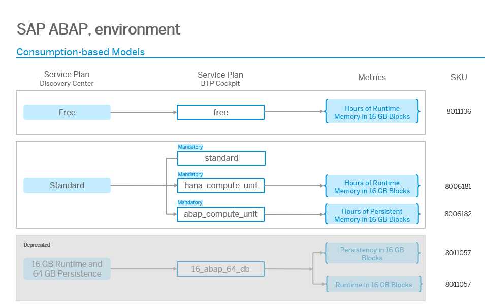

<!-- loiob7f5a93ce3804963ab7fd547f3c4fdf9 -->

# Commercial Information

<a name="loiob7f5a93ce3804963ab7fd547f3c4fdf9__section_gwp_yyy_5zb"/>

## Service

### Description

SAP BTP ABAP environment is SAP’s Platform-as-a-Service offering to create innovative ABAP applications and extensions in the cloud. It provides the modern ABAP RESTful Application Programming Model, leveraging SAP HANA, SAP Fiori, and a cloud-optimized ABAP language with a clear set of released standard APIs. Developers can utilize a development toolset that enables tight integration with Git-enabled lifecycle management.

### Overview

### SAP BTP Cockpit: Descriptions of the Service Plans

<table>
<tr>
<th valign="top">

Name

</th>
<th valign="top">

Service Plan

</th>
<th valign="top">

Description

</th>
</tr>
<tr>
<td valign="top">

free

</td>
<td valign="top">

Free

</td>
<td valign="top">

For small proof-of-concept projects. Allows you to explore all development capabilities. Also includes the piloting of ABAP Test Cockpit scenarios remotely for on-premise systems via the Custom Code Migration app. The instance will be automatically stopped each night, requiring a manual restart via the Landscape Portal. Only community support available. Free tier instance is not subject to SLAs. Upgrading to paid plan seamless; non-upgraded instance and its content decommissioned after 90 days.

</td>
</tr>
<tr>
<td valign="top">

standard

</td>
<td valign="top">

Standard

</td>
<td valign="top">

You can size the ABAP runtime and the SAP HANA memory independently from each other. To be able to do your sizing, you must also select the quota plans abap\_compute\_unit and hana\_compute\_unit. When you create an ABAP system, you must decide on the system size in ABAP compute units. One ABAP compute unit represents 16 GB.

</td>
</tr>
<tr>
<td valign="top">

abap\_compute\_unit

</td>
<td valign="top">

Standard

</td>
<td valign="top">

Configure ABAP Runtime in blocks of 16 GB. Increase the quotas in the abap\_compute\_unit service plan at least by 1.

</td>
</tr>
<tr>
<td valign="top">

hana\_compute\_unit

</td>
<td valign="top">

Standard

</td>
<td valign="top">

Configure HANA Memory in blocks of 15 GB. Increase the quotas in the hana\_compute\_unit service plan at least by 2.

</td>
</tr>
<tr>
<td valign="top">

16\_abap\_64\_db \(Deprecated\)

</td>
<td valign="top">

16 GB Runtime and 64 GB Persistence \(Deprecated\)

</td>
<td valign="top">

This ABAP runtime service plan provides a 16 GB ABAP runtime with a 64 GB database. No additional sizing is possible.

This service plan is deprecated. Please change the service plan to “standard”.

</td>
</tr>
</table>

<a name="loiob7f5a93ce3804963ab7fd547f3c4fdf9__section_x43_x1z_5zb"/>

## Metrics

<table>
<tr>
<th valign="top">

Metric

</th>
<th valign="top">

Definition

</th>
</tr>
<tr>
<td valign="top">

Memory

</td>
<td valign="top">

Temporary memory bank where computers store data that needs to be retrieve and processed quickly.

The memory represents the size of the data that can be processed , and CPU represents the speed at which the data can be retrieved.

</td>
</tr>
</table>

<a name="loiob7f5a93ce3804963ab7fd547f3c4fdf9__section_mjy_gbz_5zb"/>

## Supplemental Terms and Conditions

For more information, see the [SAP Business Technology Platform Service Description Guide](https://www.sap.com/about/trust-center/agreements/cloud/cloud-services.html?sort=latest_desc&tag=language%3Aenglish&pdf-asset=82ce6fed-917e-0010-bca6-c68f7e60039b&page=1).

