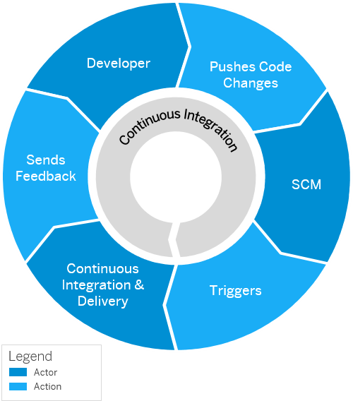

<!-- loiofe74df55b0f54e99bf6e13a3b53e1db0 -->

# Continuous Integration and Delivery \(CI/CD\)

Configure and run predefined continuous integration and delivery \(CI/CD\) pipelines that automatically build, test, and deploy your code changes to speed up your development and delivery cycles.

> ### Note:  
> For links to all SAP solutions for CI/CD, blog posts, presentations, and tutorials, have a look at our [Continuous Integration and Delivery by SAP](https://help.sap.com/viewer/product/CICD_OVERVIEW/Cloud/en-US?task=discover_task) overview.

**Continuous integration \(CI\)** describes a software development process, in which various team members integrate their contributions frequently into a single main line. Before each integration, the changes are verified through builds and automated testing. Thereby, you can detect errors as quickly as possible and prevent integration problems before completing the development.

The **continuous delivery \(CD\)** concept expands on the one of continuous integration. It adds the aspect that any change that has successfully passed the tests is immediately ready to be deployed to production, both from a technical and a qualitative point of view.

The following graphic shows the basic flow for continuous integration and delivery:

  
  
**Continuous Integration Basic Flow**

For more information about the continuous integration and continuous delivery concepts, see [What Are Continuous Integration and Continuous Delivery?](https://help.sap.com/viewer/8cacec64ed854b2a88e9a0973e0f97a2/Cloud/en-US/5ba483a2c97b4ad5ab0148f4a6c5a9ee.html).

<a name="loiofe74df55b0f54e99bf6e13a3b53e1db0__section_tlr_g4n_nkb"/>

## Use

Depending on your use case, you can choose between different CI/CD pipelines to help you implement continuous integration and delivery in your software development.

SAP Continuous Integration and Delivery lets you configure and run predefined pipelines for the development of the following applications:

-   [SAP Cloud Application Programming Model](https://help.sap.com/docs/continuous-integration-and-delivery/sap-continuous-integration-and-delivery/sap-cloud-application-programming-model?version=Cloud) 

    Configure a CI/CD pipeline for the development of applications that follow the SAP Cloud Application Programming Model in the Cloud Foundry runtime.

-   [SAP Fiori in the Cloud Foundry Environment](https://help.sap.com/docs/continuous-integration-and-delivery/sap-continuous-integration-and-delivery/sap-fiori-in-cloud-foundry-environment?version=Cloud)

    Configure a CI/CD pipeline for the development of SAPUI5/SAP Fiori applications in the Cloud Foundry runtime.

-   [SAP Fiori in the Neo environment](https://help.sap.com/docs/continuous-integration-and-delivery/sap-continuous-integration-and-delivery/sap-fiori-in-neo-environment?version=Cloud)

    Configure a CI/CD pipeline for the development of SAPUI5/SAP Fiori applications in the Neo environment.

-   [SAP Fiori for the ABAP Platform](https://help.sap.com/docs/continuous-integration-and-delivery/sap-continuous-integration-and-delivery/sap-fiori-for-abap-platform?version=Cloud&language=en-US)

    Configure a CI/CD pipeline for the development of SAPUI5/SAP Fiori applications for the ABAP platform.

-   [SAP Integration Suite Artifacts](https://help.sap.com/docs/continuous-integration-and-delivery/sap-continuous-integration-and-delivery/sap-integration-suite-artifacts?version=Cloud)

    Configure a CI/CD pipeline for the development of SAP Cloud Integration artifacts in the Cloud Foundry runtime.

-   [Container-Based Applications](https://help.sap.com/docs/continuous-integration-and-delivery/sap-continuous-integration-and-delivery/container-based-applications?version=Cloud)

    Configure a CI/CD pipeline for the development of container-based applications.

To learn more about the CI/CD pipelines supported by SAP Continuous Integration and Delivery and the stages each pipeline can comprise, see [Supported Pipelines](https://help.sap.com/docs/continuous-integration-and-delivery/sap-continuous-integration-and-delivery/supported-pipelines?version=Cloud).

<a name="loiofe74df55b0f54e99bf6e13a3b53e1db0__section_bq2_rvv_gsb"/>

## Get Started with CI/CD

SAP Continuous Integration and Delivery provides an easy, UI-guided way to set up the service and configure and run your pipelines, without hosting your own Jenkins instance.

To set up SAP Continuous Integration and Delivery:

1.  Enable the service in the SAP BTP cockpit.
2.  Assign either the *Administrator* or *Developer* role to your user.
3.  Enable the API usage to connect SAP Continuous Integration and Delivery to other services, if necessary.

To configure SAP Continuous Integration and Delivery:

> ### Note:  
> Only administrators of SAP Continuous Integration and Delivery can configure the service.

1.  Configure credentials for connecting SAP Continuous Integration and Delivery to other services \(for example, GitHub, GitLab, Bitbucket Server, or Azure Repos to clone your sources, and SAP BTP to deploy your built application\).

2.  Add your repository.

Now you can create and modify your CI/CD jobs and monitor their outcome. If you want to automate your builds, you can configure a webhook between your repository and the service. You can create and modify timed triggers for your jobs, if necessary.

For more information, see [Initial Setup](https://help.sap.com/docs/continuous-integration-and-delivery/sap-continuous-integration-and-delivery/initial-setup?version=Cloud) and [Configuration](https://help.sap.com/docs/continuous-integration-and-delivery/sap-continuous-integration-and-delivery/configuration?version=Cloud), or follow the tutorial [Configure and Run a Predefined SAP Continuous Integration and Delivery \(CI/CD\) Pipeline](https://developers.sap.com/tutorials/btp-app-ci-cd-btp.html).

<a name="loiofe74df55b0f54e99bf6e13a3b53e1db0__section_kl1_g4n_nkb"/>

## Learn and Get Certified

Depending on your learning goals and level of expertise, you can choose from the following offerings:

-   **[Efficient DevOps with SAP](https://open.sap.com/courses/devops1)**

    This openSAP course introduces general DevOps approaches and key principles. Learn about the basic CI/CD principles \(week 1\) and how to deliver cloud applications using CI/CD \(week 3\).

-   **[Continuous Integration and Delivery Introduction Guide](https://help.sap.com/viewer/ee5a61247061455ab232c19179fe4c3b/Cloud/en-US)**

    The CI/CD Introduction Guide provides you with basic knowledge for setting up and implementing continuous integration and delivery processes. It gives an overview of the concepts and principles of CI/CD, explains both procedures and their relation, and helps you plan your own CI/CD process.

