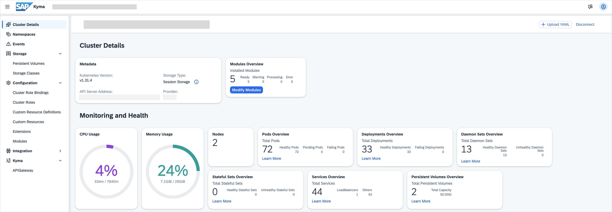

<!-- loio482ae2f53fa64568af28ba1349f5836c -->

# Kyma Dashboard

Use Kyma dashboard to access various features and functionalities of SAP BTP, Kyma runtime.

Kyma dashboard is a web-based UI utilizing the React library and the SAP Fiori Horizon design system. Kyma uses Kyma dashboard as a central administration dashboard, which provides a graphical overview of your cluster and all its resources.

To access Kyma dashboard, enable Kyma in your subaccount. The link to the dashboard will be visible in the **Kyma Environment** section.

<a name="loio482ae2f53fa64568af28ba1349f5836c__section_tvf_qgs_32c"/>

## Features

You can use Kyma dashboard to perform the following actions:

-   Add, manage, and delete Kyma modules.

-   Manage your namespaces.

-   Manage your Kubernetes and Kyma resources.

-   Generate access tokens based on service accounts and Kubernetes RoleBindings and ClusterRoleBindings, which regulate access using Role-based access control \(RBAC\).

-   Have a quick look at the basic cluster condition.

**Related Information**  

[Creating a Kyma Instance](../50-administration-and-ops/creating-a-kyma-instance-09dd313.md "Set up a Kubernetes cluster with SAP BTP, Kyma runtime and use it to build applications and extensions to your SAP and third-party solutions.")

[Adding and Deleting a Kyma Module](../50-administration-and-ops/adding-and-deleting-a-kyma-module-1b548e9.md#loio1b548e9ad4744b978b8b595288b0cb5c "To use a Kyma module, you must add it first. Use Kyma dashboard or Kyma CLI to do that. If you don't need the module anymore, delete it to save resources.")

[Setting Your Module to the Unmanaged and Managed State using Kyma Dashboard](../50-administration-and-ops/setting-your-module-to-the-unmanaged-and-managed-state-c071680.md#loiod281d803c7d946f4adcc28ee72700119 "Use Kyma dashboard to set your module to the unmanaged state.")

[Using RBAC Authorization](https://kubernetes.io/docs/reference/access-authn-authz/rbac/)

