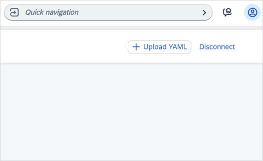
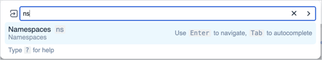
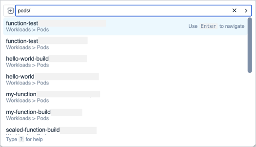
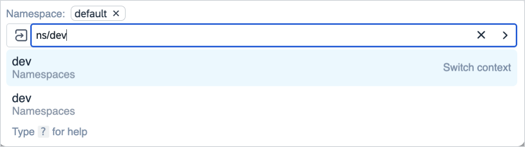

<!-- loio7542ffb3c3434d4f9d2587afcfe13c4a -->

# Kyma Dashboard Command Palette

With the Kyma dashboard command palette feature, you can easily navigate through all your dashboard resources, such as workloads, deployments, and more. You can perform actions such as listing or accessing your namespaces, or preferences, or uploading YAML files.

<a name="loio7542ffb3c3434d4f9d2587afcfe13c4a__section_wcx_nqj_y2c"/>

## Features

You can use the command palette to perform the following actions:

-   To access the command palette, press `cmd+k` on your keyboard or choose **Quick Navigation**.

    

-   To see all navigation options and the resources' aliases, enter the question mark sign `(?)`. For example, if you want to see your namespaces, it's enough to type `ns`.

    

-   To see the history of your resources, use the up or down arrow.

-   To see the list of all resources available in the given namespace, enter the resource name and press the tab key.

    

-   Switch contexts between your resources. For example, if you're viewing your available Pods in the `default` namespace, and you want to check the Pods in a different one, type `ns/{NAME_OF_YOUR_NAMESPACE}` and choose the `Switch Context` option. It takes you to the list of Pods in the selected namespace.

    

