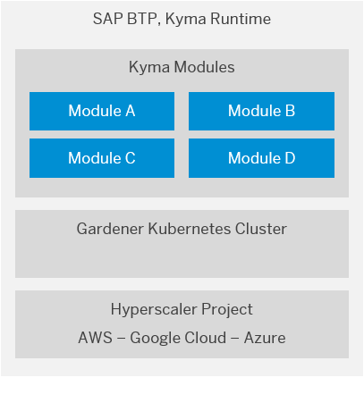

<!-- loio468c2f3c3ca24c2c8497ef9f83154c44 -->

# Kyma Environment

SAP BTP, Kyma runtime provides a fully managed Kubernetes runtime based on the open-source project "Kyma". With this cloud-native solution, developers can extend SAP solutions with serverless Functions and combine them with containerized microservices.

<a name="loio468c2f3c3ca24c2c8497ef9f83154c44__section_lx1_yxp_nrb"/>

## Kyma as a Managed Service

The offered functionality ensures smooth consumption of SAP and non-SAP applications, running workloads in a highly scalable environment, and building event-based and API-based extensions.

> ### Note:  
> Kyma as a managed service automatically checks all Kyma-managed resources. Any unexpected modifications are discarded, and the resource is reverted to the original state.

Every Kyma environment consists of:

-   A Kubernetes cluster based on project "Gardener" on a cloud provider and region \(data center\) of your choice. To find out the available regions and providers, see [Regions for the Kyma Environment](regions-for-the-kyma-environment-557ec3a.md).
-   The open-source [project "Kyma"](https://kyma-project.io/) installed in its latest version on the provisioned cluster.

  

<a name="loio468c2f3c3ca24c2c8497ef9f83154c44__section_lyr_gyp_nrb"/>

## Integration

Every Kyma environment runs on a single Kubernetes cluster created for a specific subaccount. The configuration of the Kyma environment enables you to connect it to a multitude of SAP systems. This way, you can build various formations that aggregate the SAP systems and environment according to your business use cases.

SAP systems connected to a Kyma environment expose APIs and events. To extend the existing logic of these SAP services, you can build serverless applications called “Functions”, and trigger them to react to particular events or calls to your application's API. You can also use the Kyma environment to deploy microservices or even build full-stack applications.

**Related Information**  

[Getting Started in the Kyma Environment](../20-getting-started/getting-started-in-the-kyma-environment-d1abd18.md "As an administrator, you must perform several steps to set up a fully operational Kyma environment to which you can connect the chosen SAP solutions.")

[Development in the Kyma Environment](../30-development/development-in-the-kyma-environment-606ec61.md "Learn more about developing applications in the Kyma environment.")

[Administration and Operations in the Kyma Environment](../50-administration-and-ops/administration-and-operations-in-the-kyma-environment-b8e1686.md "This is the managed offering of SAP BTP, Kyma runtime (based on the open-source project &quot;Kyma&quot;). The administrators of the Kyma environment take care of setting it up and make sure it is ready for developers to work with. Create your Kyma instance to build applications and extensions to SAP and third-party solutions, manage roles, have your Kubernetes objects backed up, and view metrics and logs.")

[Security in the Kyma Environment](../60-security/security-in-the-kyma-environment-ee08fdf.md "The Kyma environment-specific security aspects include guidelines on personal data protection and details on processing and storing logs.")

[Discovery Center](https://discovery-center.cloud.sap/serviceCatalog/kyma-runtime)

