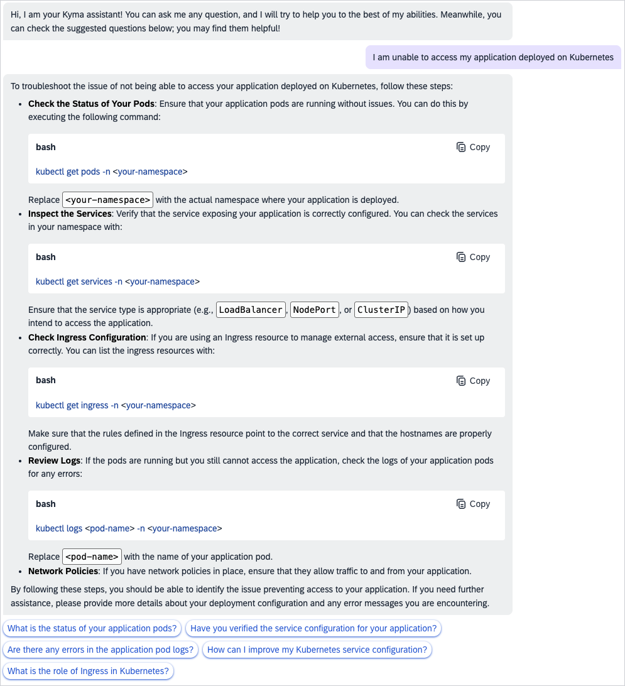
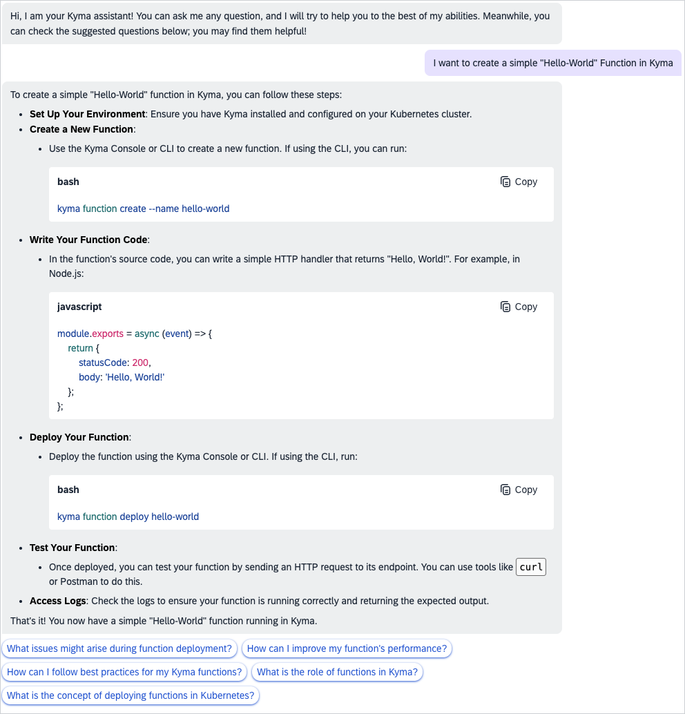
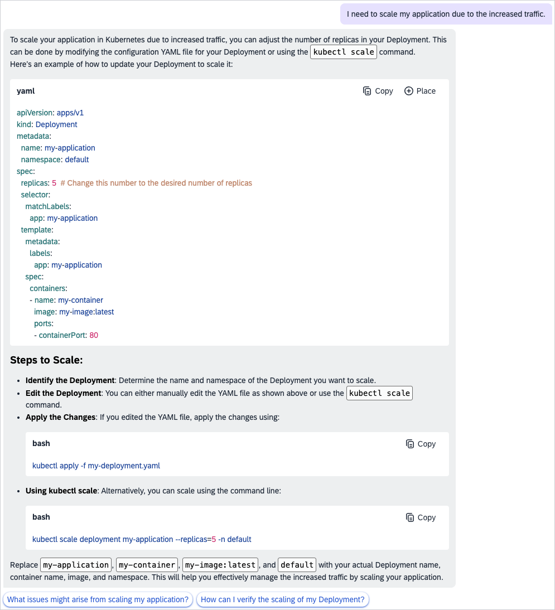
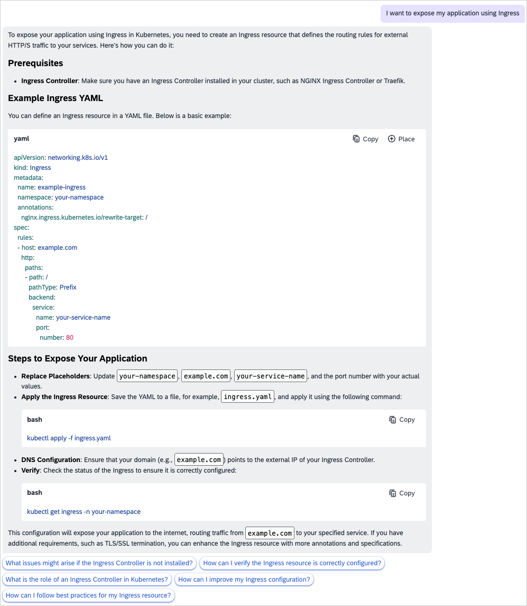
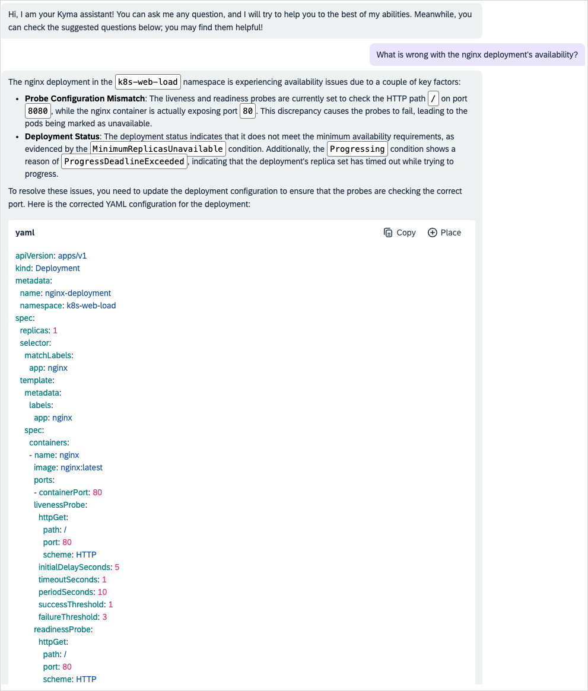

<!-- loioe169e8b0d62e4592bb3abe240780c2d2 -->

# Practical Examples of Joule Problem-Solving Capabilities

See the following examples of the Joule responses to possible issues.

<a name="loioe169e8b0d62e4592bb3abe240780c2d2__section_g55_3r3_1gc"/>

## Troubleshooting a Kubernetes Deployment Problem

A user is unable to access their application deployed on Kubernetes.

<a name="loioe169e8b0d62e4592bb3abe240780c2d2__section_ubt_jr3_1gc"/>

## Creating a Serverless Function in Kyma

A user wants to create a simple "Hello World" Function in Kyma.

<a name="loioe169e8b0d62e4592bb3abe240780c2d2__section_l52_mr3_1gc"/>

## Scaling an Application

A user wants to scale their application due to increased traffic.

<a name="loioe169e8b0d62e4592bb3abe240780c2d2__section_w1h_4r3_1gc"/>

## Configuring Ingress in Kubernetes

A user wants to expose their application using Ingress.

<a name="loioe169e8b0d62e4592bb3abe240780c2d2__section_znn_pr3_1gc"/>

## Troubleshooting nginx Deployment Availability

A user experiences a problem with the nginx deployment availability.

