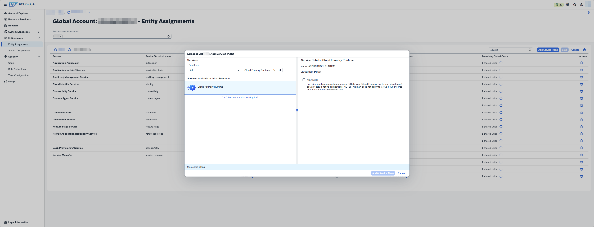
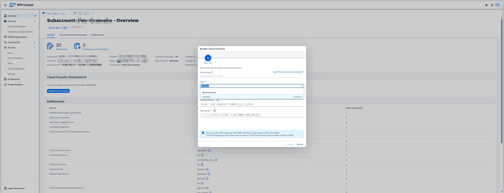

<!-- loio8d41fa40e47b45bf90d38e393a989c4c -->

<link rel="stylesheet" type="text/css" href="../css/sap-icons.css"/>

# Service Plans and Metering for Cloud Foundry Runtime

This page explains the relationship between the service plans in the SAP Discovery Center and those in the SAP BTP cockpit, and provides information to help you understand how the service is billed.

<a name="loio8d41fa40e47b45bf90d38e393a989c4c__service"/>

## Service

### Overview

The diagram below shows how the service plans listed in the [SAP Discovery Center](https://discovery-center.cloud.sap/serviceCatalog/cloud-foundry-runtime?region=all&tab=service_plan) correspond to the plans you choose in the SAP BTP cockpit, depending on the commercial model of your enterprise global account. For more information about the commercial models offered by SAP, see [Commercial Models](commercial-models-263d400.md).

This image is interactive. Hover over rectangles in the diagram to see the description. Choose the highlighted areas for more information.

![A diagram depicting the relationship between service plans in the
									SAP Discovery Center,
								service plans in the SAP BTP
								cockpit, environment plans in the SAP BTP
								cockpit, and the metric GB Memory.
								Consumption-based
								commercial model, line 1 of 2: Service Plan (SAP
									Discovery Center) - Standard;
								Service Plan (SAP BTP Cockpit) - box 1: standard - Default, box 2: MEMORY Default: 200 GB, the MEMORY plan is
								associated with a standalone service Cloud
									Foundry Runtime (technical name:
									APPLICATION_RUNTIME);
								Environment Plan (SAP BTP Cockpit) - standard; Metrics - GB
									Memory; SKU - 8008837.
								Consumption-based commercial model, line 2 of 2: Service Plan (SAP Discovery Center) - Free; Service Plan (SAP BTP
								Cockpit) - free (Environment); Environment
								Plan (SAP BTP Cockpit) - free; Metrics - GB Memory; SKU - 8011138. Subscription-based commercial
								model, line 1 of 1: Service Plan (SAP Discovery
									Center) - Standard; Service Plan
									(SAP BTP Cockpit) - box 1: standard- Default, box 2: MEMORY - Mandatory, the MEMORY plan is associated with a
								standalone service Cloud Foundry Runtime
								(technical name:
									APPLICATION_RUNTIME);
								Environment Plan (SAP BTP Cockpit) - standard; Metrics - GB
									Memory; SKU -
									8008837.](images/SAP_BTP_Cloud_Foundry_Runtime_Commercial_Information_Page_Graphic_2025_V4_fd48b9f.png)

  
  
**Diagram captions: Service plans and environment plans in SAP BTP cockpit \[Show/Hide\]**

<dl>
<dt><b>

Service Plan \(SAP BTP Cockpit\)

</b></dt>
<dd>

The plan that the global account administrator can assign to a subaccount or a directory on the *Entitlements* \> *Entity Assignments* page by choosing *Edit* \> *Add Service Plans*.

> ### Tip:  
> Choose  Zoom In for the full-sized version of the screenshot.

Screenshot: Assigning a service plan to a subaccount in SAP BTP cockpit

For general information about the procedure, see [Configure Entitlements and Quotas for Subaccounts](../50-administration-and-ops/configure-entitlements-and-quotas-for-subaccounts-5ba357b.md) or [Configure Entitlements and Quotas for Directories](../50-administration-and-ops/configure-entitlements-and-quotas-for-directories-37f8871.md).

> ### Note:  
> The greyed out parts of the diagram indicate service plans that are automatically assigned to all subaccounts by default.

</dd><dt><b>

Environment Plan \(SAP BTP Cockpit\)

</b></dt>
<dd>

The plan that the subaccount administrator can select on the *Overview* page of a subaccount when choosing *Enable Cloud Foundry*.

> ### Tip:  
> Choose  Zoom In for the full-sized version of the screenshot.

Screenshot: Selecting an environment plan for the subaccount in SAP BTP cockpit

For general information about the procedure, see [Create Orgs](../50-administration-and-ops/create-orgs-a9b1f54.md).

> ### Note:  
> An environment plan is a service plan associated with an environment. For more information about services and service plans, see [Entitlements and Quotas](entitlements-and-quotas-00aa2c2.md).

</dd>
</dl>

### Service Plans

The tables below provide details about the plans for SAP BTP, Cloud Foundry runtime. They can give you more context for understanding the diagram in the **Overview** section.

**Table 1: Plans for Consumption-Based Commercial Model \[Show/Hide\]**

<table>
<tr>
<th valign="top" align="center">

Service Plan \(SAP Discovery Center\)

</th>
<th valign="top" align="center">

Service \(SAP BTP Cockpit: *Entity Assignments*\)

</th>
<th valign="top" align="center">

Service Plan \(SAP BTP Cockpit: *Entity Assignments*\)

</th>
<th valign="top" align="center">

Environment Plan \(SAP BTP Cockpit: *Enable Cloud Foundry*\)

</th>
<th valign="top" align="center">

Explanation

</th>
</tr>
<tr>
<td valign="top" rowspan="2">

Standard

</td>
<td valign="top">

Cloud Foundry Environment \(`cloudfoundry`\)

</td>
<td valign="top">

standard

</td>
<td valign="top" rowspan="2">

standard

</td>
<td valign="top" rowspan="2">

The plans `standard` and `MEMORY` are used together to allow you to deploy and run applications in the Cloud Foundry environment.

-   `standard`: this plan allows you to create a Cloud Foundry org in a subaccount. **By itself**, the action of creating a Cloud Foundry org is free. However, when you run applications in it, you pay for the runtime memory that they use.

-   `MEMORY`: this plan is used to assign runtime memory quota to a subaccount. The runtime memory can then be consumed by applications that run in the Cloud Foundry org created with the plan `standard`. The usage of runtime memory by applications is **billable** according to the commercial model of your enterprise global account.

In the consumption-based commercial model, a default runtime memory quota of 200 GB is automatically assigned to all subaccounts, and the billing is based on the actual runtime memory usage. For more information, see [Service Specifics](service-plans-and-metering-for-cloud-foundry-runtime-8d41fa4.md#loio8d41fa40e47b45bf90d38e393a989c4c__service_specifics).

For information on how to set up the plan, see [Standard Plan for Cloud Foundry Runtime (Consumption-Based)](https://help.sap.com/viewer/4287333baaa6413a8ece0a8ed1196af4/Cloud/en-US/16a6f68b98074b93a4f331e576f2d955.html "Learn how to set up the standard plan for SAP BTP, Cloud Foundry runtime in the consumption-based commercial model.") :arrow_upper_right:.

</td>
</tr>
<tr>
<td valign="top">

Cloud Foundry Runtime \(`APPLICATION_RUNTIME`\)

</td>
<td valign="top">

MEMORY

</td>
</tr>
<tr>
<td valign="top">

Free

</td>
<td valign="top">

Cloud Foundry Environment \(`cloudfoundry`\)

</td>
<td valign="top">

free \(Environment\)

</td>
<td valign="top">

free

</td>
<td valign="top">

This is a **free tier** plan that allows you to try out and evaluate the service. For more information, see [Using Free Service Plans](using-free-service-plans-524e108.md).

When you create a Cloud Foundry org with the free plan, you also get a limited free quota of runtime memory for it. The amount of such orgs that can be created in an enterprise global account is limited.

For information on how to set up the plan, see [Free Plan for Cloud Foundry Runtime](https://help.sap.com/viewer/4287333baaa6413a8ece0a8ed1196af4/Cloud/en-US/5f4a816f349f46a9b792df000be32117.html "Learn how to set up the free tier plan available for SAP BTP, Cloud Foundry runtime in an enterprise global account that uses the consumption-based commercial model.") :arrow_upper_right:.

> ### Note:  
> Only community support is available for free tier service plans and these are not subject to SLAs. Use of free tier service plans is subject to additional terms and conditions as provided in the [Business Technology Platform Supplemental Terms and Conditions](https://www.sap.com/about/trust-center/agreements/cloud/cloud-services.html?sort=latest_desc&search=Supplement%20Business%20Technology%20Platform&tag=language%3Aenglish&pdf-asset=c8e624f5-bc7e-0010-bca6-c68f7e60039b&page=1).

</td>
</tr>
<tr>
<td valign="top">

\-

</td>
<td valign="top">

Cloud Foundry Environment \(`cloudfoundry`\)

</td>
<td valign="top">

build-runtime

</td>
<td valign="top">

build-runtime

</td>
<td valign="top">

This plan is only for using the SAP BTP, Cloud Foundry runtime as part of SAP Build. For more information, see [What Is SAP Build](https://help.sap.com/docs/build-service/build-service-guide/what-is-sap-build) and [Service Plans and Metering](https://help.sap.com/docs/build-service/build-service-guide/service-plans-and-metering).

> ### Note:  
> The plan is not depicted on the diagram in the **Overview** section.

</td>
</tr>
<tr>
<td valign="top">

See [SAP Build Code](https://discovery-center.cloud.sap/serviceCatalog/sap-build-code?region=all&tab=service_plan)

</td>
<td valign="top">

Cloud Foundry Environment \(`cloudfoundry`\)

</td>
<td valign="top">

build-code

</td>
<td valign="top">

build-code

</td>
<td valign="top">

This plan is only for using the SAP BTP, Cloud Foundry runtime as part of SAP Build Code. For more information, see [What Is SAP Build Code](https://help.sap.com/docs/build_code/d0d8f5bfc3d640478854e6f4e7c7584a/504854f457cc4fbf9f79136dbc773618.html).

> ### Note:  
> The plan is not depicted on the diagram in the **Overview** section.

</td>
</tr>
</table>

**Table 2: Plans for Subscription-Based Commercial Model \[Show/Hide\]**

<table>
<tr>
<th valign="top" align="center">

Service Plan \(SAP Discovery Center\)

</th>
<th valign="top" align="center">

Service \(SAP BTP Cockpit: *Entity Assignments*\)

</th>
<th valign="top" align="center">

Service Plan \(SAP BTP Cockpit: *Entity Assignments*\)

</th>
<th valign="top" align="center">

Environment Plan \(SAP BTP Cockpit: *Enable Cloud Foundry*\)

</th>
<th valign="top" align="center">

Explanation

</th>
</tr>
<tr>
<td valign="top" rowspan="2">

Standard

</td>
<td valign="top">

Cloud Foundry Environment \(`cloudfoundry`\)

</td>
<td valign="top">

standard

</td>
<td valign="top" rowspan="2">

standard

</td>
<td valign="top" rowspan="2">

The plans `standard` and `MEMORY` are used together to allow you to deploy and run applications in the Cloud Foundry environment.

-   `standard`: this plan allows you to create a Cloud Foundry org in a subaccount. **By itself**, the action of creating a Cloud Foundry org is free. However, when you run applications in it, you pay for the runtime memory that they use.

-   `MEMORY`: this plan is used to assign runtime memory quota to a subaccount. The runtime memory can then be consumed by applications that run in the Cloud Foundry org created with the plan `standard`. The usage of runtime memory by applications is **billable** according to the commercial model of your enterprise global account.

In the subscription-based commercial model, a predefined amount of runtime memory is paid for in advance and then gets used. For more information, see [Service Specifics](service-plans-and-metering-for-cloud-foundry-runtime-8d41fa4.md#loio8d41fa40e47b45bf90d38e393a989c4c__service_specifics).

For information on how to set up the plan, see [Standard Plan for Cloud Foundry Runtime (Subscription-Based)](https://help.sap.com/viewer/4287333baaa6413a8ece0a8ed1196af4/Cloud/en-US/cb9b264c786c4ce094370f077806b574.html "Learn how to set up the standard plan for SAP BTP, Cloud Foundry runtime in an enterprise global account that uses the subscription-based commercial model.") :arrow_upper_right:.

</td>
</tr>
<tr>
<td valign="top">

Cloud Foundry Runtime \(`APPLICATION_RUNTIME`\)

</td>
<td valign="top">

MEMORY 

</td>
</tr>
<tr>
<td valign="top" align="center">

\-

</td>
<td valign="top">

Cloud Foundry Environment \(`cloudfoundry`\)

</td>
<td valign="top">

build-runtime

</td>
<td valign="top">

build-runtime

</td>
<td valign="top">

This plan is only for using the SAP BTP, Cloud Foundry runtime as part of SAP Build. For more information, see [What Is SAP Build](https://help.sap.com/docs/build-service/build-service-guide/what-is-sap-build) and [Service Plans and Metering](https://help.sap.com/docs/build-service/build-service-guide/service-plans-and-metering).

> ### Note:  
> The plan is not depicted on the diagram in the **Overview** section.

</td>
</tr>
<tr>
<td valign="top">

See [SAP Build Code](https://discovery-center.cloud.sap/serviceCatalog/sap-build-code?region=all&tab=service_plan)

</td>
<td valign="top">

Cloud Foundry Environment \(`cloudfoundry`\)

</td>
<td valign="top">

build-code

</td>
<td valign="top">

build-code

</td>
<td valign="top">

This plan is only for using the SAP BTP, Cloud Foundry runtime as part of SAP Build Code. For more information, see [What Is SAP Build Code](https://help.sap.com/docs/build_code/d0d8f5bfc3d640478854e6f4e7c7584a/504854f457cc4fbf9f79136dbc773618.html).

> ### Note:  
> The plan is not depicted on the diagram in the **Overview** section.

</td>
</tr>
</table>

<a name="loio8d41fa40e47b45bf90d38e393a989c4c__metrics"/>

## Metrics

The table below provides details about the metrics for SAP BTP, Cloud Foundry runtime. It includes the names of services, with which the metrics are associated on the pages *Usage* or *Costs and Usage* \(accessed from the global account level\) and *Usage Analytics* \(accessed from the subaccount level\) in the SAP BTP cockpit.

<table>
<tr>
<th valign="top" align="center">

Metric

</th>
<th valign="top" align="center">

Service \(SAP BTP Cockpit\)

</th>
<th valign="top" align="center">

Metric \(SAP BTP Cockpit\)

</th>
<th valign="top" align="center">

Definition

</th>
<th valign="top" align="center">

Additional Information

</th>
</tr>
<tr>
<td valign="top">

GB Memory

</td>
<td valign="top">

Cloud Foundry Runtime

</td>
<td valign="top">

GB Memory

</td>
<td valign="top" rowspan="3">

Temporary memory bank where computers store data that needs to be retrieved and processed quickly.

The memory represents the size of the data that can be processed and CPU represents the speed at which the data can be retrieved.

</td>
<td valign="top">

For billing purposes, the GB Memory metric for the Cloud Foundry Runtime service is calculated as the total hourly usage of Cloud Foundry runtime memory across all spaces in the global account over a calendar month, divided by 730 hours and rounded up to the next full GB. For an example of such calculation, see [Consumption Monitoring](https://help.sap.com/docs/cf-runtime/cloud-foundry-runtime/monitoring-and-troubleshooting?version=Cloud#consumption-monitoring).

> ### Note:  
> In the Cloud Foundry environment, applications get a guaranteed CPU share of ¼ core per GB of runtime memory reserved for an application instance. For more information, see [SAP BTP-Specific Configurations](sap-btp-specific-configurations-9809fa4.md).

</td>
</tr>
<tr>
<td valign="top" rowspan="2">

Capacity Units

</td>
<td valign="top">

SAP Build

</td>
<td valign="top">

GB Memory

</td>
<td valign="top">

In SAP Build, the usage of SAP BTP, Cloud Foundry runtime is measured in capacity units. The GB Memory metric for the SAP Build service in the SAP BTP cockpit is intended only for monitoring the approximate usage of SAP BTP, Cloud Foundry runtime in GB when it's consumed as part of SAP Build. For more information, see [What Is SAP Build](https://help.sap.com/docs/build-service/build-service-guide/what-is-sap-build?version=Cloud).

> ### Note:  
> The metric is not depicted on the diagram in [Service](service-plans-and-metering-for-cloud-foundry-runtime-8d41fa4.md#loio8d41fa40e47b45bf90d38e393a989c4c__service).

</td>
</tr>
<tr>
<td valign="top">

SAP Build Code

</td>
<td valign="top">

CF Runtime

</td>
<td valign="top">

In SAP Build Code, the usage of SAP BTP, Cloud Foundry runtime is measured in capacity units. The CF Runtime metric for the SAP Build Code service in the SAP BTP cockpit is intended only for monitoring the approximate usage of SAP BTP, Cloud Foundry runtime in GB when it's consumed as part of SAP Build Code. For more information, see [What Is SAP Build Code](https://help.sap.com/docs/build_code/d0d8f5bfc3d640478854e6f4e7c7584a/504854f457cc4fbf9f79136dbc773618.html) and [SAP Build Code Capacity Unit Calculator](https://build-code-calculator.cfapps.eu10-004.hana.ondemand.com/).

> ### Note:  
> The metric is not depicted on the diagram in [Service](service-plans-and-metering-for-cloud-foundry-runtime-8d41fa4.md#loio8d41fa40e47b45bf90d38e393a989c4c__service).

</td>
</tr>
</table>

<a name="loio8d41fa40e47b45bf90d38e393a989c4c__service_specifics"/>

## Service Specifics

In the context of SAP BTP, Cloud Foundry runtime, the terms **consumption** \(or **consume**\) and **usage** \(or **use**\) refer to the runtime memory quota **reserved** by the platform for each application instance. This quota serves as the basis for calculating the billable consumption, as explained in [Consumption Monitoring](https://help.sap.com/docs/cf-runtime/cloud-foundry-runtime/monitoring-and-troubleshooting?version=Cloud#consumption-monitoring).

> ### Caution:  
> From a billing standpoint, it doesn't matter how much of the reserved runtime memory quota is utilized when the application is running. Billable consumption is calculated based on the full amount of runtime memory reserved, regardless of how much runtime memory actually gets utilized.

> ### Note:  
> If an application is stopped, it doesn't reserve any runtime memory and, therefore, doesn't contribute to runtime memory consumption.

There are two application settings that define how much runtime memory an application uses at any given time:

-   Runtime memory quota reserved for each application instance \(default: 1024 MB\)

-   Number of running application instances \(default: 1\)

> ### Note:  
> The total amount of runtime memory used by the application is displayed on the *Application Overview* page under *Current Application Memory Usage*.

You can specify custom values for these settings when deploying an application in the Cloud Foundry environment. You can also change them for an application that has already been deployed without having to redeploy it.

### How to set runtime memory quota and number of instances when deploying applications

-   **Option 1:** Create a manifest YAML file and specify the following application attributes:

    -   <code><a href="https://docs.cloudfoundry.org/devguide/deploy-apps/manifest-attributes.html#memory">memory</a></code>: runtime memory quota per application instance
    -   <code><a href="https://docs.cloudfoundry.org/devguide/deploy-apps/manifest-attributes.html#instances">instances</a></code>: number of application instances

    For more information about the manifest formatting, see [https://docs.cloudfoundry.org/devguide/deploy-apps/manifest-attributes.html](https://docs.cloudfoundry.org/devguide/deploy-apps/manifest-attributes.html).

    You can then deploy your application with the manifest in one of two ways:

    -   Using the SAP BTP cockpit: [Deploy an Application](../50-administration-and-ops/deploy-an-application-09fdb9b.md)
    -   Using the Cloud Foundry CLI: [https://docs.cloudfoundry.org/devguide/deploy-apps/manifest.html](https://docs.cloudfoundry.org/devguide/deploy-apps/manifest.html)

-   **Option 2:** In the SAP BTP cockpit, choose *Deploy Application*, select *Custom Settings* and specify the following:

    -   *Memory per Instance \(MB\)*: runtime memory quota per application instance
    -   *Number of Instances*: number of application instances

    For more information about the procedure, see [Deploy an Application](../50-administration-and-ops/deploy-an-application-09fdb9b.md).

-   **Option 3:** In the Cloud Foundry CLI, use the command `cf push` with the following flags:

    -   `-m`: runtime memory quota per application instance
    -   `-i`: number of application instances

    For more information about the procedure, see [https://docs.cloudfoundry.org/devguide/deploy-apps/deploy-app.html\#custom-push](https://docs.cloudfoundry.org/devguide/deploy-apps/deploy-app.html#custom-push).

### How to change runtime memory quota and number of instances for already deployed applications

-   **Option 1:** In the SAP BTP cockpit, on the *Application Overview* page you can:

    -   Change the runtime memory quota per application instance under *Instances Configuration* \> *Change Configuration* \> *Memory per Instance \(MB\)*
    -   Change the number of application instances under *Instances Configuration* \> *Change Configuration* \> *App Instances* \(or as described in [Manage Application Instances](../50-administration-and-ops/manage-application-instances-75836f1.md)\)

-   **Option 2:** In the Cloud Foundry CLI, you can use the command `cf scale` with the following flags:

    -   `-m`: change the runtime memory quota per application instance
    -   `-i`: change the number of application instances

    For more information about the procedure, see [https://docs.cloudfoundry.org/devguide/deploy-apps/cf-scale.html](https://docs.cloudfoundry.org/devguide/deploy-apps/cf-scale.html).

You can use the **Application Autoscaler** to automatically increase or decrease the number of application instances based on the policies you have defined. For more information, see [What Is Application Autoscaler](https://help.sap.com/viewer/7472b7d13d5d4862b2b06a730a2df086/Cloud/en-US/45341f37cf6e4738a4b7cd20f18350de.html "Automatically scale your applications to meet their dynamic resource needs.") :arrow_upper_right:.

> ### Tip:  
> For tips on how to optimize the consumption of runtime memory, see the blog post [Optimise your SAP BTP, Cloud Foundry runtime costs](https://blogs.sap.com/2022/02/11/optimise-your-sap-btp-cloud-foundry-runtime-costs/). Note that while the general principles outlined in the blog post still apply, some of the UI texts and parameter names may have changed.

<a name="loio8d41fa40e47b45bf90d38e393a989c4c__supplemental_terms_and_conditions"/>

## Supplemental Terms and Conditions

For more information, see the section **SAP BTP, Cloud Foundry Runtime** in the [SAP Business Technology Platform Service Description Guide](https://www.sap.com/about/trust-center/agreements/cloud/cloud-services.html?%3Bpage=1&%3Bpdf-asset=82ce6fed-917e-0010-bca6-c68f7e60039b&%3Btag=language%3Aenglish&search=SAP%20Business%20Technology%20Platform%20Service%20Description%20Guide&sort=latest_desc&pdf-asset=9a48fd54-c97e-0010-bca6-c68f7e60039b&page=7).

<a name="loio8d41fa40e47b45bf90d38e393a989c4c__glossary"/>

## Glossary

[Commercial Information Glossary](https://help.sap.com/docs/help/5d771150f8f547c6bc604c7d674cf30d/7014f9db099148f1897c1bda5db21f39.html)

