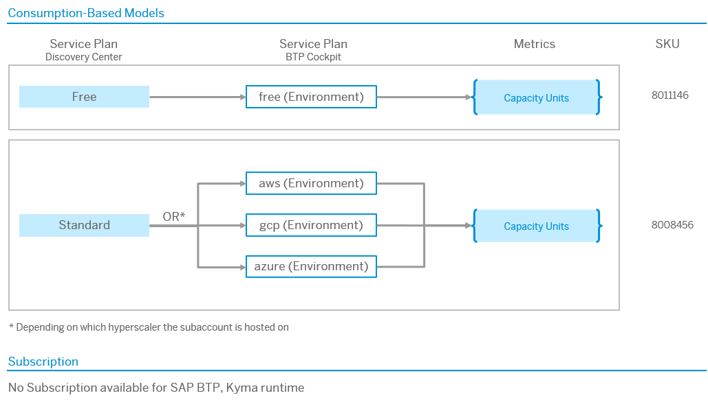

<!-- loioc33bb114a86e474a95db29cfd53f15e6 -->

# Service Plans and Metering for Kyma Runtime

This page explains the relationship between the service plans of the SAP Discovery Center and the service plans of the SAP BTP cockpit and provides information to help you understand how the service is billed.

<a name="loioc33bb114a86e474a95db29cfd53f15e6__section_gwp_yyy_5zb"/>

## Service

### Overview

The following diagram shows how the service plans listed in the [SAP Discovery Center](https://discovery-center.cloud.sap/serviceCatalog/kyma-runtime?tab=service_plan) correspond to the plans you choose in the SAP BTP cockpit. For more information about the commercial model, see [What is the Consumption-Based Commercial Model?](https://help.sap.com/docs/btp/sap-business-technology-platform/what-is-consumption-based-commercial-model?version=Cloud)

Note that there's no subscription-based commercial model for SAP BTP, Kyma runtime.

### SAP BTP Cockpit: Service Plans

<table>
<tr>
<th valign="top">

Name

</th>
<th valign="top">

Service Plan \(Discovery Center\)

</th>
<th valign="top">

Description

</th>
</tr>
<tr>
<td valign="top">

free 

</td>
<td valign="top">

Free 

</td>
<td valign="top">

Subscribe to the 30-day free plan provided on Amazon Web Services. This plan uses Kyma on a limited-size cluster \(4 CPU—16 GB RAM\). You can use the free plan only once in a global account for up to 30 days. The upgrade to the paid plan is not yet supported. Only best-effort support is available for free tier service plans, and these are not subject to SLAs. The services you plan to use must be available in the same region as the subaccount for the Kyma runtime.

</td>
</tr>
<tr>
<td valign="top">

aws

</td>
<td valign="top">

Standard 

</td>
<td valign="top">

Select Amazon Web Services as the cloud provider where your Kyma cluster is deployed.

</td>
</tr>
<tr>
<td valign="top">

gcp

</td>
<td valign="top">

Standard 

</td>
<td valign="top">

Select Google Cloud as the cloud provider where your Kyma cluster is deployed.

</td>
</tr>
<tr>
<td valign="top">

azure

</td>
<td valign="top">

Standard 

</td>
<td valign="top">

Select Microsoft Azure as the cloud provider where your Kyma cluster is deployed.

</td>
</tr>
</table>

<a name="loioc33bb114a86e474a95db29cfd53f15e6__section_x43_x1z_5zb"/>

## Metrics

The usage metric for SAP BTP, Kyma runtime is a Capacity Unit \(CU\) per hour.

<table>
<tr>
<th valign="top">

Metric

</th>
<th valign="top">

Definition

</th>
</tr>
<tr>
<td valign="top">

Capacity Unit

</td>
<td valign="top">

Number of units consumed by the usage of the services as outlined in the solution-specific product supplement.

For SAP BTP, Kyma runtime, CUs are calculated for **workload** and for **storage**.

</td>
</tr>
</table>

<a name="loioc33bb114a86e474a95db29cfd53f15e6__section_o4b_bsz_5zb"/>

## Backward Calculation

> ### Tip:  
> If you use the Cloud Manager module, also see [Calculation with the Cloud Manager Module](service-plans-and-metering-for-kyma-runtime-c33bb11.md#loioc33bb114a86e474a95db29cfd53f15e6__section_cloud_manager).

### Formula

The formula is a mapping between consumed workload/storage and the respective CUs. The details are provided in the following tables.

However, as Kyma supports flexible scaling, cost per hour may vary because it depends on the size of the nodes that were used.

### Underlying Metrics

The workload calculation takes the number of virtual CPU \(vCPU\) and provides the number of CU per hour. To better understand the relationship between vCPU and nodes, note that one node is sized with 2 vCPUs.

**Calculation for CPU**

<table>
<tr>
<th valign="top">

Number of vCPU

</th>
<th valign="top">

Number of CU per Hour

</th>
</tr>
<tr>
<td valign="top">

2

</td>
<td valign="top">

0.24 \* 1.5

</td>
</tr>
<tr>
<td valign="top">

4

</td>
<td valign="top">

0.24 \* 2

</td>
</tr>
<tr>
<td valign="top">

8

</td>
<td valign="top">

0.24 \* 4

</td>
</tr>
<tr>
<td valign="top">

16

</td>
<td valign="top">

0.24 \* 8

</td>
</tr>
<tr>
<td valign="top">

32

</td>
<td valign="top">

0.24 \* 16

</td>
</tr>
<tr>
<td valign="top">

...

</td>
<td valign="top">

...

</td>
</tr>
</table>

You can also calculate CU for different storage types: PersistentVolume and VolumeSnapshotContent resources.

**Calculation for Storage**

<table>
<tr>
<th valign="top">

Amount of Storage

</th>
<th valign="top">

Number of CU per Hour

</th>
</tr>
<tr>
<td valign="top">

32 GB

</td>
<td valign="top">

0.02

</td>
</tr>
</table>

### Examples

-   Your consumption report for nodes shows 1800 capacity units charged for 4 vCPU nodes for 30 days.

    This means that you were running roughly 1800 / \(0.24 \* 2\) = 3750 hours worth of 4 vCPU nodes. Given that 30 days have 720 hours, this means you were running 3750/720 = 5.21 nodes cluster for the 30 days.

    Due to Kyma’s automatic scaling, 5.21 does not mean actual size. It means that during some hours in the 30 days, the cluster size was 4 nodes. At other times, there was more load, so the cluster autoscaled to 5 or 6 nodes, based on your configurations. So your average cluster size for the 30 days was 5.21 nodes.

-   Your consumption report for storage shows 200 capacity units charged for storage \(32 GB block\) for 30 days.

    This means that you used 200 / 0.02 = 10000 hours of 32 GB storage blocks. Given that 30 days have 720 hours, this means that you have used 10000/720 = 13.89 blocks of 32 GB over the 30 days. So, you used 13.89 \* 32 = 444.44 GB of storage continuously during the 30 days.

    This implies that as you started using Kyma, you deployed more applications that used storage of various sizes, such as 4 GB or 8 GB.

    Note that storage is provided in blocks of 32 GB, so if you used 33 GB, you would be charged for 2 \* 32 GB, that is 64 GB.

<a name="loioc33bb114a86e474a95db29cfd53f15e6__section_cloud_manager"/>

## Calculation with the Cloud Manager Module

### Calculation with the Cloud Manager Module

Using the Cloud Manager module and enabling Redis or NFS storage or both, introduces additional costs.

-   The cost of NFS storage introduces factor 3 to the calculation.

    **Calculation for NFS Storage**

    <table>
    <tr>
    <th valign="top">

    Amount of NFS Storage
    
    </th>
    <th valign="top">

    Number of CU per Hour
    
    </th>
    </tr>
    <tr>
    <td valign="top">
    
    32 GB
    
    </td>
    <td valign="top">
    
    0.06 \(= 0.02 \* 3\)
    
    </td>
    </tr>
    </table>
    
-   Using Redis adds costs depending on the tier you choose.

    > ### Note:  
    > Even though the actual available size \(GiB\) might vary depending on the cloud provider, the tiers for Redis are standardized across cloud providers. Because of that, also the pricing is standardized across all available cloud providers.

    **Calculation for Redis Tiers**

    <table>
    <tr>
    <th valign="top">

    Tier
    
    </th>
    <th valign="top">

    Approx. Available Size \(GiB\)
    
    </th>
    <th valign="top">

    Cost in Storage Size per Hour
    
    </th>
    <th valign="top">

    Number of CU per Hour
    
    </th>
    </tr>
    <tr>
    <td valign="top">
    
    S1
    
    </td>
    <td valign="top">
    
    1
    
    </td>
    <td valign="top">
    
    0.25277778
    
    </td>
    <td valign="top">
    
    0.1027777778
    
    </td>
    </tr>
    <tr>
    <td valign="top">
    
    S2
    
    </td>
    <td valign="top">
    
    3
    
    </td>
    <td valign="top">
    
    0.50555556
    
    </td>
    <td valign="top">
    
    0.2055555556
    
    </td>
    </tr>
    <tr>
    <td valign="top">
    
    S3
    
    </td>
    <td valign="top">
    
    6
    
    </td>
    <td valign="top">
    
    1.32361111
    
    </td>
    <td valign="top">
    
    0.5375000000
    
    </td>
    </tr>
    <tr>
    <td valign="top">
    
    S4
    
    </td>
    <td valign="top">
    
    12
    
    </td>
    <td valign="top">
    
    2.65972222
    
    </td>
    <td valign="top">
    
    1.0805555556
    
    </td>
    </tr>
    <tr>
    <td valign="top">
    
    S5
    
    </td>
    <td valign="top">
    
    24
    
    </td>
    <td valign="top">
    
    5.26805556
    
    </td>
    <td valign="top">
    
    2.1402777778
    
    </td>
    </tr>
    <tr>
    <td valign="top">
    
    S6
    
    </td>
    <td valign="top">
    
    48
    
    </td>
    <td valign="top">
    
    10.54305556
    
    </td>
    <td valign="top">
    
    4.2833333333
    
    </td>
    </tr>
    <tr>
    <td valign="top">
    
    S7
    
    </td>
    <td valign="top">
    
    101
    
    </td>
    <td valign="top">
    
    21.08333333
    
    </td>
    <td valign="top">
    
    8.5652777778
    
    </td>
    </tr>
    <tr>
    <td valign="top">
    
    S8
    
    </td>
    <td valign="top">
    
    202
    
    </td>
    <td valign="top">
    
    42.15694444
    
    </td>
    <td valign="top">
    
    17.1263888889
    
    </td>
    </tr>
    <tr>
    <td valign="top">
    
    P1
    
    </td>
    <td valign="top">
    
    5
    
    </td>
    <td valign="top">
    
    2.64305556
    
    </td>
    <td valign="top">
    
    1.0736111111
    
    </td>
    </tr>
    <tr>
    <td valign="top">
    
    P2
    
    </td>
    <td valign="top">
    
    12
    
    </td>
    <td valign="top">
    
    5.31666667
    
    </td>
    <td valign="top">
    
    2.1597222222
    
    </td>
    </tr>
    <tr>
    <td valign="top">
    
    P3
    
    </td>
    <td valign="top">
    
    24
    
    </td>
    <td valign="top">
    
    10.53611111
    
    </td>
    <td valign="top">
    
    4.2805555556
    
    </td>
    </tr>
    <tr>
    <td valign="top">
    
    P4
    
    </td>
    <td valign="top">
    
    48
    
    </td>
    <td valign="top">
    
    21.08333333
    
    </td>
    <td valign="top">
    
    8.5652777778
    
    </td>
    </tr>
    <tr>
    <td valign="top">
    
    P5
    
    </td>
    <td valign="top">
    
    101
    
    </td>
    <td valign="top">
    
    42.17083333
    
    </td>
    <td valign="top">
    
    17.1319444444
    
    </td>
    </tr>
    <tr>
    <td valign="top">
    
    P6
    
    </td>
    <td valign="top">
    
    200
    
    </td>
    <td valign="top">
    
    84.31111111
    
    </td>
    <td valign="top">
    
    34.2513888889
    
    </td>
    </tr>
    </table>
    

### Examples for Cloud Manager

-   Your consumption report for the NFS storage shows 200 capacity units charged for storage \(32 GB block\) for 30 days.

    This means that you used 200 / 0.06 = 3333.33 hours of 32 GB storage blocks. Given that 30 days have 720 hours, this means that you have used 3333.33/720 = 4.63 blocks of 32 GB over the 30 days. So, you used 4.63 \* 32 = 148.15 GB of NFS storage continuously during the 30 days.

-   Your consumption report for Redis shows 200 capacity units for storage for 30 days.

    This means that you used 200 / 0.1027777778 = 1945.946 hours of the Redis S1 tier. Given that 30 days have 720 hours, this means that you have used 1945.946/720 = 2.703 tier S1 Redis instances continuously during the 30 days.

<a name="loioc33bb114a86e474a95db29cfd53f15e6__section_dnb_hsz_5zb"/>

## Calculator

Find the Kyma price calculator at [https://kyma-project.github.io/price-calculator/](https://kyma-project.github.io/price-calculator/) and use it to estimate the costs for your SAP BTP, Kyma runtime.

1.  Choose the base configuration for the size and minimum number virtual machines \(VM\) you need.

2.  Optionally, add more storage to the calculation.

3.  If needed, adjust the conversion rate.

Note that the result is an estimate, and the consumption report may vary depending on the actual hours and size of the Kyma cluster \(workload and storage\) that was running in 30 days.

<a name="loioc33bb114a86e474a95db29cfd53f15e6__section_egv_qcn_1bc"/>

## Supplemental Terms And Conditions

For more information, see [SAP Business Technology Platform Service Description Guide](https://www.sap.com/about/trust-center/agreements/cloud/cloud-services.html?%3Bpage=1&%3Bpdf-asset=82ce6fed-917e-0010-bca6-c68f7e60039b&%3Btag=language%3Aenglish&search=SAP%20Business%20Technology%20Platform%20Service%20Description%20Guide&sort=latest_desc&pdf-asset=9a48fd54-c97e-0010-bca6-c68f7e60039b&page=7), section “SAP BTP, KYMA RUNTIME”.

<a name="loioc33bb114a86e474a95db29cfd53f15e6__section_bl4_4tz_5zb"/>

## Glossary

[Commercial Information Glossary](https://help.sap.com/docs/help/5d771150f8f547c6bc604c7d674cf30d/7014f9db099148f1897c1bda5db21f39.html?locale=en-US)

<a name="loioc33bb114a86e474a95db29cfd53f15e6__section_ypn_rtz_5zb"/>

## Service Specifics

As soon as you instantiate a Kyma cluster, the basic cost for the empty cluster incurs.

Cost may then vary depending on the actual workloads and storage you consume.

