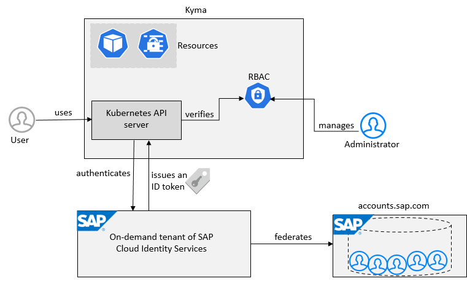

<!-- loiocc1c676b43904066abb2a4838cbd0c37 -->

# User and Member Management

On SAP BTP, user management takes place at all levels from global account to environment. There are different types of users, such as depending on their roles in the company.

<a name="loiocc1c676b43904066abb2a4838cbd0c37__section_ygb_5xw_jlb"/>

## User Accounts

A user account corresponds to a particular user in an identity provider. The user is always stored in an external identity provider, such as a custom tenant of SAP Cloud Identity Services - Identity Authentication or the default identity provider.

> ### Recommendation:  
> We strongly recommend that you configure your custom tenant of SAP Cloud Identity Services as the identity provider and connect SAP Cloud Identity Services to your own corporate identity provider.
> 
> For more information, see [Trust and Federation with Identity Providers](../50-administration-and-ops/trust-and-federation-with-identity-providers-cb1bc8f.md).

**User accounts** enable users to log on to SAP BTP, access subaccounts, and to use applications according to the permissions granted to them.

> ### Note:  
> A user name alone doesn't determine a concrete user account with associated authorizations, as you can have users with the same user name in different identity providers. Accessible data and allowed operations also depend on the identity provider. The concrete user is identified by the combination of user name and identity provider.
> 
> > ### Example:  
> > There are two users with the same user name, which is the email address here. The two users with different identity providers have different authorizations and can access different applications.
> > 
> > -   julia.moore@acme.com from the custom identity provider has authorizations to access her favorite industrial applications. She needs the logon with the custom identity provider for her actual work.
> > 
> > -   julia.moore@acme.com from the default identity provider has no authorizations.

Before diving into the different user and member management concepts, it's important to understand the difference between the two types of users we’re referring to: **platform users** and **business users**.

For more information, see [Platform Users](platform-users-4401316.md) and [Business Users](business-users-2e68494.md).

## Exceptions

There are some exceptions from the separation of platform and business users. Typical cases are the ABAP environment, which doesn't distinguish between these two types, and SAP Build Code or SAP Build applications, which developers currently access as business users.

### ABAP Environment

Typical cases are the ABAP environment, which doesn't distinguish between these two types, and SAP Build Code or SAP Build applications, which developers currently access as business users.

The user and authorization concept used in the ABAP environment is completely decoupled and independent from the authorization concept of SAP BTP or within Cloud Foundry. The ABAP environment runs within the SAP BTP, Cloud Foundry environment. Therefore, administrators or developers need the right authorizations in Cloud Foundry to create the ABAP environment or other services, which get consumed in an application running in the ABAP environment.

For more information, see [Administration and Operations in the ABAP Environment](../50-administration-and-ops/administration-and-operations-in-the-abap-environment-c4fd102.md).

### Kyma Environment

To enable a Kyma environment, you need the subaccount administrator role collection \(see [Role Collections and Roles in Global Accounts, Directories, and Subaccounts](role-collections-and-roles-in-global-accounts-directories-and-subaccounts-0039cf0.md)\). All other authorizations and trust are managed in the Kyma cluster.

Kyma uses Kubernetes Role-Based Access Control \(RBAC\) and assures during provisioning that a user who creates and owns a particular runtime is given the cluster-admin role. Users with the cluster-admin role can define any additional cluster roles or use those defined in Kyma and bind them to other users from Kyma dashboard or with the kubectl CLI tool. See [Assign Roles in the Kyma Environment](../60-security/assign-roles-in-the-kyma-environment-148ae38.md). For recommendations on setting up roles and permissions in Kyma, see  <?sap-ot O2O class="- topic/xref " href="bb31080fd0474d38a050e32a7a7ed629.xml" text="" desc="" xtrc="xref:7" xtrf="file:/home/builder/src/dita-all/jjq1673438782153/loio2080d0faf9d84ce6aa14caa4caa32935_en-US/src/content/localization/en-us/cc1c676b43904066abb2a4838cbd0c37.xml" output-class="" outputTopicFile="file:/home/builder/tp.net.sf.dita-ot/2.3/plugins/com.elovirta.dita.markdown_1.3.0/xsl/dita2markdownImpl.xsl" ?> .

**Related Information**  

[Working with Users](../50-administration-and-ops/working-with-users-2c91f88.md "In the SAP BTP cockpit, you can see the users of your global account or subaccount, user-related identity provider information, and their authorizations. In a user's overview, you can create and delete users, and assign role collections. You can also display an overview of the role collections, where you can drill down all the way to the role, and see the application that the role belongs to.")

[Roles and Role Collections](../50-administration-and-ops/roles-and-role-collections-14a877c.md "Usually a role collection consists of one or multiple roles. You can use the SAP BTP cockpit to add or remove roles.")

[Attributes](../50-administration-and-ops/attributes-713f52a.md "Attributes use information that is specific to the user, for example the user's country. If the application developer in the Cloud Foundry environment of SAP BTP has created a country attribute to a role, this restricts the data a business user can see based on this attribute.")

[Trust and Federation with Identity Providers](../50-administration-and-ops/trust-and-federation-with-identity-providers-cb1bc8f.md "When setting up accounts you need to assign users. While we provide you with your first users from the default identity provider to get you started, your organization has identity providers that you want to integrate.")

