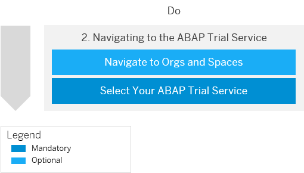
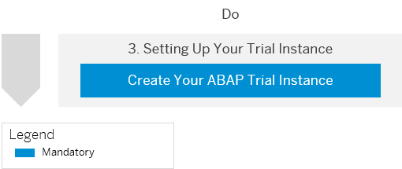
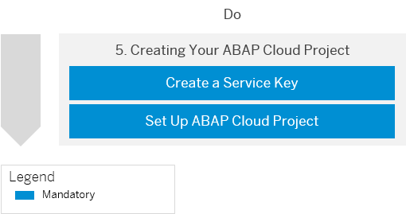

<!-- loio720c423ef1a8498ab690cf0e5512ba50 -->

<link rel="stylesheet" type="text/css" href="../css/sap-icons.css"/>

# Getting Started with a Trial Account in the ABAP Environment

Quickly get started with a trial account.

<a name="loio720c423ef1a8498ab690cf0e5512ba50__section_kyg_mmk_y3b"/>

## 1. Getting a Global Account

-   [Get a Trial Account](Getting_a_Global_Account_d61c281.md#loio42e7e54590424e65969fced1acd47694)
-   [Trial Accounts](../10-concepts/Trial_Accounts_046f127.md)

Before you begin, sign up for a free trial account. See [Get a Free Trial Account](Getting_a_Global_Account_d61c281.md#loio42e7e54590424e65969fced1acd47694). For more information about trial accounts, see [Trial Accounts](../10-concepts/Trial_Accounts_046f127.md).

> ### Restriction:  
> Note that you can only select *Amazon Web Services \(AWS\)* as your provider and either *Europe \(Frankfurt\)* or *US East \(VA\)* as your region to get access to ABAP trial.

> ### Tip:  
> To speed up the setup process, log on to the SAP BTP cockpit, navigate to your global trial account, and choose *Boosters* in the navigation area. The interactive booster *Prepare an Account for ABAP Trial* guides you through the process of creating an ABAP environment trial instance and a service key. To find out more about boosters, see [Boosters](../30-development/Boosters_fb1b561.md).

<a name="loio720c423ef1a8498ab690cf0e5512ba50__section_fnw_mnk_y3b"/>

## 2. Navigating to Your ABAP Environment Trial Service

-   [Navigate to Orgs and Spaces](../50-administration-and-ops/Navigate_to_Orgs_and_Spaces_5bf8735.md)

1.  After registering for a trial account, you will be navigated to the space that was created for your Cloud Foundry trial account. If not, see [Navigate to Orgs and Spaces](../50-administration-and-ops/Navigate_to_Orgs_and_Spaces_5bf8735.md).

    > ### Note:  
    > You should see the following path in the breadcrumbs:
    > 
    >  Home /  <global\_account\> /  <subaccount\> /  <space\>

2.  Go to your trial service by selecting *ABAP environment* from the list of services that are available to you in *Services* \> *Service Marketplace*.

    > ### Tip:  
    > If you don't see the *ABAP environment* tile, go back to your trial subaccount and select *Entitlements* in the navigation menu to add a shared service plan.

<a name="loio720c423ef1a8498ab690cf0e5512ba50__Create_ABAP_Trial_Instance"/>

## 3. Setting Up Your ABAP Environment Trial Instance

-   [Create Your ABAP Trial Instance](Create_Your_ABAP_Trial_Instance_a2f7a8e.md)

Now that you have registered for a trial account and navigated to your ABAP environment trial service, it's time to set up your ABAP environment trial instance. See [Create Your ABAP Trial Instance](Create_Your_ABAP_Trial_Instance_a2f7a8e.md).

> ### Tip:  
> If you experience issues with accessing your ABAP environment trial service or creating an ABAP environment trial instance, submit your question on [SAP Community](https://answers.sap.com/questions/ask.html) by selecting ***SAP BTP, ABAP environment*** as your SAP Managed Tag.

<a name="loio720c423ef1a8498ab690cf0e5512ba50__section_iml_1xy_y3b"/>

## 4. Setting Up Your Development Environment

-   [https://tools.hana.ondemand.com/\#abap](https://tools.hana.ondemand.com/#abap)
-   [https://developers.sap.com/tutorials/abap-environment-abapgit.html\#63bab1ab-0d66-4188-a693-8f63a2944d49](https://developers.sap.com/tutorials/abap-environment-abapgit.html#63bab1ab-0d66-4188-a693-8f63a2944d49)

1.  Download and install ABAP Development Tools \(ADT\) from [https://tools.hana.ondemand.com/\#abap](https://tools.hana.ondemand.com/#abap).
2.  Install the abapGit plugin. See [Install and Set Up abapGit](../30-development/Install_and_Set_Up_abapGit_2002380.md) and [Tutorial: Install abapGit Eclipse plugin](https://developers.sap.com/tutorials/abap-environment-abapgit.html#63bab1ab-0d66-4188-a693-8f63a2944d49).

<a name="loio720c423ef1a8498ab690cf0e5512ba50__section_vyl_snk_y3b"/>

## 5. Creating Your ABAP Cloud Project

-   [Creating Service Keys](../30-development/Creating_Service_Keys_4514a14.md)
-   [Connect to the ABAP System](../30-development/Connect_to_the_ABAP_System_7379dbd.md)

1.  Create a service key for your trial system. See [Creating Service Keys](../30-development/Creating_Service_Keys_4514a14.md).
2.  To start developing in your trial system, you need to create a new project in your ADT installation. Set up an ABAP cloud project to connect to your ABAP trial system. See [Connect to the ABAP System](../30-development/Connect_to_the_ABAP_System_7379dbd.md).

**Related Information**  

[Video Tutorial: Getting Started with a Trial Account](https://www.youtube.com/watch?v=0cMPYBPCy60&list=PLkzo92owKnVxWqJSoFLGe1VRkzOs4Ucdr&index=4&t=0s)

[Tutorial: Create an SAP BTP ABAP Environment Trial User](https://developers.sap.com/tutorials/abap-environment-trial-onboarding.html)

[Tutorial: Create Your First ABAP Console Application](https://developers.sap.com/tutorials/abap-environment-console-application.html)

[Trial Learning Journey](https://help.sap.com/doc/221f8f84afef43d29ad37ef2af0c4adf/HP_2.0/en-US/c3e8d3d2926a4d53a99cc2c66e2e97df.html)

[SAP Community](https://community.sap.com/topics/cloud-platform-abap-environment)

