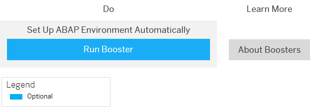

<!-- loioe34a329acc804c0e874496548183682f -->

# Getting Started with a Customer Account in the ABAP Environment

After you have purchased a customer account, learn how to get started in the ABAP environment.

> ### Note:  
> This documentation informs you about the first steps as an administrator in the ABAP environment. For more information about getting started as a developer, see [Getting Started as a Developer in the ABAP Environment](getting-started-as-a-developer-in-the-abap-environment-4b896c9.md).

<a name="loioe34a329acc804c0e874496548183682f__section_wtq_4mf_p4b"/>

## 1. Logging on to SAP BTP

1.  After you have purchased your customer account, you will receive an e-mail with a link to the home page of SAP BTP and the logon data as administrator for the global account.

2.  Log on to SAP BTP.

    You are now in the SAP BTP cockpit.

3.  Navigate to your global account.

<a name="loioe34a329acc804c0e874496548183682f__section_llx_rps_j4b"/>

## 2. Automated Initial Setup Using a Booster \(Optional\)

-   [Using a Booster to Automate the Setup of the ABAP Environment \(Optional\)](using-a-booster-to-automate-the-setup-of-the-abap-environment-optional-cd7e7e6.md)
-   [https://help.sap.com/viewer/65de2977205c403bbc107264b8eccf4b/Cloud/en-US/fb1b56148f834749a2bf51127421610b.html](https://help.sap.com/viewer/65de2977205c403bbc107264b8eccf4b/Cloud/en-US/fb1b56148f834749a2bf51127421610b.html)

To set up a development system quickly, you can use the booster *Prepare an Account for ABAP Development*. The interactive booster guides you through the process of setting up your subaccounts, configuring entitlements, assigning members, and so on. For more information, see [Using a Booster to Automate the Setup of the ABAP Environment \(Optional\)](using-a-booster-to-automate-the-setup-of-the-abap-environment-optional-cd7e7e6.md).

Using a booster is optional. If you don't use the booster, you must perform more steps manually.

<a name="loioe34a329acc804c0e874496548183682f__section_dds_jy1_l4b"/>

## 3. Manual Setup

Even if you have used the booster, some manual setup steps are still required. In the following, steps that are performed by the booster are indicated.

### a. Setting Up Your Account Model

-   [Creating a Cloud Foundry Subaccount for the ABAP Environment](creating-a-cloud-foundry-subaccount-for-the-abap-environment-0153671.md)
-   [Creating a Cloud Foundry Organization and Space](creating-a-cloud-foundry-organization-and-space-dc18bac.md)
-   [https://help.sap.com/viewer/65de2977205c403bbc107264b8eccf4b/Cloud/en-US/8ed4a705efa0431b910056c0acdbf377.html](https://help.sap.com/viewer/65de2977205c403bbc107264b8eccf4b/Cloud/en-US/8ed4a705efa0431b910056c0acdbf377.html)

1.  \(Not required if you have used the booster\):

    Create a subaccount for ABAP environment in your global account \(see [Creating a Cloud Foundry Subaccount for the ABAP Environment](creating-a-cloud-foundry-subaccount-for-the-abap-environment-0153671.md) \).

    This allows you to further break down your account model and structure it according to your business needs.

2.  \(Not required if you have used the booster\):

    Create organizations and spaces \(see [Creating a Cloud Foundry Organization and Space](creating-a-cloud-foundry-organization-and-space-dc18bac.md)\).

    If you want to learn more about subaccounts, orgs, and spaces, and how they relate to each other, see [Account Model](https://help.sap.com/viewer/65de2977205c403bbc107264b8eccf4b/Cloud/en-US/8ed4a705efa0431b910056c0acdbf377.html).

### b. Setting Up the ABAP System

-   [Increasing the Quota for the ABAP Environment](increasing-the-quota-for-the-abap-environment-c40cb18.md)
-   [Increasing the Quota for the Cloud Foundry Runtime \(Optional\)](increasing-the-quota-for-the-cloud-foundry-runtime-optional-7aba501.md)
-   [Creating an ABAP System](creating-an-abap-system-50b32f1.md)
-   [Subscribing to the Web Access for ABAP](subscribing-to-the-web-access-for-abap-98928b0.md)
-   [https://help.sap.com/viewer/65de2977205c403bbc107264b8eccf4b/Cloud/en-US/c8248745dde24afb91479361de336111.html](https://help.sap.com/viewer/65de2977205c403bbc107264b8eccf4b/Cloud/en-US/c8248745dde24afb91479361de336111.html)

1.  \(Not required if you have used the booster\):

    Before you can start using resources such as services or application runtimes, you must manage your entitlements and add quotas to your subaccount \(see [Increasing the Quota for the ABAP Environment](increasing-the-quota-for-the-abap-environment-c40cb18.md) \).

2.  \(Not required if you have used the booster\):

    Optionally, if your developers want to deploy their own apps in Cloud Foundry, increase the quota for the Cloud Foundry runtime \(see [Increasing the Quota for the Cloud Foundry Runtime \(Optional\)](increasing-the-quota-for-the-cloud-foundry-runtime-optional-7aba501.md)\).

3.  \(Not required if you have used the booster\):

    Create your ABAP system \(see [Creating an ABAP System](creating-an-abap-system-50b32f1.md)\).

4.  \(Not required if you have used the booster\):

    Subscribe to the Web access for ABAP SaaS application to get direct browser access to your instances in the ABAP environment \(see [Subscribing to the Web Access for ABAP](subscribing-to-the-web-access-for-abap-98928b0.md)\).

    This also allows you to access the administration launchpad including your own SAP Fiori applications. You only have to subscribe once for each subaccount.

### c. Creating Administrator and Developer Users

-   [Adding a User as Org Manager for the Cloud Foundry Organization](adding-a-user-as-org-manager-for-the-cloud-foundry-organization-57059dc.md)
-   [Adding a User as Space Manager for the Cloud Foundry Space](adding-a-user-as-space-manager-for-the-cloud-foundry-space-02b8cd8.md)
-   [Logging on to the Administration Launchpad of the ABAP Environment](logging-on-to-the-administration-launchpad-of-the-abap-environment-11e765e.md)
-   [Creating an Employee Record for a New Administrator](creating-an-employee-record-for-a-new-administrator-7580525.md)
-   [Assigning the ABAP Environment Administrator Role to the New Administrator User](assigning-the-abap-environment-administrator-role-to-the-new-administrator-user-ad888b0.md)
-   [Creating New Space Members and Assigning Space Developer Roles to Them](creating-new-space-members-and-assigning-space-developer-roles-to-them-967fc4e.md)
-   [Creating an Employee Record for a New Developer](creating-an-employee-record-for-a-new-developer-a66fdc5.md)
-   [https://help.sap.com/viewer/65de2977205c403bbc107264b8eccf4b/Cloud/en-US/cc1c676b43904066abb2a4838cbd0c37.html](https://help.sap.com/viewer/65de2977205c403bbc107264b8eccf4b/Cloud/en-US/cc1c676b43904066abb2a4838cbd0c37.html)
-   [Assigning the ABAP Developer User to the ABAP Developer Role](assigning-the-abap-developer-user-to-the-abap-developer-role-13b2cfb.md)

1.  Optionally, you can create additional administrator users for the ABAP environment as follows:

    1.  \(Not required if you have used the booster\):

        Add users as administrators of the Cloud Foundry organization that you created for the ABAP environment \(see [Adding a User as Org Manager for the Cloud Foundry Organization](adding-a-user-as-org-manager-for-the-cloud-foundry-organization-57059dc.md)\).

    2.  \(Not required if you have used the booster\):

        Add the users as managers for the Cloud Foundry space that you created for the ABAP environment \(see [Adding a User as Space Manager for the Cloud Foundry Space](adding-a-user-as-space-manager-for-the-cloud-foundry-space-02b8cd8.md) \).

    3.  Log on to the administration launchpad \(see [Logging on to the Administration Launchpad of the ABAP Environment](logging-on-to-the-administration-launchpad-of-the-abap-environment-11e765e.md)\).

    4.  Create employee records for the new administrators \(see [Creating an Employee Record for a New Administrator](creating-an-employee-record-for-a-new-administrator-7580525.md)\).

    5.  Assign the administrator role for the ABAP environment to the new users \(see [Assigning the ABAP Environment Administrator Role to the New Administrator User](assigning-the-abap-environment-administrator-role-to-the-new-administrator-user-ad888b0.md)\).

2.  For your developers, create business users and assign them to the developer business role as follows:

    1.  \(Not required if you have used the booster\):

        Create new members for the space that you created for the ABAP environment and assign developer roles to the new members \(see [Creating New Space Members and Assigning Space Developer Roles to Them](creating-new-space-members-and-assigning-space-developer-roles-to-them-967fc4e.md)\).

    2.  Create employee records for the new developer users \(see [Creating an Employee Record for a New Developer](creating-an-employee-record-for-a-new-developer-a66fdc5.md)\).

    3.  Assign the ABAP developer users to the ABAP developer role \(see [Assigning the ABAP Developer User to the ABAP Developer Role](assigning-the-abap-developer-user-to-the-abap-developer-role-13b2cfb.md)\).

<a name="loioe34a329acc804c0e874496548183682f__section_rlp_drs_j4b"/>

## 4. What's Next

After the initial setup of the ABAP environment, your developers can now develop applications using ABAP Development Tools. You can tell your developers to get started \(see [Getting Started as a Developer in the ABAP Environment](getting-started-as-a-developer-in-the-abap-environment-4b896c9.md)\).

As next steps, you can optionally set up additional tools for your developers or ensure the integration with other systems:

-   If your developers need a UI development tool, set up SAP Business Application Studio \(see [Setup of UI Development in SAP Business Application Studio \(Optional\)](setup-of-ui-development-in-sap-business-application-studio-optional-37a896b.md)\).
-   As a default identity service in the ABAP environment, you get SAP ID. You might want to set up a custom identity service \(see [Setup of a Custom Identity Service \(Optional\)](setup-of-a-custom-identity-service-optional-550251a.md)\).
-   As an alternative to SAP Business Application Studio, you can also set up SAP Web IDE \(see [Setup of UI Development in SAP Web IDE \(Optional\)](setup-of-ui-development-in-sap-web-ide-optional-43d1a08.md)\).

-   [Setup of UI Development in SAP Business Application Studio \(Optional\)](setup-of-ui-development-in-sap-business-application-studio-optional-37a896b.md)
-   [Setup of a Custom Identity Service \(Optional\)](setup-of-a-custom-identity-service-optional-550251a.md)
-   [Setup of UI Development in SAP Web IDE \(Optional\)](setup-of-ui-development-in-sap-web-ide-optional-43d1a08.md)

**Related Information**  

[Learning Journey](https://help.sap.com/doc/221f8f84afef43d29ad37ef2af0c4adf/HP_2.0/en-US/49047e7668844d419ccee567923a475e.html)

[Discovery Center](https://discovery-center.cloud.sap/serviceCatalog/abap-environment)

[SAP Community](https://community.sap.com/topics/cloud-platform-abap-environment)

[SAP Road Map Explorer](https://roadmaps.sap.com/board?PRODUCT=73555000100800001164&range=CURRENT-LAST#Q1%202021)

[Video Tutorials](https://www.youtube.com/playlist?list=PLkzo92owKnVxWqJSoFLGe1VRkzOs4Ucdr)

