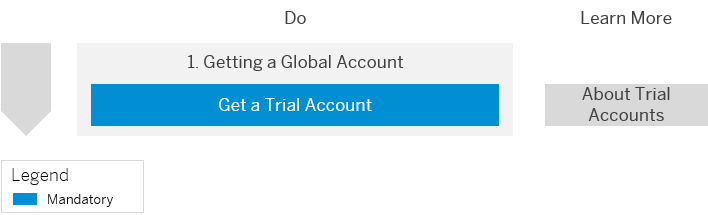
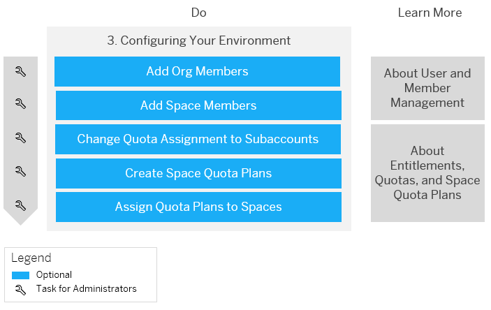
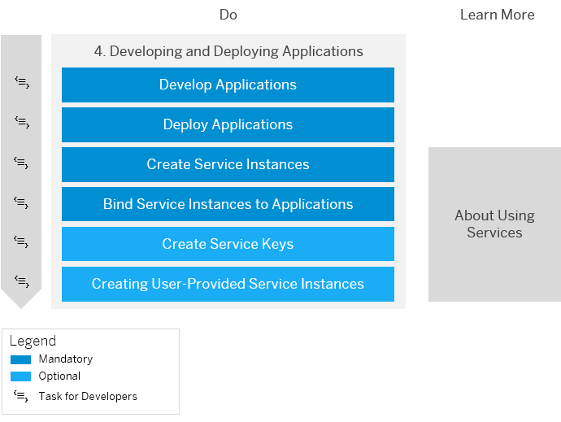

<!-- loioe50ab7b423f04a8db301d7678946626e -->

# Getting Started with a Trial Account in the Cloud Foundry Environment

Quickly get started with a trial account.

<a name="loioe50ab7b423f04a8db301d7678946626e__section_ncd_t5k_wbb"/>

## 1. Getting a Global Account

Before you begin, sign up for a free trial account. See [Get a Free Trial Account](getting-a-global-account-d61c281.md#loio42e7e54590424e65969fced1acd47694). For more information about the scope of our trial offering, see [Trial Accounts and Free Tier](../10-concepts/trial-accounts-and-free-tier-046f127.md).

If you want to familiarize yourself with the Cloud Foundry environment, see [Cloud Foundry Environment](../10-concepts/cloud-foundry-environment-9c7092c.md#loio9c7092c7b7ae4d49bc8ae35fdd0e0b18).

<a name="loioe50ab7b423f04a8db301d7678946626e__section_gns_3vk_wbb"/>

## 2. Setting Up Your Account Model

1.  When you register for a trial account, a subaccount and a space are created for you. You can create additional subaccounts and spaces, thereby further breaking down your account model and structuring it according to your development scenario, but first it's important you understand how to navigate to your accounts and spaces using the SAP BTP cockpit. See [Navigate to Orgs and Spaces](../50-administration-and-ops/navigate-to-orgs-and-spaces-5bf8735.md).

2.  If you like, create further subaccounts. See [Create a Subaccount](../50-administration-and-ops/create-a-subaccount-05280a1.md). You can also download and use the CLI forSAP BTP to create new subaccounts. See [Download and Start Using the btp CLI Client](../50-administration-and-ops/download-and-start-using-the-btp-cli-client-8a8f17f.md#loio8a8f17f5fd334fb583438edbd831d506) and [Working with Global Accounts, Directories, and Subaccounts Using the btp CLI](../50-administration-and-ops/working-with-global-accounts-directories-and-subaccounts-using-the-btp-cli-85a683e.md).

3.  If you haven't done so already, now is a good time to download and install the Cloud Foundry Command Line Interface \(cf CLI\). This tool allows you to administer and configure your environment,enable services, and deploy applications. See [Download and Install the Cloud Foundry Command Line Interface](../50-administration-and-ops/download-and-install-the-cloud-foundry-command-line-interface-4ef907a.md). But don't worry, you can also perform all the necessary task using the SAP BTP cockpit, which you don't need to install.
4.  If you'd like to use the cf CLI, log on to your environment. See [Log On to the Cloud Foundry Environment Using the Cloud Foundry Command Line Interface](../50-administration-and-ops/log-on-to-the-cloud-foundry-environment-using-the-cloud-foundry-command-line-interface-7a37d66.md).
5.  If you like, create further spaces. See [Create Spaces](../50-administration-and-ops/create-spaces-2f6ed22.md). If you want to learn more about subaccounts, orgs, and spaces, and how they relate to each other, see [Account Model](../10-concepts/account-model-8ed4a70.md#loio8ed4a705efa0431b910056c0acdbf377).

<a name="loioe50ab7b423f04a8db301d7678946626e__section_qr5_wwk_wbb"/>

## 3. Configuring Your Environment

1.  Now that you've set up your account model, it's time to think about member management. You can add members at different levels. For example, you can add members at the org level. See [Add Org Members](../50-administration-and-ops/add-org-members-a4eeaf1.md). For more information about the roles that are available on the different levels, see [User and Member Management](../10-concepts/user-and-member-management-cc1c676.md).

2.  You can also add members at the space level. See [Add Space Members](../50-administration-and-ops/add-space-members-81d0b4d.md).
3.  In a trial account, quotas are automatically assigned to your subaccounts, but you can change that assignment. See [Configure Entitlements and Quotas for Subaccounts](../50-administration-and-ops/configure-entitlements-and-quotas-for-subaccounts-5ba357b.md). To learn more about entitlements and quotas, see [Entitlements and Quotas](../10-concepts/entitlements-and-quotas-00aa2c2.md).
4.  You can also assign quotas to different spaces within a subaccount. To do so, first create a space quota plan. See [Create Space Quotas](../50-administration-and-ops/create-space-quotas-b13c4a2.md) or [Create Space Quota Plans Using the Cloud Foundry Command Line Interface](../50-administration-and-ops/create-space-quota-plans-using-the-cloud-foundry-command-line-interface-504fde9.md).
5.  Then assign the quota plan to your space. See [Assign Space Quotas to Spaces](../50-administration-and-ops/assign-space-quotas-to-spaces-13028c4.md) or [Assign Quota Plans to Spaces Using the Cloud Foundry Command Line Interface](../50-administration-and-ops/assign-quota-plans-to-spaces-using-the-cloud-foundry-command-line-interface-d1e4203.md).

<a name="loioe50ab7b423f04a8db301d7678946626e__section_w1d_txk_wbb"/>

## 4. Developing and Deploying Applications

1.  Develop your application. Check out the Developer Guide for tutorials and more information. See [Development](../30-development/development-c2fec62.md).

2.  Deploy your application. See [Deploy Business Applications in the Cloud Foundry Environment](../30-development/deploy-business-applications-in-the-cloud-foundry-environment-4946ea5.md).
3.  Integrate your application with a service. To do so, first create a service instance. See [Creating Service Instances](../30-development/creating-service-instances-8221b74.md).

4.  Bind the service instance to your application. See [Binding Service Instances to Applications](../30-development/binding-service-instances-to-applications-e98280a.md).
5.  Alternatively, you can also create and use service keys. See [Creating Service Keys](../30-development/creating-service-keys-4514a14.md). For more information on using services and creating service keys, see [About Services](../30-development/about-services-d1d0fc8.md).
6.  You can also create instances of user-provided services. See [Creating User-Provided Service Instances](../30-development/creating-user-provided-service-instances-a44355e.md).

> ### Tip:  
> Also check out the tutorial [Create Your First App on Cloud Foundry](https://developers.sap.com/group.scp-3-first-app.html) to see how you can deploy a pre-bundled set of artifacts using the SAP BTP cockpit, access the app from your web browser, and create an instance of a service available on Cloud Foundry and bind it to your app.

**Related Information**  

[Cloud Foundry Environment](../10-concepts/cloud-foundry-environment-9c7092c.md#loio9c7092c7b7ae4d49bc8ae35fdd0e0b18 "The Cloud Foundry environment allows you to create polyglot cloud applications in Cloud Foundry. It contains the SAP BTP, Cloud Foundry runtime service, which is based on the open-source application platform managed by the Cloud Foundry Foundation.")

[Trial Accounts and Free Tier](../10-concepts/trial-accounts-and-free-tier-046f127.md "Explore the different options for trying out SAP BTP.")

[Account Model](../10-concepts/account-model-8ed4a70.md#loio8ed4a705efa0431b910056c0acdbf377 "Learn more about the different types of accounts on SAP BTP and how they relate to each other.")

[Entitlements and Quotas](../10-concepts/entitlements-and-quotas-00aa2c2.md "When you purchase an enterprise account, you’re entitled to use a specific set of resources, such as the amount of memory that can be allocated to your applications.")

[User and Member Management](../10-concepts/user-and-member-management-cc1c676.md "On SAP BTP, user management takes place at all levels from global account to environment. There are different types of users, such as depending on their roles in the company.")

[About Services](../30-development/about-services-d1d0fc8.md "In the Cloud Foundry environment, you usually enable services by creating a service instance using either the SAP BTP cockpit or the Cloud Foundry command line interface (cf CLI), and binding that instance to your application.")

