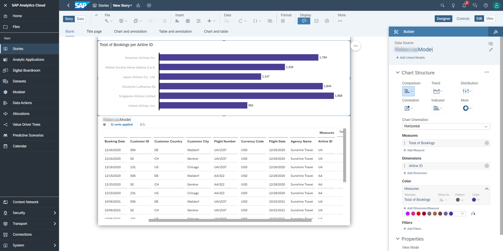

<!-- loio616ba1dd50f24eff8c5f4f28f75bea11 -->

# Consume Queries on SAC to Create Models and Stories

Once a successful connection has been established, you can start creating models and stories based on your query.

### Creating Models

1.  Login to your SAP Analytics Cloud \(SAC\) tenant.
2.  In the main menu, select *Modeler*.
3.  Click on *Live Data Model*.
4.  In the dialog window, provide the following values:

    -   *System Type*: SAP BW
    -   *Connection*: The name of the connection defined in [Connect the ABAP Environment System to SAP Analytics Cloud](Connect_the_ABAP_Environment_System_to_SAP_Analytics_Cloud_a102853.md).
    -   *Data Source*: The technical name of the query. This name can be found in your service binding as *External Service Name*.
    Click *Ok*.

5.  Save your model by clicking the save icon. Select a pre-existing folder or create a new one. Give your model a *Name* and *Desription* and click *Ok*.

### Creating Stories

Now you can create an analytical story.

1.  In your SAC tenant, go to the main menu and select *Stories*.
2.  Create a new story or select an existing template.
3.  Click on *Chart and table* and click the *+* \(Add\) button in the graph.
4.  Select the model you created.
5.  You can insert a table and/or a chart and use the builder on the right to select measures and dimensions.
6.  Click the Save icon to export your story.

### Result

