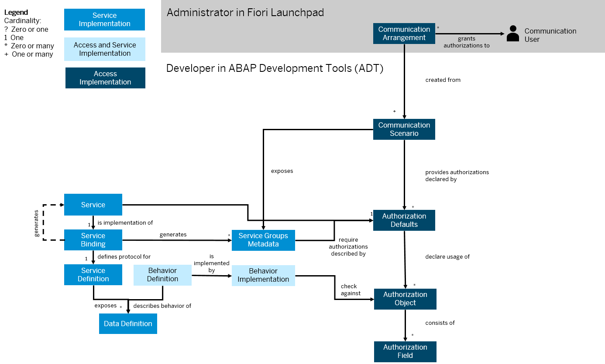

<!-- loiobc9c2c927d47402e9bbdfba30e491046 -->

# Granting Access Based on Activities for Communication Users

In this scenario, you grant access depending on what the communication user should be allowed to do, for example, read or write access.

This scenario is more complex than a simple unrestricted access grant because you also need to create an authorization object and implement authority checks in the behavior implementation.

  

In this documentation, you get a more detailed overview of how to implement a separate read and write access. You can achieve such a separation by creating an authorization object with the standard authorization field for activities, an authority check to protect the service, and a communication scenario with authorization fields and activities defined. The administrator can then create two communication arrangements for read and write access each, for example.

-   **[Protecting the Service \(Developer\)](Protecting_the_Service_(Developer)_b904f7b.md "With creating an authorization object for your service and with the implementation of a protection against unauthorized creation and
		change activities, you implement a basic protection of your service.")**  
With creating an authorization object for your service and with the implementation of a protection against unauthorized creation and change activities, you implement a basic protection of your service.
-   **[Developing Authorizations for Communication Users \(Developer\)](Developing_Authorizations_for_Communication_Users_(Developer)_fadf4b5.md "After you’ve protected your service against unauthorized use, you can now create the objects that are needed to grant authorizations for
		communication users: authorization default values and a communication scenario.")**  
After you’ve protected your service against unauthorized use, you can now create the objects that are needed to grant authorizations for communication users: authorization default values and a communication scenario.
-   **[Creating a Communication Arrangement \(Administrator\)](Creating_a_Communication_Arrangement_(Administrator)_1734fb7.md "To grant authorizations to a communication user, as admnistrator, you create a communication arrangement. In this example, the
		communication arrangement is based on the communication scenario created by the developer, including all authorization
		restrictions.")**  
To grant authorizations to a communication user, as admnistrator, you create a communication arrangement. In this example, the communication arrangement is based on the communication scenario created by the developer, including all authorization restrictions.

