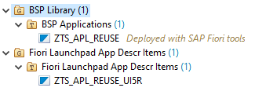

<!-- loioa094e54ff3234c68a41395e029a3f022 -->

# How to Use the Fiori Reuse Library

You can use the *Reuse Library* to implement a reusable component that can display an application log.


## Context

To be able to use the reusable components, you need to adapt the code that can be found in your view definition file and your controller file.

In the view definition file \(*<MY\_LOG\_DISPLAY\_VIEW.view.xml\>*\), the log display must be positioned on the page.


## Procedure

1.  Prepare a container control that will hold the log display component:

    > ### Sample Code:  
    > ```
    > `<!-- xmlns:core="sap.ui.core" --> 
    > <core:ComponentContainer id="LogMessagesControlContainer" />`
    > ```

2.  In the controller file \(*<MY\_LOG\_DISPLAY\_VIEW.controller.js\>*\), the relevant coding goes into the handler for the *onlnit* event. Create the component and place it into the container control:

    > ### Note:  
    > Make sure to replace the string *<MY\_LOG\_DISPLAY\_VIEW\>* with your own view's name!

    > ### Sample Code:  
    > ```
    > `var sLogDataServiceUrl = "/sap/opu/odata/sap/APL_LOG_MANAGEMENT_SRV/";
    > this.oComp = sap.ui.getCore().createComponent({
    >     name: "sap.nw.core.applogs.lib.reuse.applogs",
    >     id: this.createId("LogMessagesControlComponent"),
    >     settings: {
    >         "persistencyKey": "MY_LOG_DISPLAY_VIEW",
    >         "showHeader": false,
    >         "showFilterBar": true,
    >         "logDataServiceUrl": sLogDataServiceUrl
    >     }
    > });
    > this.byId("LogMessagesControlContainer").setComponent(this.oComp);`
    > ```

    > ### Note:  
    > The component you embed makes use of the *SmartFilter* and the *SmartTable* control. Both controls enable a user to configure the components interactively, and also to store a current set of configuration settings as a named variant. By providing a value for the `persistencyKey` parameter, you make sure that the variants that get created in your application become visible only to the users of your application, and not to all users of the component in all applications.

3.  In case of route change events, make sure that the proper parameters are evaluated:

    > ### Sample Code:  
    > ```
    > `var that = this;
    > this.oRouter.attachRoutePatternMatched(function(oEvent) {
    >     if (oEvent.getParameter("name") === "ShowMsgHandle") {
    >         that._sLogHandle = decodeURIComponent(oEvent.getParameter("arguments").logHandle);
    >         that.oComp.setLogHandle(that._sLogHandle);
    >         that.oComp.refresh();
    >     } else if (oEvent.getParameter("name") === "ShowMsgNumber") {
    >         that._sLogNumber = decodeURIComponent(oEvent.getParameter("arguments").logNumber);
    >         that.oComp.setLogNumber(that._sLogNumber);
    >         that.oComp.refresh();
    >     }
    > }, this);`
    > ```

4.  Adapt your *<manifest.json\>* file and add the *nw.core.applogs.lib.reuse* library under the `dependencies` section:

    > ### Sample Code:  
    > ```
    > "dependencies": {
    >    	 "libs": {
    >         	"sap.nw.core.applogs.lib.reuse": {
    >             	"lazy": true
    >         }
    >     }
    > }
    > ```

    > ### Note:  
    > Manual testing of the reuse library using *SAP Business Application Studio* is not possible. Create and test your app finally before implementing the reuse app. Test the reuse app after deployment.
    > 
    > After your app was deployed successfully to an SAP Business Technology Platform system, the updated BSP application and the SAP Fiori Launchpad app descriptor item will appear under your created package in Eclipse.

    After your app was deployed successfully to an SAP BTP, ABAP environment system, the *BSP application* and the *SAP Fiori Launchpad* app descriptor item will appear under your created package in Eclipse.

     

5.  Now, you need to create a new *IAM App*. Follow the instructions described here: [Defining an IAM App for the Business Service](Defining_an_IAM_App_for_the_Business_Service_d0249dd.md)

6.  Once created, you need to maintain the *Application Log* OData Service to call your application log data. To do this, go to the *Service* tab and add the *Application Log OData Service* by naming the service type `OData V2` and add the following service name: `APL_LOG_MANAGEMENT_SRV 0001`. Please make sure to add all 13 spaces in between `SRV` and `0001`. Now, go to the *Authorization* tab and maintain your *log objects / sub objects* for the authorization object `S_APPL_LOG`.

7.  Finally, you need to create a new *Business Catalog*. Please follow the procedure described here: [Creating a Business Catalog](Creating_a_Business_Catalog_d120838.md) 

    Having created the business catalog, you have successfully implemented a reusable component to display your application logs.


