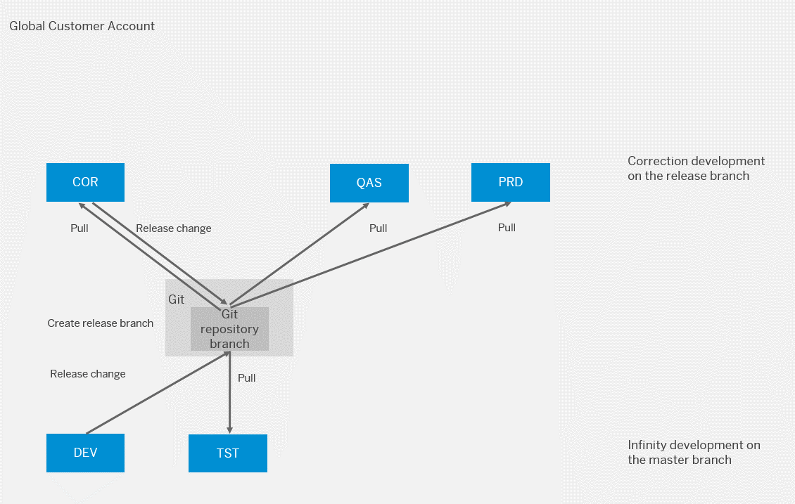

<!-- loio4e53874043e544ce8f41fea26f674134 -->

# Use Case 2: One Development and Correction Codeline in a 5-ABAP-System Landscape

You can apply this setup if you have permanent/infinite development activities for large applications with many developers, where development cannot be paused to implement an urgent correction. Corrections need to run in parallel to development and on a released state. You need to separate testing from development to ensure the solutions also runs in a non-development ABAP system before being delivered to production. 

General considerations:

-   ABAP systems COR and QAS have the same software state as the production ABAP system PRD, unless a new change is tested and released. This means transport requests are released in the DEV ABAP system only if development is completed and it is planned to import the changes to the production ABAP system.
-   Releases are planned and communicated to development in advance:
    -   Upon cutoff date, development is finished. All development that is released at this time must be tested and be of good quality. From then on, you have to fix defects in the COR system and maintain them in parallel in the DEV system.
    -   Upon release date, all defects must be fixed. If you make the decision during testing in the QAS system that a complete functionality is not delivered, developers must delete, revert, or disable the functionality in the COR system and release the corresponding transport requests. You cannot remove objects from the release branch, e.g. by deselecting transport requests. To revert objects to an older transported state, use the compare editor of the Eclipse *History* view. If the withdrawal of the functionality shall be performed in the DEV system as well it is considered as a correction and you have to perform double maintenance of corrections into the DEV system. The released software state from the COR system is imported into the production ABAP system\(s\) PRD
-   ABAP system COR is usually locked for development. First, this means developers cannot do changes by default and there are two approaches how to handle this:

<table>
<tr>
<th>

 

</th>
<th>

User Locking

</th>
<th>

Read-Only + Write Developer Role

</th>
</tr>
<tr>
<td>

How-to Details

</td>
<td>

Unlock user on demand

</td>
<td>

Assign write role on demand

</td>
</tr>
<tr>
<td>

Pros

</td>
<td>

No additional role needed

</td>
<td>

No generic read user needed

No logon with different user for read access needed

User-specific auditing

</td>
</tr>
<tr>
<td>

Cons

</td>
<td>

Generic read user needed if you want to provide read access

</td>
<td>

Additional role needed

</td>
</tr>
</table>

Second, developers are also not allowed to create transport requests and tasks on their own, but it’s the release manager who creates them for all developers. This separation is achieved by giving business catalog `SAP_A4C_BC_TRN_MNG_PC` \(Development - Transport Management\) to the release manager instead of the developer role in the correction ABAP system COR.

<a name="loio4e53874043e544ce8f41fea26f674134__section_rhr_jv5_wlb"/>

## For Go Live/Development after Go Live \(Including Deferrable Corrections\)

**Starting Situation for Go Live:**

Recently created development ABAP system DEV and other already existing ABAP systems cannot be based on some branch yet, as the software component does not exist yet.

The Go Live process is characterized by creating different systems only when needed for the first time, however, you can provision the ABAP systems already beforehand. Additionally, the future solution’s software component does not exist from the start. The resulting release branch is YYYY-01. Apart from this, the Go Live process does not differ from the release development processes.

**Starting Situation after Go Live:**

-   Development ABAP system DEV and test ABAP system TST are on the main branch
-   Correction ABAP system COR, quality assurance ABAP system QAS, and production ABAP system PRD are on release branch YYYY-<nn\>

This process can also be used for deferrable corrections, which do not need to reach production before the next development release. These corrections are handled like normal development.

<table>
<tr>
<th>

Step

</th>
<th>

System

</th>
<th>

Role

</th>
<th>

Task

</th>
<th>

Tool

</th>
</tr>
<tr>
<td>

0

</td>
<td>

DEV

</td>
<td>

Release Manager

</td>
<td>

At Go Live only: Create a software component and pull it initially

</td>
<td>

Manage Software Components app

</td>
</tr>
<tr>
<td>

1

</td>
<td>

DEV

</td>
<td>

Developer

</td>
<td>

Develop a new functionality or a deferrable correction. All changes are collected in transport requests

</td>
<td>

ADT for Eclipse

</td>
</tr>
<tr>
<td>

2

</td>
<td>

DEV

</td>
<td>

Developer

</td>
<td>

Once development is finished, release the transport request. The changes are now in the main branch

</td>
<td>

ADT for Eclipse: Transport Organizer view

</td>
</tr>
<tr>
<td>

3

</td>
<td>

TST

</td>
<td>

Release Manager

</td>
<td>

Pull the software component into system TST

</td>
<td>

Manage Software Components app

</td>
</tr>
<tr>
<td>

4

</td>
<td>

TST

</td>
<td>

Tester

</td>
<td>

Test the change and report the test result

</td>
<td>

ADT for Eclipse and custom SAP Fiori apps as well as external test tools

External documentation tool

</td>
</tr>
<tr>
<td>

 

</td>
<td>

 

</td>
<td>

 

</td>
<td>

If changes are required, repeat steps 1-4

</td>
<td>

 

</td>
</tr>
<tr>
<td>

5

</td>
<td>

QAS or any other

</td>
<td>

Release Manager

</td>
<td>

Cutoff: at cutoff date, create a release branch YYYY-<nn+1\> \(at Go Live: YYYY-01\) \(release candidate\)

</td>
<td>

Manage Software Components app

</td>
</tr>
<tr>
<td>

6

</td>
<td>

QAS

</td>
<td>

Release Manager

</td>
<td>

Check out the release branch YYYY-<nn+1\> \(at Go Live: YYYY-01\) into system QAS

</td>
<td>

Manage Software Components app

</td>
</tr>
<tr>
<td>

7

</td>
<td>

QAS

</td>
<td>

Tester

</td>
<td>

Test the release candidate and report the test result

</td>
<td>

ADT for Eclipse with ADT and custom SAP Fiori apps as well as external test tools

External documentation tool

</td>
</tr>
<tr>
<td>

8

</td>
<td>

COR

</td>
<td>

Release Manager

</td>
<td>

Check out the branch YYYY-<nn+1\> \(at Go Live: YYYY-01\) into system COR

</td>
<td>

Manage Software Components app

</td>
</tr>
<tr>
<td>

9

</td>
<td>

COR

</td>
<td>

Release Manager

</td>
<td>

Enable the respective development users for development in system COR, depending on the process you decided for, either by unlocking or assigning a different role

</td>
<td>

Manage Business Users app

</td>
</tr>
<tr>
<td>

10

</td>
<td>

COR

</td>
<td>

Developer

</td>
<td>

Implement the correction

</td>
<td>

ADT for Eclipse

</td>
</tr>
<tr>
<td>

11

</td>
<td>

COR

</td>
<td>

Release Manager

</td>
<td>

Release the transport request. The changes are now in the release candidate.

</td>
<td>

ADT for Eclipse: Transport Organizer

</td>
</tr>
<tr>
<td>

12

</td>
<td>

QAS

</td>
<td>

Release Manager

</td>
<td>

Pull the software component to get the correction into the already checked out release branch YYYY-<nn+1\> \(@Go Live: YYYY-01\)

</td>
<td>

Manage Software Components app

</td>
</tr>
<tr>
<td>

13

</td>
<td>

QAS

</td>
<td>

Tester

</td>
<td>

Test the change and report the test result

</td>
<td>

ADT for Eclipse and custom SAP Fiori apps as well as external test tools

External documentation tool

</td>
</tr>
<tr>
<td>

 

</td>
<td>

 

</td>
<td>

 

</td>
<td>

If changes are required, repeat steps 11-13

</td>
<td>

 

</td>
</tr>
<tr>
<td>

14

</td>
<td>

QAS

</td>
<td>

Release Manager

</td>
<td>

Release decision: the changes are successfully tested and approved

</td>
<td>

External documentation tool

</td>
</tr>
<tr>
<td>

15

</td>
<td>

PRD

</td>
<td>

Release Manager

</td>
<td>

Check out the release branch YYYY-<nn+1\> \(at GoLive: YYYY-01\) into system PRD

</td>
<td>

Manage Software Components app

</td>
</tr>
<tr>
<td>

16

</td>
<td>

COR

</td>
<td>

Release Manager

</td>
<td>

Disable the respective development users for development in system COR

</td>
<td>

Manage Business Users app

</td>
</tr>
<tr>
<td>

17

</td>
<td>

DEV

</td>
<td>

Developer

</td>
<td>

Perform the same changes as for the correction in the main branch and release them

</td>
<td>

ADT for Eclipse

</td>
</tr>
<tr>
<td>

18

</td>
<td>

TST

</td>
<td>

Release Manager

</td>
<td>

Pull the software component to get the correction into the already checked out main branch

</td>
<td>

Manage Software Components app

</td>
</tr>
</table>

<a name="loio4e53874043e544ce8f41fea26f674134__section_b22_5z5_wlb"/>

## Skipping a Release

If issues during the test phase of YYYY-<nn+1\> cannot be fixed in a reasonable time frame until the next release date, you can skip that release, especially if you have a tight release schedule \(“continuous delivery” model\). In that case, you have to perform double maintenance for the unfinished corrections from YYYY-<nn+1\> in the main branch of the development ABAP system, release them, and create the new release branch YYYY-<nn+2\> derived from that main branch. That way, branch YYYY-<nn+2\> contains finished new development as well as the unfinished corrections from branch YYYY-<nn+1\>. Afterwards, you can bring system COR and QAS to branch YYYY-<nn+2\> and continue with that.

> ### Note:  
> Branches cannot be deleted or marked as obsolete. Therefore, it’s important to use other tools to inform consumers about not using branch YYYY-<nn+1\>.

<a name="loio4e53874043e544ce8f41fea26f674134__section_vck_wz5_wlb"/>

## Urgent Corrections

**The starting situation:** 

-   Development ABAP system DEV and test ABAP system TST are on the main branch

-   Correction ABAP system COR, quality assurance ABAP system QAS, and production ABAP system PRD are on release branch YYYY-<nn\>

This process is a subset of the previous development process and can be applied to corrections that are too urgent to release with the next development release.

<table>
<tr>
<th>

Step

</th>
<th>

System

</th>
<th>

Role

</th>
<th>

Task

</th>
<th>

Tool

</th>
</tr>
<tr>
<td>

1

</td>
<td>

COR

</td>
<td>

Release Manager

</td>
<td>

Enable the respective development users for development in system COR, depending on the process you decided for, either by unlocking or assigning a different role.

</td>
<td>

Manage Business Users app

</td>
</tr>
<tr>
<td>

2

</td>
<td>

COR

</td>
<td>

Developer

</td>
<td>

Create a transport request and implement the correction

</td>
<td>

ADT for Eclipse

</td>
</tr>
<tr>
<td>

3

</td>
<td>

COR

</td>
<td>

Release Manager

</td>
<td>

Release the transport request. The changes are now in the release candidate

</td>
<td>

ADT for Eclipse: Transport Organizer

</td>
</tr>
<tr>
<td>

4

</td>
<td>

QAS

</td>
<td>

Release Manager

</td>
<td>

Pull the already checked out branch YYYY-<nn+1\> into QAS

</td>
<td>

Manage Software Components app or external tool calling the pull service of communication scenario `Test Integration`

</td>
</tr>
<tr>
<td>

5

</td>
<td>

QAS

</td>
<td>

Tester

</td>
<td>

Test the change and report the test result

</td>
<td>

ADT for Eclipse and custom SAP Fiori apps as well as external test tools

External documentation tool

</td>
</tr>
<tr>
<td>

 

</td>
<td>

 

</td>
<td>

 

</td>
<td>

If changes are required, repeat steps 2-5

</td>
<td>

 

</td>
</tr>
<tr>
<td>

6

</td>
<td>

QAS

</td>
<td>

Release Manager

</td>
<td>

As the correction was successfully tested before it gets approved now.

</td>
<td>

External documentation tool

</td>
</tr>
<tr>
<td>

7

</td>
<td>

PRD

</td>
<td>

Release Manager

</td>
<td>

Pull the already checked out release branch YYYY-<nn+1\> into system PRD

</td>
<td>

Manage Software Components app

</td>
</tr>
<tr>
<td>

8

</td>
<td>

COR

</td>
<td>

Release Manager

</td>
<td>

Disable the respective development users for development in system COR

</td>
<td>

Manage Business Users app

</td>
</tr>
<tr>
<td>

9

</td>
<td>

DEV

</td>
<td>

Developer

</td>
<td>

Perform the same changes as for the correction in the main branch and release them

</td>
<td>

ADT for Eclipse

</td>
</tr>
<tr>
<td>

10

</td>
<td>

TST

</td>
<td>

Release Manager

</td>
<td>

Pull the software component to get correction into already checked out main branch

</td>
<td>

Manage Software Components app

</td>
</tr>
</table>

