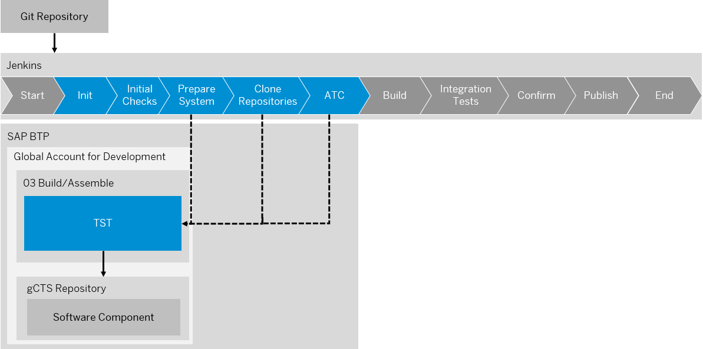
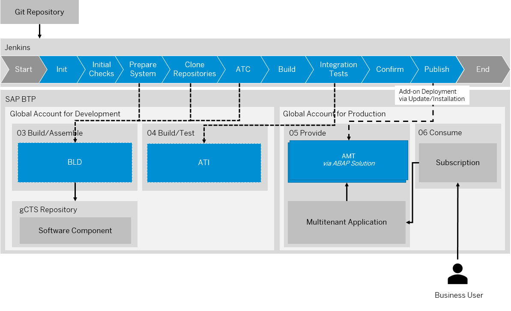

<!-- loio2398b874f7c5445db188b780ff0cef89 -->

# ABAP Environment Pipeline

The goal of the ABAP environment pipeline is to enable continuous integration for the ABAP environment.

The pipeline contains several stages and currently supports two relevant scenarios:

-   Add-on build using AAKaaS

-   Continuous testing via gCTS

A pipeline definition, containing all configuration, and a running CI/CD server are required to execute the ABAP environment pipeline. You can consume the different scenarios by enabling different pipeline stages in the configuration. For more information on how to configure the ABAP environment steps and stages, see [Configuration](https://www.project-piper.io/pipelines/abapEnvironment/configuration/) and [ABAP Environment Pipeline](https://www.project-piper.io/pipelines/abapEnvironment/introduction/).

The Landscape Portal offers the option to configure and execute the add-on build scenario using the [Build Product Version](https://help.sap.com/docs/help/d91c4152c3d74c12bc9bd4ed92681902/0c40cc527b15450c9211c3cff0188296.html) app, without the need for external repositories or Jenkins servers.

> ### Note:  
> The *Continuous Testing* scenario is currently not supported by the Landscape Portal. This means that a running Jenkins server is required, even when using the Build Product Version app. See [Add-On or gCTS](https://help.sap.com/docs/btp/sap-business-technology-platform/delivery-via-add-on-or-gcts?version=Cloud).

### Jenkins Setup

> ### Note:  
> This is only required for running the Continuous Testing scenario. The add-on build scenario can be realized using the Build Product Version app in the Landscape Portal.

The general configuration of the ABAP environment pipeline always follows the same approach regardless of the scenario that you want to configure:

1.  **Prepare Git Repository**

    As a DevOps engineer, you need to prepare a Git repository by including the Jenkins file, initializing the pipeline, and the pipeline configuration file `.pipeline/config.yml`. See [Jenkins File](https://sap.github.io/jenkins-library/pipelines/abapEnvironment/configuration/#2-jenkinsfile) and [Technical Pipeline Configuration](https://sap.github.io/jenkins-library/pipelines/abapEnvironment/configuration/#6-technical-pipeline-configuration).

2.  **Create Service User for Git Repository**

    To enable read access to the Git repository, you need to create a service user and assign it to the repository. Later, this user’s access credentials are stored in the Jenkins credentials by the Jenkins administrator. See [Using Credentials](https://www.jenkins.io/doc/book/using/using-credentials/).

3.  **Create Jenkins Instance**

    As a Jenkins administrator, you need to set up a new Jenkins instance. See [Custom Jenkins Setup](https://www.project-piper.io/infrastructure/overview/) and [Docker Hub](https://hub.docker.com/u/ppiper).

4.  **Configure Jenkins Instance**

    As a Jenkins administrator, you need to add technical Git user credentials and platform user credentials to the integrated secure store. Make sure that a shared library piper-lib-os is configured pointing to the project "Piper" library. See [Piper Library](https://github.com/SAP/jenkins-library.git).

For more information on how to configure the ABAP environment steps and stages, see [Configuration](https://sap.github.io/jenkins-library/pipelines/abapEnvironment/configuration/).

<a name="loio2398b874f7c5445db188b780ff0cef89__section_e1g_1lj_grb"/>

## Transport from DEV to TST System via gCTS

Development system DEV and test system TST stay on the same main branch. To make the latest implementations available in the test system, the developed software components can be imported on a regular basis to test system TST and tested using the ABAP Test Cockpit by scheduling a planned execution of the ABAP environment pipeline. See [Continuous Testing on SAP BTP ABAP Environment](https://www.project-piper.io/scenarios/abapEnvironmentTest/) and [Running ATC Checks and ABAP Unit Tests on a Static ABAP Environment System](https://github.com/SAP-samples/abap-platform-ci-cd-samples/tree/atc-static).

The ABAP environment pipeline is executed in a Jenkins server that is connected to subaccount *02 Test* in the global account for development by authenticating via a technical Cloud Foundry platform user. The permanent test system TST is used to import software components and run ABAP Test Cockpit checks.

<a name="loio2398b874f7c5445db188b780ff0cef89__section_jcq_bhj_grb"/>

## Build Add-On Version

The ABAP environment pipeline can automate the build and assembly process of ABAP add-ons. From creating the delivery packages in the assembly system to publishing the add-on release, all steps are part of this pipeline.

This scenario can be run in the Landscape Portal using the [Build Product Version](https://help.sap.com/docs/help/d91c4152c3d74c12bc9bd4ed92681902/0c40cc527b15450c9211c3cff0188296.html) app, or it can be configured manually and run on a local Jenkins server. In both cases, the same pipeline stages will be executed.

See [Build and Publish Add-on Products on SAP BTP ABAP Environment](https://www.project-piper.io/scenarios/abapEnvironmentAddons/).

The ABAP environment  pipeline is executed in a Jenkins server that is connected to subaccount *03 Build/Assemble* and *04 Build/Test* in the global account for development by authenticating via a technical Cloud Foundry platform user. Transient systems are then provisioned for add-on assembly \(BLD\) and installation tests \(ATI\).

**Add-On Assembly System**

Add-on assembly system BLD includes an instance of communication scenario `SAP_COM_0948` and an instance of communication scenario `SAP_COM_0582`. See SAP\_COM\_0948 and [Software Assembly Integration \(SAP\_COM\_0582\)](software-assembly-integration-sap-com-0582-26b8df5.md). Service keys with parameters referring to the communication scenarios are created in the BLD system, which leads to the creation of communication arrangements that can be used by the pipeline for inbound communication.

In the **Prepare System** pipeline stage, a new transient system BLD is provisioned for the add-on assembly. See [Prepare System](https://www.project-piper.io/pipelines/abapEnvironment/stages/prepareSystem/). ABAP Test Cockpit checks, software component imports, and the local build of deliveries are performed in this stage. By default, the system is deleted again in the **Post** pipeline stage. See [Post](https://www.project-piper.io/pipelines/abapEnvironment/stages/post/).

The communication with remote components is enabled via communication scenario SAP\_COM\_0948 and communication scenario [Software Assembly Integration \(SAP COM 0582\)](https://help.sap.com/docs/btp/sap-business-technology-platform/software-assembly-integration-sap-com-0582?version=Cloud).

By default, the system is created from scratch for each new add-on version. You can choose to reuse a permanent BLD system instead of provisioning a new one each time. This has the advantage of reducing the pipeline execution time, as system provisioning is one of the most time-consuming tasks. See [Build Add-Ons on a Permanent ABAP Environment System](https://github.com/SAP-samples/abap-platform-ci-cd-samples/tree/addon-build-static).

To reduce costs, it is recommended that you shut down the permanent system when no builds are scheduled. See [Manage System Hibernation](https://help.sap.com/docs/help/d91c4152c3d74c12bc9bd4ed92681902/cf4fa759888745889152bfba5e1e7833.html). Please note that hibernated systems still incur costs.

You can decide in detail whether to use a permanent or transient assembly system based on following criteria:

<table>
<tr>
<th valign="top">

 

</th>
<th valign="top">

Transient Assembly System

</th>
<th valign="top">

Permanent Assembly System

</th>
</tr>
<tr>
<td valign="top">

Pros

</td>
<td valign="top">

-   If additional dependencies to objects outside the modeled product exist, they will be transparent as import errors

</td>
<td valign="top">

-   API Snapshots are automatically created locally, can be downloaded for use in other systems, and remain in the system for continuous API compatibility checks
-   Reduced time consumed for add-on build as no new assembly system needs to be provisioned
-   Local history of ABAP objects, transport piece lists, deliveries, transport logs etc. remains available in the system for trouble shooting and error analysis

</td>
</tr>
<tr>
<td valign="top">

Contras

</td>
<td valign="top">

-   API Snapshots are only created locally and thus deleted once a system is deprovisioned. Therefore, API compatibility checks cannot be used. Snapshots can be downloaded for use in other systems, but only while the system exists.
-   A new assembly system needs to be provisioned for each new add-on build, software components need to be cloned from scratch – resulting in longer runtime
-   Local history of ABAP objects, transport piece lists, deliveries, transport logs etc. is not available after the assembly system is deprovisioned

</td>
<td valign="top">

-   Import errors during gCTS operations must be resolved to always guarantee the software component state in the system to be consistent with the remote repository
-   Dependencies to objects outside the modeled product might exist, so there is no guarantee to reveal unwanted dependencies

</td>
</tr>
</table>

> ### Note:  
> In case of dependencies between software components that are facilitated trough the creation of released APIs, it is recommended to use a permanent assembly system. Only then the API compatibility checks can function properly based on the API snapshots that are required to remain in the system. See [Released APIs and API Snapshots](https://help.sap.com/docs/btp/sap-business-technology-platform/concepts?version=Cloud#released-apis-and-api-snapshots).

> ### Tip:  
> You may reuse existing permanent test systems like TST or quality assurance system QAS as alternative for the assembly system BLD. If you choose to do so, make sure that there are no ongoing activities like software component lifecycle actions. See [System Landscape/Account Model](https://help.sap.com/docs/btp/sap-business-technology-platform/concepts?version=Cloud#system-landscape-account-model).
> 
> In such a case also the manual creation of API snapshots in those systems becomes obsolete as the add-on build pipeline will automatically create such snapshots and set them as check-relevant. See [Released APIs and API Snapshots](https://help.sap.com/docs/btp/sap-business-technology-platform/concepts?version=Cloud#released-apis-and-api-snapshots).

**Add-on Installation Test System**

To verify that the delivery packages included in the add-on product version are installable, a target vector is published in "test" scope during the **Build** stage.

In the **Integration Tests** pipeline stage, a new transient system ATI is then provisioned for an add-on deployment test that installs the add-on product version. See [Integration Tests](https://www.project-piper.io/pipelines/abapEnvironment/stages/integrationTest/). After the successful add-on installation is confirmed, the system is deleted, unless otherwise specified.

For generation and syntax check, please take a look at communication scenario [Software Assembly Integration \(SAP\_COM 0582\)](https://help.sap.com/docs/sap-btp-abap-environment/abap-environment/software-assembly-integration-sap-com-0582?version=Cloud).

By default the ATI system is not created from scratch for each new add-on version. If you configure your pipeline manually, you can choose not to dismantle the ATI system automatically after the import test. This is intended to be able to analyze issues in this system in case they cannot be solved by the pipeline log output. Do not forget to delete the system manually prior to the next implementation of the pipeline. Otherwise it is reused. Reusing the system would save runtime as no new system would need to be provisioned but not all issues which should be detected by this installation test would be detectable anymore.

**Add-on Assembly Kit as a Service**

The Add-on Assembly Kit as a Service \(AAKaaS\) is used for registering and publishing the software product.

The service is offered in the SAP Service and Support systems, which means that access is granted via a technical communication user that packs the delivery into an importable package format. It is similar to the Software Delivery Assembler \(SDA, transaction SSDA\) as a part of the SAP Add-On Assembly Kit. See [SAP Add-On Assembly Kit](https://help.sap.com/viewer/product/SAP_ADD-ON_ASSEMBLY_KIT/) and  [Add-On Assembly Kit as a Service](https://sap.github.io/jenkins-library/scenarios/abapEnvironmentAddons/#add-on-assembly-kit-as-a-service-aakaas).

**Add-on Consumption**

For the consumption of the add-on as a SaaS solution, software components are installed via add-on delivery packages into multitenancy-enabled production systems \(AMT\) provisioned via the ABAP Solution service. This is orchestrated via a multi-tenant application deployed to the Cloud Foundry environment on SAP BTP. See [Multitenant Application](https://help.sap.com/docs/btp/sap-business-technology-platform/multitenant-application?version=Cloud) and [Deploy](https://help.sap.com/docs/btp/sap-business-technology-platform/saas-apps-order-and-provide?version=Cloud#deploy).

> ### Note:  
> If you need support or experience issues during the add-on build, see [Troubleshooting](https://www.project-piper.io/scenarios/abapEnvironmentAddons/#troubleshooting).

