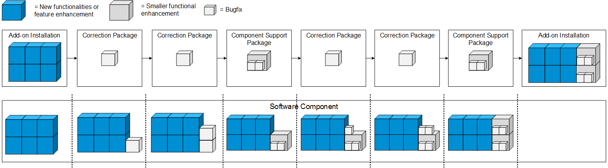

<!-- loio398be26971414fbb91cbe3b0a3cb8a26 -->

# Add-On Package Types

For the delivery of add-on packages, there are three package types that serve different purposes: AOI, CSP, and CPK.

The different add-on package types are used for different purposes. The set of objects to be included depends on the package type.

> ### Note:  
> The required type of delivery is automatically determined by the delivery production tools based on how the version number of software components is changed.

### AOI \(Add-On Installation\)

Delivery packages of type Add-on Installation \(AOI\) are created for all new release versions, e.g. version 1.0.0, and should be used to deliver new functionalities or feature enhancements.

These delivery packages include all the objects in the software component and are usually created on a regular basis \(e.g. quarterly\).

### CSP \(Component Support Package\)

Delivery packages of type Component Support Package \(CSP\) are created for all new support package deliveries, e.g. version 1.1.0, and should be used to deliver a collection of patch deliveries or to deliver smaller functional enhancements.

These delivery packages include either the objects that were changed since the previous release delivery or since the previous support package delivery. They are usually created on a regular basis \(e.g. bi-weekly\).

### CPK \(Correction Package\)

Delivery packages of type Correction Package \(CPK\) are created for all new patch deliveries, e.g. version 1.0.1, and should be used to deliver bugfixes.

These delivery packages include only those objects that were changed since the previous patch delivery and are only created when necessary \(e.g. emergency patch\).

For more information on the add-on package types and how these are determined based on changes to the software component version, see [Software Component Version](https://sap.github.io/jenkins-library/scenarios/abapEnvironmentAddons/#software-component-version).

