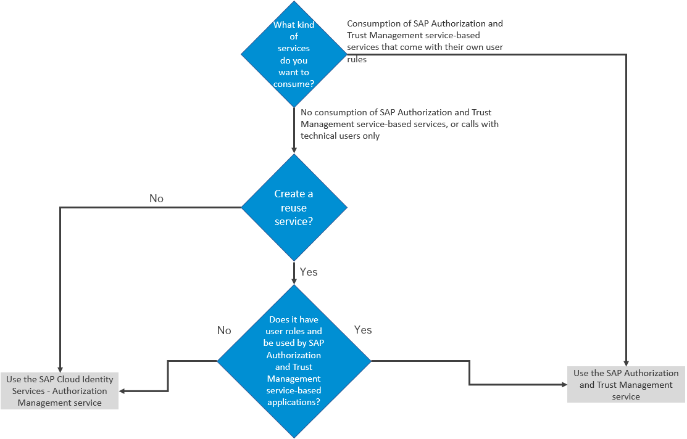

<!-- loio419ae2ef1ddd49dca9eb65af2d67c6ec -->

# Adding Authentication and Authorization

Developers create authorization information for business users in their environment and deploy this information in an application. They make this available to administrators, who complete the authorization setup and assign the authorizations to business users.

Developers store authorization information as design-time role templates in the `xs-security.json` security descriptor file. Using the cockpit, administrators of the environment assign the authorizations to business users.

The following sections contain the process of adding authentication and authorization checks for protecting your applications, links to a number of associated tutorials, extended tasks for creating authorization artifacts, as well as reference information, including the syntax required to set the properties and values defined in the application security descriptor file.

<a name="loio419ae2ef1ddd49dca9eb65af2d67c6ec__section_j5s_ntw_bzb"/>

## Using the SAP Authorization and Trust Management service or the SAP Cloud Identity Services

SAP BTP is currently replacing the authorization management done by the SAP Authorization and Trust Management service, with an integrated solution with the SAP Cloud Identity Services - Authorization Management service. This service is integrated into the SAP Cloud Identity Services, which will offer authentication, authorization, user provisioning and management in one place.

Currently, there are still use cases where the usage of the old model with the SAP Authorization and Trust Management service is simpler when it comes to the technical setup, especially in the administration for business users.

For decision considerations on when to use the SAP Authorization and Trust Management service and when to use the SAP Cloud Identity Services - Authorization Management service as the authorization management system on SAP BTP, you can follow this decision tree that will be regularly updated:

Developers use the Cloud Application Programming model for authorization policies. For more information, see [Authorization and Access Control](https://cap.cloud.sap/docs/guides/authorization).

<a name="loio419ae2ef1ddd49dca9eb65af2d67c6ec__section_vpw_kr3_snb"/>

## Protecting Your Application

Application security is maintained in the application security descriptor file \(`xs-security.json`\). You can use this file to define application-based security artifacts, which are the building blocks for authorizations. In this section, you can learn how to create this file and use it to create a service instance of the SAP Authorization and Trust Management service. Following this single tenant scenario, move on in increasing complexity to procedures that depict how to propagate user information between applications or services, add multitenancy to your application, and set up instance-based authorizations.

<a name="loio419ae2ef1ddd49dca9eb65af2d67c6ec__section_qhn_5t3_snb"/>

## Tutorials for Authentication and Authorizations

Use tutorials to get familiar with the SAP Authorization and Trust Management service in the Cloud Foundry environment of SAP BTP.

For more information, see [Tutorials for the SAP Authorization and Trust Management Service](tutorials-for-the-sap-authorization-and-trust-management-service-902ae80.md).

<a name="loio419ae2ef1ddd49dca9eb65af2d67c6ec__section_ipn_cs3_snb"/>

## Tasks On Demand

Here you can find information regarding accessing the UAA admin APIs for creating XSUAA artifacts, as well as the process of configuring redirect URLs.

In addition, as an application developer, you may want to create role collections for immediate use. For example, to deliver role collections that administrators can use in the SAP BTP cockpit and easily assign to users in an onboarding process.

For more information, see [Create Role Collections with Predefined Roles](create-role-collections-with-predefined-roles-fe75054.md).

<a name="loio419ae2ef1ddd49dca9eb65af2d67c6ec__section_fld_rs3_snb"/>

## Reference Information

For the syntax required to set the properties and values defined in the application security descriptor file \(`xs-security.json`\), see [Application Security Descriptor Configuration Syntax](application-security-descriptor-configuration-syntax-517895a.md).

**Related Information**  

[SAP Authorization and Trust Management Service](../60-security/sap-authorization-and-trust-management-service-6373bb7.md "The global account and subaccounts get their users from identity providers. Administrators make sure that users can only access their dedicated subaccount by making sure that there is a dedicated trust relationship only between the identity providers and the respective subaccounts. Developers configure and deploy application-based security artifacts containing authorizations, and administrators assign these authorizations using the SAP BTP cockpit.")

 <?sap-ot O2O class="- topic/link " href="982ac5f91d2346fda8dd8096e861fc36.xml" text="" desc="" xtrc="link:2" xtrf="file:/home/builder/src/dita-all/jjq1673438782153/loio2080d0faf9d84ce6aa14caa4caa32935_en-US/src/content/localization/en-us/419ae2ef1ddd49dca9eb65af2d67c6ec.xml" output-class="" outputTopicFile="file:/home/builder/tp.net.sf.dita-ot/2.3/plugins/com.elovirta.dita.markdown_1.3.0/xsl/dita2markdownImpl.xsl" ?> 

