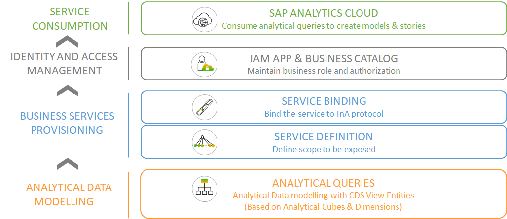

<!-- loio4ae5db4d9bfd472ba70613b358dbb16b -->

# Analytical Data Modeling & Live Data Connection to SAP Analytics Cloud

As an ABAP environment developer with your own standalone SAP Analytics Cloud \(SAC\) tenant, you can use analyical queries that reside in your ABAP environment system as data sources for a SAC story.

The new RAP-based Information Access \(InA\) service exposure enables ABAP environment developers to create analytical queries that are based on ABAP-CDS analytical data models, and expose them via the InA service protocol. These analytical queries can then be consumed in SAP Analytics Cloud \(SAC\) to create analytical models, stories, KPIs, multi-dimentional reports, and more. For information on how to integrate SAP Analytics Cloud, see [Integrating SAP Analytics Cloud](../50-administration-and-ops/integrating-sap-analytics-cloud-587aec4.md).

This guide provides you with all the information you need to get started, explains the concepts and gives detailed step-by-step instructions for the entire process, from start to finish.

