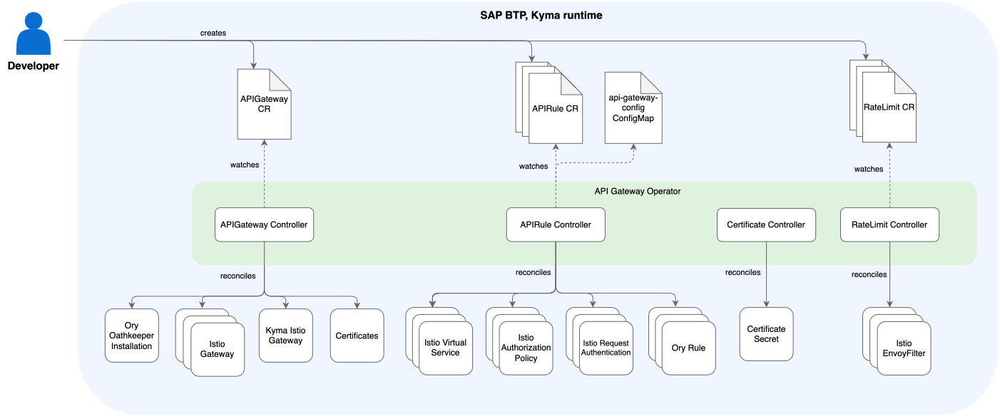

<!-- loiof323ab16595a47779bc74344969c0133 -->

# API Gateway Module

Use the API Gateway module to expose and secure APIs.

> ### Caution:  
> The APIRule CustomResourceDefinition \(CRD\) in version `v1beta1` has been deprecated and scheduled for deletion. If you use APIRule custom resources \(CRs\) `v1beta1`, you must migrate to version `v2`. See [APIRule Migration](apirule-migration-f8df238.md).

<a name="loiof323ab16595a47779bc74344969c0133__section_h2t_yq2_qbc"/>

## What Is API Gateway?

API Gateway is a Kyma module with which you can expose and secure APIs.

To use the API Gateway module, you must also add the Istio module. Moreover, to expose a workload using the APIRule custom resource, the workload must be part of the Istio service mesh.

By default, both the API Gateway and Istio modules are added when you create a Kyma runtime instance.

<a name="loiof323ab16595a47779bc74344969c0133__section_prg_1r2_qbc"/>

## Features

The API Gateway module offers the following features:

-   **API Exposure**: The module uses Istio features to help you easily and securely expose your workloads by creating APIRule custom resources. With an APIRule, you can perform the following actions:
    -   Group multiple workloads and expose them under a single host.
    -   Use a short host name to simplify the migration of resources to a new cluster.
    -   Configure the `noAuth` access strategy, which offers a simple configuration to allow access to specific HTTP methods.
    -   Secure your workloads by configuring `jwt` or `extAuth` access strategies. The **jwt** access strategy enables you to use Istio’s JWT configuration to protect your exposed services and interact with them using JSON Web Tokens. The `extAuth` access strategy allows you to implement custom authentication and authorization logic.

-   **Gateway configuration**:
    -   The module sets up the default TLS Kyma Gateway, which uses the default domain of your Kyma cluster and a self-signed certificate.
    -   The module allows you to configure a custom Gateway, which is recommended for production environments. Additionally, it enables you to expose workloads using a custom domain and DNSEntry.

-   **Rate Limiting**: The module simplifies local rate limiting on the Istio service mesh layer. You can configure it using a straightforward RateLimit custom resource.

<a name="loiof323ab16595a47779bc74344969c0133__section_ixg_1r2_qbc"/>

## Architecture

### API Gateway Operator

Within the API Gateway module, API Gateway Operator manages the application of API Gateway’s configuration and handles resource reconciliation. It contains the following controllers: APIGateway Controller, APIRule Controller, and RateLimit Controller.

### APIGateway Controller

APIGateway Controller is responsible for the following:

-   Configuring Kyma Gateway
-   Managing Certificate and DNSEntry resources

### APIRule Controller

APIRule Controller uses [Istio](https://istio.io/) resources to expose and secure APIs.

### Certificate Controller

Certificate Controller is responsible for handling the Secret `api-gateway-webhook-certificate` in the `kyma-system` namespace. This Secret contains the Certificate data required for the APIRule conversion webhook.

### RateLimit Controller

RateLimit Controller manages the configuration of local rate limiting on the Istio service mesh layer. By creating a RateLimit custom resource \(CR\), you can limit the number of requests targeting an exposed application in a unit of time, based on specific paths and headers.

<a name="loiof323ab16595a47779bc74344969c0133__section_j3q_qr2_qbc"/>

## API/Custom Resource Definitions

The `apigateways.operator.kyma-project.io` CRD describes the APIGateway CR that APIGateway Controller uses to manage the module and its resources. See [APIGateway Custom Resource](https://kyma-project.io/#/api-gateway/user/custom-resources/apigateway/04-00-apigateway-custom-resource).

The `apirules.operator.kyma-project.io` CRD describes the APIRule CR that APIRule Controller uses to expose and secure APIs. See [APIRule Custom Resource](https://kyma-project.io/#/api-gateway/user/custom-resources/apirule/README).

The `ratelimits.gateway.kyma-project.io` CRD describes the kind and the format of data that RateLimit Controller uses to configure the request rate limits for applications. See [RateLimit Custom Resource](https://kyma-project.io/#/api-gateway/user/custom-resources/ratelimit/04-00-ratelimit).

<a name="loiof323ab16595a47779bc74344969c0133__section_u2c_qr2_qbc"/>

## Resource Consumption

To learn more about the resources used by the API Gateway module, see [Kyma Modules’ Sizing](https://help.sap.com/docs/btp/sap-business-technology-platform-internal/kyma-modules-sizing?locale=en-US&state=DRAFT&version=Internal&comment_id=22217515&show_comments=true#api-gateway).

**Related Information**  

[kyma-project.io: API Gateway troubleshooting guides](https://kyma-project.io/#/api-gateway/user/troubleshooting-guides/README)

[kyma-project.io: API Gateway tutorials](https://kyma-project.io/#/api-gateway/user/tutorials/README)

[Ory Oathkeeper Introduction](https://www.ory.sh/docs/oathkeeper)

[Istio](https://istio.io/)

