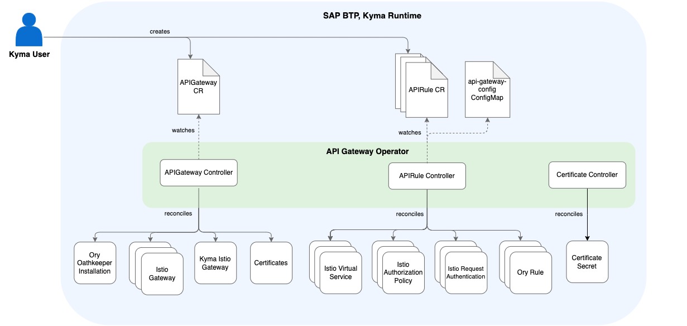

<!-- loiof323ab16595a47779bc74344969c0133 -->

# API Gateway Module

Use the API Gateway module to expose and secure APIs.

<a name="loiof323ab16595a47779bc74344969c0133__section_h2t_yq2_qbc"/>

## What Is API Gateway?

API Gateway is a Kyma module with which you can expose and secure APIs.

To use the API Gateway module, you must also add the Istio module. By default, both the API Gateway and Istio modules are added when you create a Kyma runtime instance.

<a name="loiof323ab16595a47779bc74344969c0133__section_prg_1r2_qbc"/>

## Features

The API Gateway module offers the following features:

-   Ory Oathkeeper installation: The module simplifies and manages the installation of Ory Oathkeeper.
-   API Exposure: The module combines Ory Oathkeeper and Istio capabilities to offer the APIRule CustomResourceDefinition \(CRD\). By creating APIRule custom resources \(CRs\), you can easily and securely expose your workloads.
-   Kyma Gateway installation: The module installs the default simple TLS Kyma Gateway.

<a name="loiof323ab16595a47779bc74344969c0133__section_ixg_1r2_qbc"/>

## Architecture

### API Gateway Operator

Within the API Gateway module, API Gateway Operator manages the application of API Gateway’s configuration and handles resource reconciliation. It contains two controllers: APIGateway Controller and APIRule Controller.

### APIGateway Controller

APIGateway Controller manages the installation of Ory Oathkeeper and handles the configuration of Kyma Gateway and the resources defined in the APIGateway CR. The controller is responsible for:

-   Installing, upgrading, and uninstalling Ory Oathkeeper
-   Configuring Kyma Gateway
-   Managing Certificate and DNSEntry resources

### APIRule Controller

APIRule Controller uses Ory Oathkeeper and Istio resources to expose and secure APIs.

### Certificate Controller

Certificate Controller is responsible for handling the Secret `api-gateway-webhook-certificate` in the `kyma-system` namespace. This Secret contains the Certificate data required for the APIRule conversion webhook.

<a name="loiof323ab16595a47779bc74344969c0133__section_j3q_qr2_qbc"/>

## API/Custom Resource Definitions

The `apigateways.operator.kyma-project.io` CRD describes the APIGateway CR that APIGateway Controller uses to manage the module and its resources. See [APIGateway Custom Resource](https://kyma-project.io/#/api-gateway/user/custom-resources/apigateway/04-00-apigateway-custom-resource).

The `apirules.operator.kyma-project.io` CRD describes the APIRule CR that APIRule Controller uses to expose and secure APIs. See [APIRule Custom Resource](https://kyma-project.io/#/api-gateway/user/custom-resources/apirule/README).

The `ratelimits.gateway.kyma-project.io` CRD describes the kind and the format of data that RateLimit Controller uses to configure the request rate limits for applications. See [RateLimit Custom Resource](https://kyma-project.io/#/api-gateway/user/custom-resources/ratelimit/04-00-ratelimit).

<a name="loiof323ab16595a47779bc74344969c0133__section_u2c_qr2_qbc"/>

## Resource Consumption

To learn more about the resources used by the API Gateway module, see [Kyma Modules’ Sizing](https://help.sap.com/docs/btp/sap-business-technology-platform-internal/kyma-modules-sizing?locale=en-US&state=DRAFT&version=Internal&comment_id=22217515&show_comments=true#api-gateway).

**Related Information**  

[kyma-project.io: API Gateway troubleshooting guides](https://kyma-project.io/#/api-gateway/user/troubleshooting-guides/README)

[kyma-project.io: API Gateway tutorials](https://kyma-project.io/#/api-gateway/user/tutorials/README)

[Ory Oathkeeper Introduction](https://www.ory.sh/docs/oathkeeper)

[Istio](https://istio.io/)

