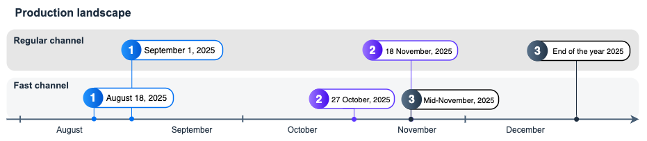

<!-- loiof8df238618eb4858905c2b42fa4ec815 -->

# APIRule Migration

APIRule custom resource \(CR\) `v1beta1` has been deprecated and scheduled for deletion. You must migrate all your APIRule CRs to version `v2`. Learn more about the timeline and see how to perform the migration.


<a name="loiof8df238618eb4858905c2b42fa4ec815__section_lmb_52g_cgc"/>

## How to Migrate APIRules to Version `v2`

To migrate to version `v2`, follow the steps:

1.  To identify which APIRules must be migrated, run the following command:

    ```
    kubectl get apirules.gateway.kyma-project.io -A-o json | jq '.items[] | select(.metadata.annotations["gateway.kyma-project.io/original-version"] == "v1beta1") | {namespace: .metadata.namespace, name: .metadata.name}'
    ```

2.  If two or more of your APIRules target the same workload, apply an additional AuthorizationPolicy to avoid traffic disruption during migration. See [Migrate Multiple APIRules Targeting the Same Workload from v1beta1 to v2](migrate-multiple-apirules-targeting-the-same-workload-from-v1beta1-to-v2-b897dd3.md).

3.  To retrieve the complete `spec` with the `rules` field of an APIRule in version `v1beta1`, see [Retrieving the Complete spec of an APIRule in Version v1beta1](retrieving-the-complete-spec-of-an-apirule-in-version-v1beta1-fefeb7f.md).

4.  To migrate an APIRule from version `v1beta1` to version `v2`, follow the relevant guide:

    -   [Migrating APIRule v1beta1 of Type jwt to Version v2](migrating-apirule-v1beta1-of-type-jwt-to-version-v2-bcaec91.md)
    -   [Migrating APIRule v1beta1 of Type noop, allow, or no\_auth to Version v2](migrating-apirule-v1beta1-of-type-noop-allow-or-no-auth-to-version-v2-2b19ef5.md)
    -   [Migrating APIRule v1beta1 of type oauth2\_introspection to version v2](migrating-apirule-v1beta1-of-type-oauth2-introspection-to-version-v2-394d18a.md)


For more information about APIRule `v2`, see also [APIRule `v2` Custom Resource](https://kyma-project.io/#/api-gateway/user/custom-resources/apirule/04-10-apirule-custom-resource) and [Changes Introduced in APIRule v2](changes-introduced-in-apirule-v2-aa34a4a.md).


<a name="loiof8df238618eb4858905c2b42fa4ec815__section_msj_d2c_hgc"/>

## APIRule `v1beta1` Migration Timeline

The APIRule `v1beta1` deletion process is divided into three steps. See the following timeline:

**Step 1: Completed with API Gateway 3.2**

Kyma dashboard doesn’t display APIRule CRs in version `v1beta1`. All APIRules `v1beta1` are fully operational from the command line, and you are still able to manage them using kubectl. This change does not affect any pipelines that manage APIRules using Kubernetes utilities such as kubectl or helm.

**Step 2: Completed with API Gateway 3.3**

You won't be able to create APIRule CRs `v1beta1` in new clusters. In existing clusters, you will still be able to create and modify APIRule CRs `v1beta1`.

**Step 3: Planned for API Gateway 3.4**

You won't be able to create APIRule CRs `v1beta1` in new and existing clusters, modify existing APIRule CRs `v1beta1`, or delete them. All APIRule `v1beta1` configurations set up prior to this restriction will remain active and continue to function as expected. The API Gateway module will manage and reconcile resources based on the existing APIRule settings.

-   Fast channel release date: 19 November, 2025
-   Regular channel release date: 30 December, 2025



