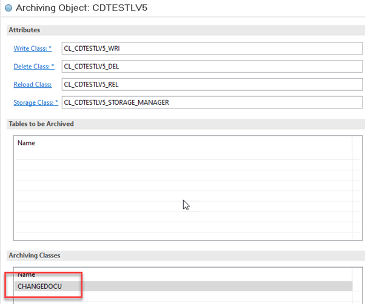

<!-- loio8b8c4a46e9dc4272ad8df83a4ce2dcd4 -->

# Archiving Change Documents

You can archive change documents together with their application documents.


<a name="loio8b8c4a46e9dc4272ad8df83a4ce2dcd4__ArchivingChangeDocuments_prerequisites"/>

## Prerequisites

1.  A change document object is available \(see [Working with Change Document Objects](https://help.sap.com/docs/btp/sap-abap-development-user-guide/working-with-change-document-objects?version=Cloud)\) and it's implemented to create change documents \(see [Writing Change Documents](writing-change-documents-bf7a980.md)\).
2.  There is an archiving object to archive current application documents \(see [Working with Archiving Objects](https://help.sap.com/docs/btp/sap-abap-development-user-guide/working-with-archiving-objects?version=Cloud).


<a name="loio8b8c4a46e9dc4272ad8df83a4ce2dcd4__ArchivingChangeDocuments_steps"/>

## Procedure

1.  Add the archiving class `CHANGEDOCU` to the archiving classes of your archiving object using `ABAP Development Tools` \(ADT\):

    

2.  Update the write class of your archiving object to archive change documents.

    > ### Sample Code:  
    > ```abap
    > CLASS ZCL_<YOUR_ARCH_OBJECT>_WRI IMPLEMENTATION.
    > METHOD if_apj_rt_exec_object~execute.
    > …
    > TRY.
    > DATA(lo_write) = cl_arch_write_api=>get_instance( iv_archiving_object = <YOUR_ARCH_OBJECT> iv_testmode = lv_test ).
    > LOOP AT lt_keys_tab ASSIGNING FIELD-SYMBOL(<fs_keys>).
    > lo_write->open_data_object( ).
    > cl_changedocu_archive=>get_instance( )->if_changedocu_archive~changedocu_archive_object( iv_objectclass = <YOUR_CD_OBJECTCLASS>
    > iv_objectid = <fs_keys>-objectid
    > iv_write_instance = lo_write ).
    > lo_write->close_data_object( ).
    > ENDLOOP.
    > lo_write->finalize( ).
    > CATCH cx_arch_api INTO DATA(lx_error).
    > CATCH cx_chdo_archive_error INTO DATA(lx_error2).
    > ENDTRY.
    > ENDMETHOD.
    > 
    > ```

    > ### Note:  
    > String `<YOUR_ARCH_OBJECT>` is for your archiving object. String `<YOUR_CD_OBJECTCLASS>` is for your change document object.

    > ### Note:  
    > To read change documents from the archive, consider [Reading Change Documents](reading-change-documents-c34f02d.md).


