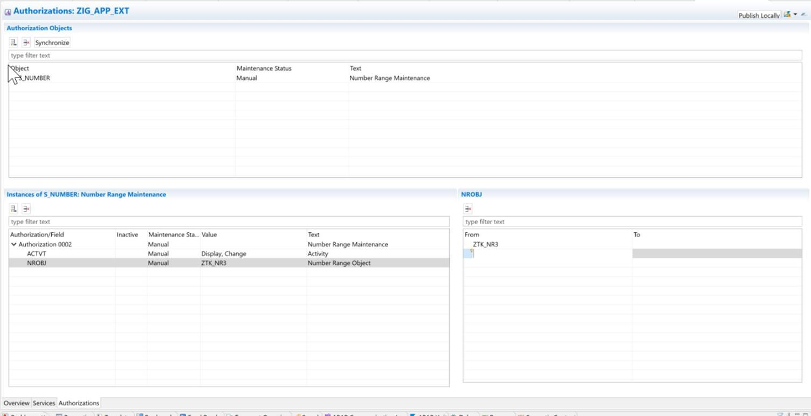

<!-- loio6143baf8f63f48c291df51b25930266f -->

# Authorization Object S\_NUMBER

<a name="loio6143baf8f63f48c291df51b25930266f__section_hjm_15n_qdc"/>

## Prerequisites

-   You need access to the authorization role `S_NUMBER` for the number range app.
-   You need access to an authorization role of the `ZTK_NR3 object`.

To make objects available for business partners in the SAP BTP ABAP environment, you need to create an I AM app and assign the authorization `S_NUMBER` to this app in the authorization settings. Here, all available objects will be listed, though they don't need to be released objects.

Afterwards, you create a business catalog and assign the created IAM application to it.

Next, you need to assign a user to the catalog in the I AM app. In the Fiori Identity and Access Management menu, you can navigate to the Business Catalog maintenance view. Here, you are able to assign a business user to the created business catalog. Now as a user you are able to only see objects that were assigned to this catalog and keep all other objects private.

In parallel to this setting, you still need an assignment to the number range catalog to be able to see number range objects. In the number range catalog, you can navigate to the restriction settings to edit the readability and changeability restrictions for individual objects.

