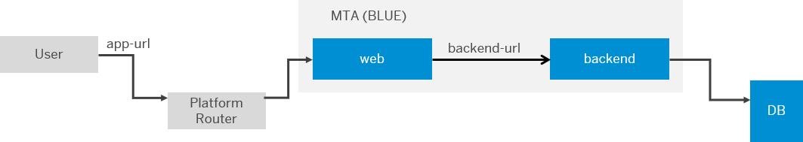
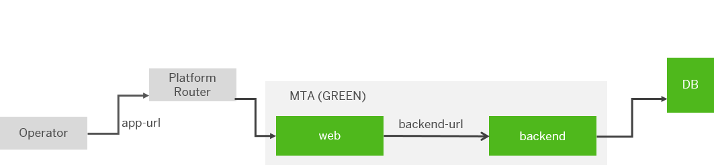

<!-- loio7c83810c31d842938cbc39c135a2d99f -->

# Blue-Green Deployment Strategy

Use the current blue-green deployment of Multitarget applications.


<a name="loio7c83810c31d842938cbc39c135a2d99f__prereq_ssz_xnt_dlb"/>

## Prerequisites

> ### Restriction:  
> Blue-green deployment is supported only for Cloud Foundry applications. It is not supported for bound services, such as service instances and their configuration, workflow content, and HTML5 repository content, among others. Live and idle applications are bound to the same service instances.

You have a previously deployed MTA, with functional productive applications and routes:




<a name="loio7c83810c31d842938cbc39c135a2d99f__context_nvv_tfx_rcb"/>

## Context

> ### Note:  
> If you already have executed deployments using the `cf bg-deploy` command and they have been successful, you can switch to the deploy `--strategy blue-green` deployment method, or vice versa. Do not begin a blue-green deployment using a given deployment command and continue with the other, as this might result in downtime.


<a name="loio7c83810c31d842938cbc39c135a2d99f__steps_ryh_k2m_qcb"/>

## Procedure

1.  Deploy your updated MTA in idle state by executing the command `cf deploy <your-mta-archive-v2> --strategy blue-green`.

    > ### Note:  
    > The first action is that all MTA services are updated. The changes between the old and the new versions must be compatible. For example, the changes between the old and the new versions of the database tables, UAA configurations, and so on.

    This creates:

    -   new applications adding “idle” to the original application names
    -   temporary routes to the idle applications

        

    -   an interrupt to the process showing a message similar to the following:

        > ### Output Code:  
        > ```
        > Process has entered testing phase. After testing your new deployment you can resume or abort the process.
        > Use "cf deploy -i 7e6233b9-6001-11ea-8959-eeee0a98a87d -a abort" to abort the process.
        > Use "cf deploy -i 7e6233b9-6001-11ea-8959-eeee0a98a87d -a resume" to resume the process.
        > Hint: Use the '--skip-testing-phase' option of the deploy command to skip this phase
        > ```


2.  Optionally, test the idle version of the application using the temporary routes.

    > ### Note:  
    > You can skip this step by using one of the following command line options:
    > 
    > -   *\--skip-testing-phase* - you have to use it when starting the process.
    > 
    > -   *\--skip-idle-start* - this option will also skip the start of the newly deployed applications on idle routes.

3.  If you do not want to make the “idle” version available, abort the process using cf deploy `-i <operation ID> -a abort`.

    > ### Note:  
    > This action does not perform a rollback and the state of apps, routes and services remains unchanged. Depending on your needs, you might want to remove the new app versions and the temporary routes.

4.  If you want to make the “idle” version productive, manually resume the process, using `cf deploy -i <operation ID> -a resume`.

    This does the following:

    -   maps the productive routes to your idle versions
    -   deletes the temporary routes
    -   restarts “idle” apps with productive route configurations
    -   deletes the “live” applications, which were productive before

        


<a name="loio7c83810c31d842938cbc39c135a2d99f__result_jz4_vwx_xkb"/>

## Results

You can see an example of the process at [Blue-Green Deployment](https://github.com/SAP-samples/cf-mta-examples/tree/main/blue-green-deploy-strategy)

**Related Information**  


[https://github.com/SAP-samples/cf-mta-examples/tree/main/blue-green-deploy-strategy](https://github.com/SAP-samples/cf-mta-examples/tree/main/blue-green-deploy-strategy)

[Blue-Green Deployment of Multitarget Applications](blue-green-deployment-of-multitarget-applications-772ab72.md "Run two identical production environments to employ the blue-green deployment technique.")

[Legacy Blue-Green Deployment](legacy-blue-green-deployment-764308c.md "Use the legacy blue-green deployment strategy of Multitarget applications.")

[Multitarget Application Commands for the Cloud Foundry Environment](../50-administration-and-ops/multitarget-application-commands-for-the-cloud-foundry-environment-65ddb1b.md "A list of additional commands to deploy multitarget applications (MTA) to the Cloud Foundry environment.")

