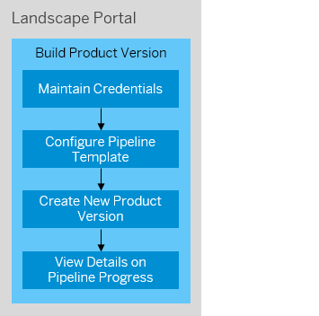

<!-- loio8120bf6d9eed465684d205ec48623490 -->

# Build Product Version

You can use the *Build Product Version* app to easily trigger the build of new product versions via pipelines based on templates that you can configure for different use cases such as new release deliveries, support packages or hotfixes/patch deliveries.

The app guides you through the creation of runs for your product versions and triggers them to be deployed on a system.

Since technical users are needed in various steps, the app can also be used to add and maintain credentials that can be reused in multiple products, see [Maintain Credentials](maintain-credentials-67b5aee.md).

Previously, the scenario was described in project "Piper", see [Build and Publish Add-On Products on SAP BTP, ABAP Environment.](https://www.project-piper.io/scenarios/abapEnvironmentAddons/) We recommend using the *Build Product Version* app that enables the 'Build Add-On Products' scenario for you without the need to set up a Jenkins server.

<a name="loio8120bf6d9eed465684d205ec48623490__section_ird_tn5_ktb"/>

## Key Features

You can use the *Build Product Version* app to:

-   Choose prepared pipeline templates depending on your use case and configure them to create different types of pipelines for your product versions:
    -   Release Deliveries
    -   Support Package Stacks
    -   Patch Deliveries

-   View details on a product version’s pipeline progress
-   Maintain credentials for users that can be reused for different products

The standard user flow is described in the following diagram. Hover over the different steps to display additional information.

<a name="loio8120bf6d9eed465684d205ec48623490__section_umt_xqz_1tb"/>

## Prerequisites

-   Users need to have the “LandscapePortalAdmin” user role assigned to their user account to access this app.
-   Users need an active subscription for the SAP Continuous Integration and Delivery service in the BTP subacccount of the Landscape Portal subscription to be able to use the *Build Product Version* app. If this subscription is not maintained, the following error will occur: 'No subscription to CI/CD service found for this subaccount. Please see the note below for more information on how to add the CI/CD service as entitlement and how to subscribe to it.

> ### Note:  
> Follow these steps to add the CI/CD service as entitlement and to subscibe to it.
> 
> Adding the CI/CD Service as Entitlement
> 
> 1.  Sign into your account in the *SAP BTP Cockpit*.
> 2.  On global account level, navigate to *Entity Assignments* in the Entitlements menu tree.
> 3.  Open the value help for *Select Entities* and choose the subaccount to which the *CI/CD Service* entitlement shall be added. Click *Select*.
> 4.  Click the button *Configure Entitlements* and then *Add Service Plans*.
> 5.  Select *Continuous Integration & Delivery* from the list and choose the service plan *default \(Application\)*, then click *Add 1 Service Plan*.
> 6.  Click *Save* to add the service plan to your selected subaccount.
> 
> Subscribing to the CI/CD Service in the SAP BTP Cockpit
> 
> 1.  Sign into your account in the *SAP BTP Cockpit*.
> 2.  Select your global account, then navigate to *Subaccounts* and select your production subaccount.
> 3.  Navigate to *Service Marketplace*.
> 4.  Select *Continuous Integration & Delivery* tile.
> 5.  Click *Create*.
> 6.  Select the plan *default \(Subscription\)* and click the *Create* button.
> 
>     The subscription process might take a few minutes. After the CI/CD service is subscribed, you can use the *Build Product Version* app from this subaccount.

