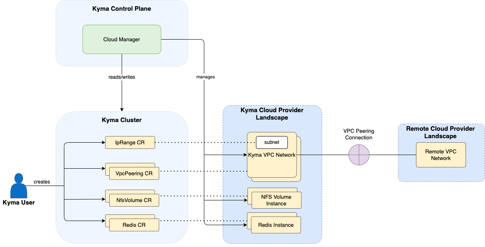

<!-- loio617a1a944a3e421a8e661b1db6a067a1 -->

# Cloud Manager Module

Use the Cloud Manager module to manage infrastructure providers' resources from SAP BTP, Kyma runtime.

<a name="loio617a1a944a3e421a8e661b1db6a067a1__section_h2t_yq2_qbc"/>

## What Is Cloud Manager?

The Cloud Manager module manages access to cloud providers' chosen resources and products. Once you add Cloud Manager to your Kyma cluster, the module securely brings the offered resources. Cloud Manager is strictly coupled with the cloud provider where your Kyma cluster is deployed.

> ### Remember:  
> Using certain features of the Cloud Manager module introduces additional costs. For more information, see [Calculation with the Cloud Manager Module](../10-concepts/service-plans-and-metering-for-kyma-runtime-c33bb11.md#loioc33bb114a86e474a95db29cfd53f15e6__section_cloud_manager).

<a name="loio617a1a944a3e421a8e661b1db6a067a1__section_pvw_gr2_qbc"/>

## Scope

The Cloud Manager module is available on Kyma clusters running on Amazon Web Services, Google Cloud, and Microsoft Azure.

> ### Restriction:  
> Cloud Manager supports the NFS and VPC peering features of Amazon Web Services and Google Cloud only.

<a name="loio617a1a944a3e421a8e661b1db6a067a1__section_prg_1r2_qbc"/>

## Features

The Cloud Manager module provides the following features tailored for each of the cloud providers.

-   [NFS](nfs-4783e94.md): Network File System \(NFS\) server that can be used as a ReadWriteMany \(RWX\) volume in the Kyma cluster.

-   [VPC Peering](vpc-peering-255e45e.md): Virtual Private Cloud \(VPC\) peering between your SAP BTP, Kyma runtime and remote cloud provider's project, account, or subscription.

-   [Redis](redis-6127744.md): cloud provider-flavored cache that can be used in your Kyma cluster.

<a name="loio617a1a944a3e421a8e661b1db6a067a1__section_ixg_1r2_qbc"/>

## Architecture

Cloud Manager has read and write access to your IpRange, VpcPeering, NfsVolume, and Redis custom resources \(CRs\) in the Kyma cluster. The module also manages Kyma VPC networks, NFS Volume instances, and Redis instances in your cloud provider landscape in Kyma.

<a name="loio617a1a944a3e421a8e661b1db6a067a1__section_j3q_qr2_qbc"/>

## API/Custom Resource Definitions

The `cloud-resources.kyma-project.io` Custom Resource Definition \(CRD\) describes the kind and the format of data that Cloud Manager uses to configure resources. For more information, see [Cloud Manager Resources](cloud-manager-resources-2389f6f.md).

**Related Information**  

[kyma-project.io: Cloud Manager module: Tutorials](https://github.com/kyma-project/cloud-manager/blob/main/docs/user/tutorials/README.md)

[Calculation with the Cloud Manager Module](../10-concepts/service-plans-and-metering-for-kyma-runtime-c33bb11.md#loioc33bb114a86e474a95db29cfd53f15e6__section_cloud_manager)

