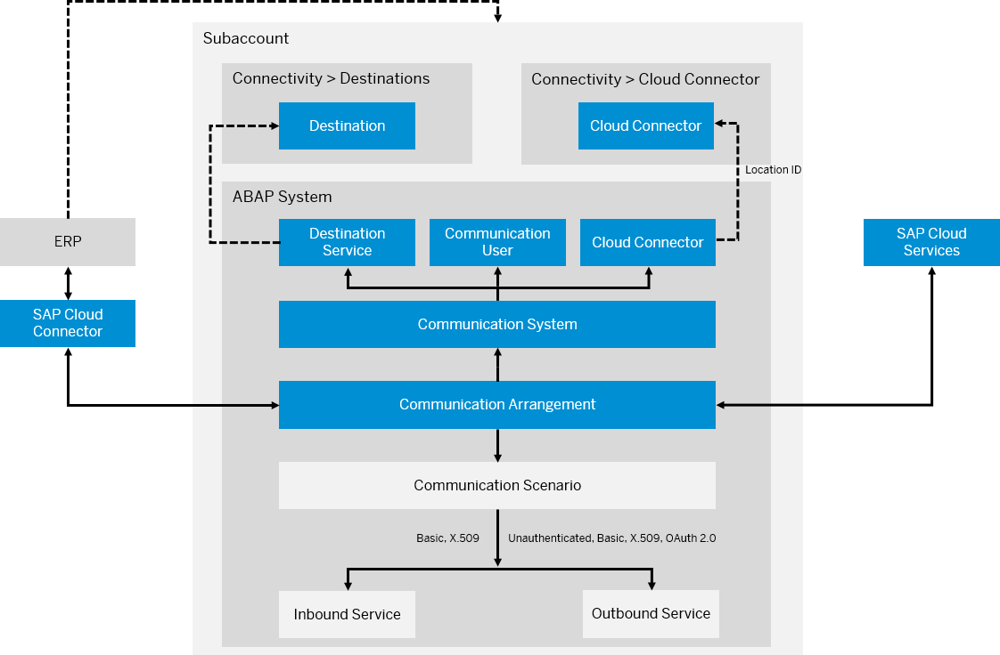

<!-- loio5b8ff39ddb6741a29ddfcf587939e8f4 -->

# Communication Management

Learn more about the basic principles of communication management when integrating your system or solution with other systems to enable data exchange in your ABAP environment.

<a name="loio7ea7276c89a644d9867bf0f8627aed67"/>

<!-- loio7ea7276c89a644d9867bf0f8627aed67 -->

## Communication Scenario

A communication scenario, which is created in the development system using `ABAP Development Tools` and transported to other systems, is a design time description of how two communication partners communicate with each other. It consists of inbound and/or outbound services as well as supported authentication methods.

It provides technical information, such as the used inbound and outbound services and their service type, for example OData or SOAP, and the number of allowed communication arrangement instances. If the scenario exposes inbound services, it specifies the authorizations that are required to run the services.

The following types of communication scenarios are available:

-   **Managed by SAP**, where SAP provides a ready-to-use communication scenario and you create and maintain a communication arrangement.
-   **Managed by the customer**, where you develop a communication scenario and create and maintain a communication arrangement.

**Related Information**  

[Display Communication Scenarios](../50-administration-and-ops/display-communication-scenarios-baa798b.md "You can use this app to get an overview of available communication scenarios.")

[Overview of Communication Scenarios Managed by SAP](https://help.sap.com/docs/btp/sap-business-technology-platform/overview-of-communication-scenarios-managed-by-sap?version=Cloud)

[Developing External Service Consumption \(Outbound Communication\)](developing-external-service-consumption-outbound-communication-f871712.md "Get more information about consuming external services.")

[Developing APIs for Inbound Communication](developing-apis-for-inbound-communication-94ebfa0.md "Learn more about developing APIs for inbound communication.")

<a name="loio875a3d6b20cb4934bcfea815e28afaa1"/>

<!-- loio875a3d6b20cb4934bcfea815e28afaa1 -->

## Communication System

A communication system is a specification of a system that represents a communication partner and the technical information required for the communication, such as the host name, port, users for inbound or outbound communication, certificates, etc.

If the communication system represents an on-premise system that is protected by a firewall, the system can be connected by assigning a cloud connector.

Instead of maintaining the credentials for outbound communication in the communication system itself, the communication system can also refer to a destination from the destination service. This can be a destination on subaccount level, or a destination from a destination service instance.

An administrator user in the ABAP environment has to create the communication system in the [Communication Systems](../50-administration-and-ops/communication-systems-15663c1.md) app in SAP Fiori launchpad. Note that the communication system is not transported between ABAP systems but created locally. The communication partner can vary for each system.

<a name="loio09a1ee098bde4f42baab2bdc14b42f9b"/>

<!-- loio09a1ee098bde4f42baab2bdc14b42f9b -->

## Communication User

A communication user is a specific type of technical user that is assigned to a communication system. The user can be assigned a password or X.509 certificate.

A communication user is added as a user for inbound communication to communication systems.

An administrator user in the ABAP environment creates the communication user in the [Maintain Communication Users](../50-administration-and-ops/maintain-communication-users-eef80dd.md) app in SAP Fiori launchpad. Note that the communication user is not transported between systems but created locally. The technical users and their credentials can vary for each system.

<a name="loio201de48e2f57404e9222181b019eff14"/>

<!-- loio201de48e2f57404e9222181b019eff14 -->

## Communication Arrangement

A communication arrangement is a runtime description of a specific communication scenario. It describes which communication partners communicate with each other in the scenario, and how they communicate.

To describe this runtime behavior, you have to create an arrangement for a scenario, assign the communication system and communication users, and select the authentication method that shall be used.

If the communication scenario exposes inbound services, the communication user is granted the authorizations that have been specified for the communication scenario.

An administrator user in the ABAP environment creates the communication arrangement in the [Communication Arrangements](../50-administration-and-ops/communication-arrangements-1decd8b.md) app in SAP Fiori launchpad. Note that it is not transported between systems but created locally. For certain SAP-managed scenarios that integrate an SAP BTP service, you can also create a communication arrangement from a service key of the service instance that you would like to connect.

For inbound-only scenarios, you can create a communication arrangement by creating a corresponding service key for the ABAP environment service instance.

**Related Information**  

[Maintain a Communication Arrangement for Inbound Communication](https://developers.sap.com/tutorials/abap-environment-communication-arrangement.html)

<a name="loioeeb0ec2318fb4dda87830a09ac7a02fa"/>

<!-- loioeeb0ec2318fb4dda87830a09ac7a02fa -->

## Destination Service

Using the SAP destination service, you can retrieve and store technical information about the target resource \(destination\) that you want to connect with your application to a remote service or a system.

The destination service allows you to read and manage the address of a remote service and the user authentication information for the connection on subaccount and service instance level.

**Related Information**  

[Destination Service](https://help.sap.com/viewer/cca91383641e40ffbe03bdc78f00f681/Cloud/en-US/daca64dacc6148fcb5c70ed86082ef91.html#loiodaca64dacc6148fcb5c70ed86082ef91__services)

[Create a Destination](create-a-destination-3fa7934.md "If your business application uses external services, you have to set up a destination for outbound communication either in your subaccount, which is recommended, or in your space.")

<a name="loio118f66e9776144f98bf2cdb2beedf9ba"/>

<!-- loio118f66e9776144f98bf2cdb2beedf9ba -->

## Destination

A destination is stored in the SAP destinations service and contains the connection details for the communication partner.

You can use a destination to:

-   Connect your application to the Internet \(via HTTP, RFC, or WebSocket RFC\) or to an on-premise system \(via HTTP or RFC\)

-   Send and retrieve emails by configuring a mail destination

> ### Note:  
> You can create a destination for a destination service on instance level or subaccount level.
> 
> A destination can be referenced in a communication system. To refer a destination from a destination service instance, a communication arrangement for SAP-managed scenario `SAP_COM_0276` needs to be maintained to enable communication with the destination service instance. See [Create a Destination](create-a-destination-3fa7934.md). In this case, the destination name and the service instance name need to be maintained in the communication system.

**Related Information**  

[Managing Destinations](https://help.sap.com/viewer/cca91383641e40ffbe03bdc78f00f681/Cloud/en-US/84e45e071c7646c88027fffc6a7bb787.html)

<a name="loiodf870b8fc35147309482ab177db265a8"/>

<!-- loiodf870b8fc35147309482ab177db265a8 -->

## Cloud Connector

The Cloud Connector serves as a link between cloud applications and on-premise systems.

In the Cloud Connector, the subaccount of the ABAP system is connected so that the Cloud Connector can be used within a communication system or destination in the subaccount.

It provides an easy setup with a clear configuration of the systems that are exposed to SAP BTP.

**Related Information**  

[Cloud Connector](https://help.sap.com/viewer/cca91383641e40ffbe03bdc78f00f681/Cloud/en-US/e6c7616abb5710148cfcf3e75d96d596.html#loioe6c7616abb5710148cfcf3e75d96d596__context)

[Integrating On-Premise Systems](integrating-on-premise-systems-c95327f.md "Set up the Cloud Connector to enable communication from the ABAP environment to your on-premise systems using Remote Function Calls (RFC) and HTTP calls.")

