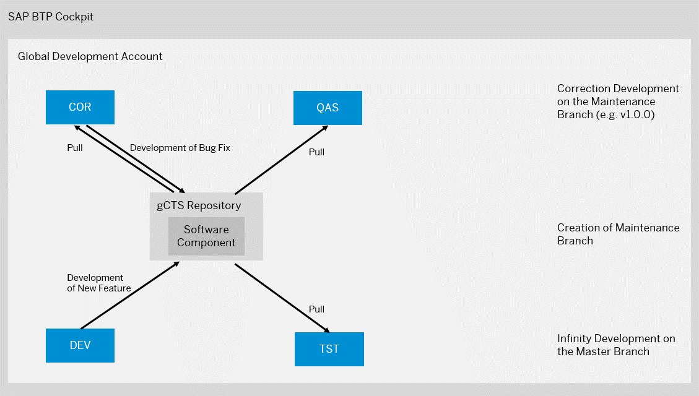
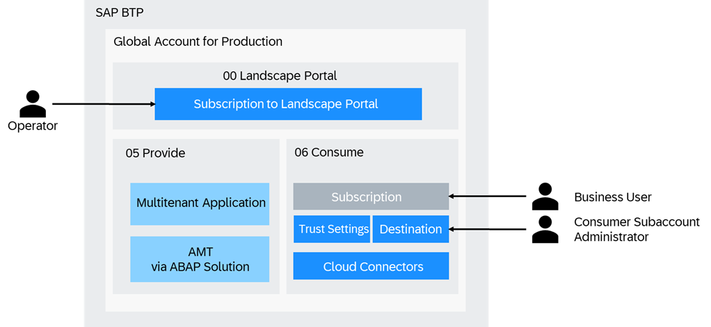
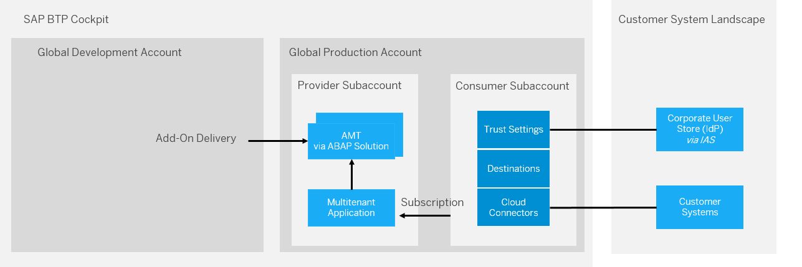
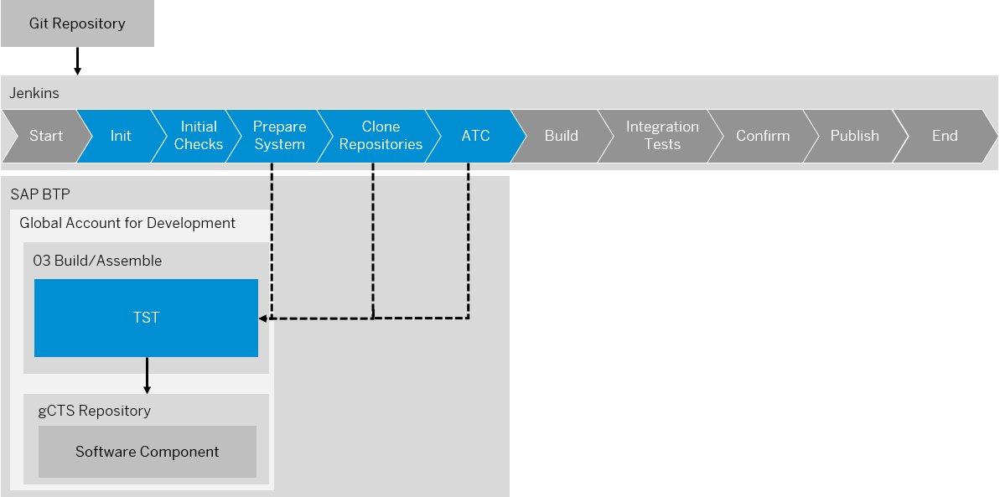
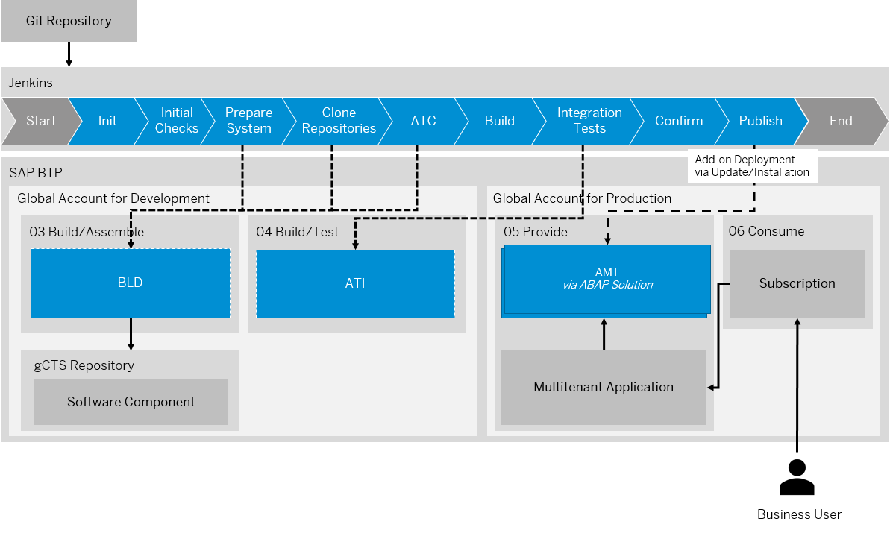
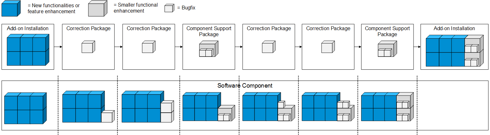
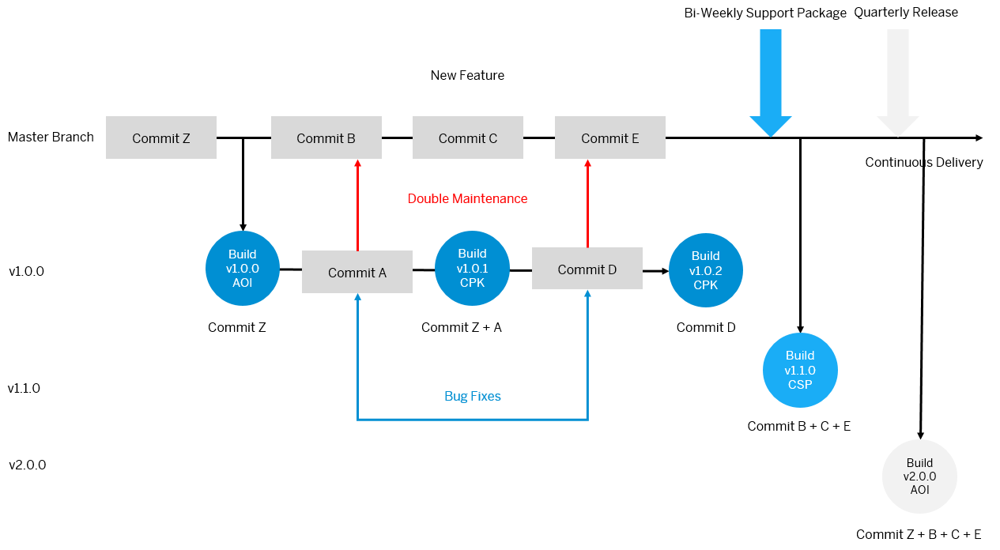
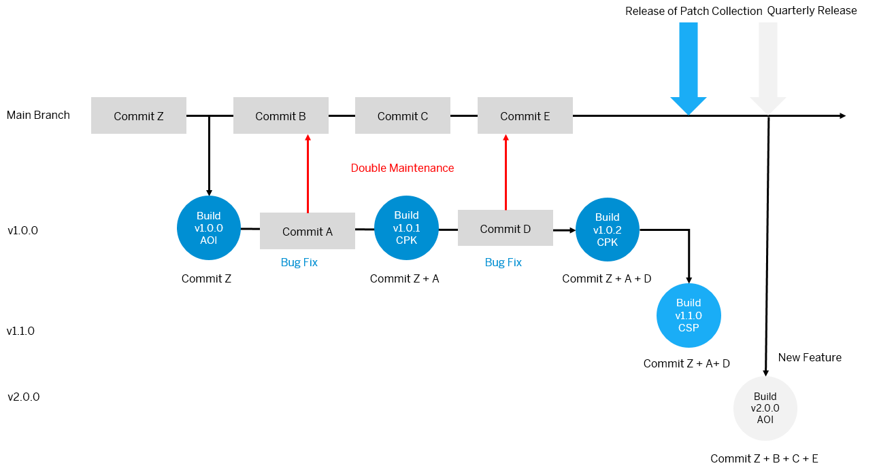
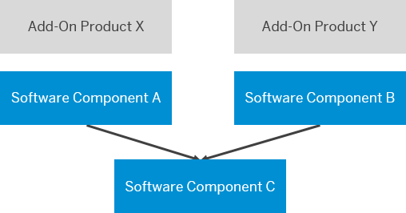

<!-- loio9482e7eef4634cb993a4ae296b2029fa -->

# Concepts

Learn more about the system landscape/account model, ABAP environment pipeline, as well as versioning and branches.

<a name="loio4ca756395fc24e56a42b77632a6bd862"/>

<!-- loio4ca756395fc24e56a42b77632a6bd862 -->

## System Landscape/Account Model

> ### Note:  
> If you use gCTS transport delivery instead of add-on delivery, no discounted development licenses are available: ABAP systems created for development purposes \(development, test, demo\) cost the same as ABAP systems created for production purposes. For creation on system AMT instead of `saas_oem`, the standard service plan is used since no add-on is installed.
> 
> Additionally, the same global account is used for development/production purposes because gCTS repositories are only available across the same global account.

ABAP systems for development and for production purposes are created based on different partner contracts and licenses.

Discounted development licenses can be used for development, test, and demo purposes.

> ### Note:  
> You have to acquire a development license for partners. See [SAP PartnerEdge Test, Demo & Development Price List](http://help.sap.com/disclaimer?site=https://partneredge.sap.com/en/library/assets/partnership/sales/order_license/pl_pl_part_price_list.html).

Production licenses are used whenever one of your customers is consuming the solution provided by you in one of your systems.

> ### Note:  
> You have to acquire a production license for partners. See [Resources for OEM Partners](http://help.sap.com/disclaimer?site=https://partneredge.sap.com/en/partnership/manage/op_resource/oem.html).

To separate development and production purposes, you have to create different global accounts:

-   **Global account for development**

    The global account for development is used for add-on/UI development and testing. Also, add-on assembly and add-on test installation triggered by the add-on build pipeline are performed in this global account.

    All ABAP systems created in this global account are used for development, test, or demo purposes.

-   **Global account for production**

    All ABAP systems created in this global account are used for production purposes. That means, the systems are used to provide the SaaS solution to your customers. Consumer subaccounts are also created in the global account for production.


> ### Recommendation:  
> We recommend creating subaccounts for the different stages of the SaaS solution enablement.
> 
> Using different subaccounts for the different phases has multiple advantages: Trust settings and destination/connectivity settings can be adjusted for each subaccount. That means, you can connect the development subaccount to the developer user identity provider and the test subaccount to the test user identity provider. In terms of connectivity, the development subaccount can be connected to the development on-premise system and the test subaccount can be connected to the test on-premise system.


<a name="loio4ca756395fc24e56a42b77632a6bd862__section_wtx_qvj_xnb"/>

## Global Account for Development


1.  **00 Landscape Portal**

    We recommend creating a dedicated subaccount for the Landscape Portal. This subaccount will contain your Landscape Portal & CI/CD service subscriptions for you to freely choose between regions for your other subaccounts.

2.  **01 Develop: Development subaccount including development space**

    ABAP development system DEV and correction system COR are created in this subaccount. You need to subscribe to SAP Business Application Studio to develop SAP Fiori UIs and implement multitenant applications. See [Setup of UI Development in SAP Business Application Studio](https://help.sap.com/products/BTP/65de2977205c403bbc107264b8eccf4b/37a896bfac604076ae825a1d37b0bd0a.html?version=Cloud).

3.  **02 Test: Test subaccount including test space**

    ABAP test system TST and quality assurance system QAS are created in this subaccount. See [Use Case 2: One Development and Correction Codeline in a 5-System Landscape](use-case-2-one-development-and-correction-codeline-in-a-5-system-landscape-4e53874.md). Since development is structured with software components that are stored in a repository for each global account, these software components can automatically be imported to the test system on a regular basis automated by the CI/CD server. See [\(Deprecated\) Test Integration \(SAP\_COM\_0510\)](deprecated-test-integration-sap-com-0510-b04a9ae.md). The CI/CD server uses a Git repository to read the pipeline definition and configuration.

4.  **03 Build/Assemble: Subaccount for add-on assembly including build/assemble space**

    > ### Note:  
    > The ABAP environment platform version of the assembly system is used to determine the minimum platform version for the add-on product version that is created.
    > 
    > Such a system should not be nominated for the pre-upgrade option of the ABAP environment because this would lead to the add-on product only being able to installed in systems with the pre-upgrade release. When using Build Product Version \(recommended\), the add-on definition is configured directly in the app.

    For the add-on build process, an assembly system BLD is provisioned in this subaccount by the CI/CD server. See [Software Assembly Integration \(SAP\_COM\_0582\)](software-assembly-integration-sap-com-0582-26b8df5.md) When using the Build Product Version app \(recommended\), the add-on definition is configured directly in the app.

5.  **04 Build/Test: Subaccount for add-on installation test including build/test space**

    After the add-on has been assembled during the build of an add-on version, an installation test is required to verify that the add-on can be installed without errors into a system. As part of the add-on build pipeline, an `abap/saas_oem` system ATI is provisioned in this subaccount and the add-on is installed. When using the Build Product Version app \(recommended\), the add-on definition is configured directly in the app.

6.  **05 Provide: Provider subaccount including provider space**

    During the development phase, the multitenant application is deployed to this space for testing purposes. The ABAP solution service can then provision `abap/saas_oem` systems AMT, tenants, and users in this account, once a consumer subscribes to the provided SaaS solution.

7.  **06 Consume: Consumer subaccount**

    To test the subscription to the SaaS solution during the development phase of the multitenant application, a consumer subaccount is created in the global account for development. This allows your consumers to have their own configuration of:

    -   Trust settings \(custom identity provider\)

        > ### Note:  
        > If you want to integrate an existing corporate identity provider for authentication/authorization in subaccounts of the global account for development, see [Trust and Federation with Identity Providers](https://help.sap.com/products/BTP/65de2977205c403bbc107264b8eccf4b/cb1bc8f1bd5c482e891063960d7acd78.html?version=Cloud). To restrict access based on certain criteria, such as the IP address, you need to use the Identity Authentication service. See [SAP Cloud Identity Services - Identity Authentication](https://help.sap.com/viewer/6d6d63354d1242d185ab4830fc04feb1/Cloud/en-US/d17a116432d24470930ebea41977a888.html).

    -   Connectivity via SAP Cloud Connector. See [Connectivity in the Cloud Foundry Environment](https://help.sap.com/viewer/cca91383641e40ffbe03bdc78f00f681/Cloud/en-US/34010ace6ac84574a4ad02f5055d3597.html).
    -   Destinations. See [Managing Destinations](https://help.sap.com/viewer/cca91383641e40ffbe03bdc78f00f681/Cloud/en-US/84e45e071c7646c88027fffc6a7bb787.html).
    -   Subscriptions

    > ### Note:  
    > You can use a booster \(see [Booster for Landscape Portal](prepare-4338854.md#loio8d34e0f80489468088a99202a7fb4a60)\) to automatically perform the setup of subaccounts 00 Landscape Portal, 03 Build/Assemble and 04 Build/Test.


### Development Flow

For development and maintenance processes, the steps mentioned below, that are similar to the ones described in [Use Case 2: One Development and Correction Codeline in a 5-System Landscape](use-case-2-one-development-and-correction-codeline-in-a-5-system-landscape-4e53874.md), are performed.



-   ABAP system COR and QAS have the same software state, unless a new change is tested and released. This means, transport requests are released in ABAP system DEV only if development is completed and it’s planned to import the changes to the production ABAP system.
-   Upon cutoff date, development is finished. All development that is released at this time must be tested and be of good quality. From then on, you must fix defects in the COR system and maintain them in parallel in the DEV system.
-   Upon release date, all defects must be fixed. If, during testing in the QAS system, you make the decision that a complete functionality isn’t delivered, developers must delete, revert, or disable the functionality in the COR system and release the corresponding transport requests. You can't remove objects from the release branch, e.g. by deselecting transport requests. To revert objects to a previous transported state, use the Compare editor of the Eclipse History view. If you want to withdraw the functionality in the DEV system as well, it’s considered a correction and you have to perform double maintenance of corrections into the DEV system. See [Double Maintenance of Corrections into Development](double-maintenance-of-corrections-into-development-1241b14.md).
-   Users in ABAP system COR are locked during ongoing development and only unlocked when a correction has to be implemented
-   For the consumption as a SaaS solution, instead of importing a release branch into a productive system, software components are installed via add-on delivery packages into multitenancy-enabled production systems AMT provisioned via the ABAP Solution service. See [ABAP Solution Service](order-and-provide-975bd3e.md#loio1697387c02e74e66a55cf21a05678167).


<a name="loio4ca756395fc24e56a42b77632a6bd862__section_mbj_tvj_xnb"/>

## Global Account for Production



1.  **00 Landscape Portal**

    Since the Landscape Portal service is only available in region eu10, we recommend creating a dedicated subaccount in this region. This subaccount will contain your Landscape Portal & CI/CD service subscriptions for you to freely choose other regions for your other subaccounts.

    > ### Note:  
    > If you plan to create any of the other subaccounts in eu10, then you can simply reuse one of those subaccounts.

2.  **05 Provide: Provider subaccount including provider space**

    The multitenant application is deployed to the provider subaccount in the global account for production.

    The ABAP solution service can then provision `abap/saas_oem` systems \(AMT\), tenants, and users in this account once a consumer subscribes to the provided SaaS solution.

3.  **06 Consume: Consumer subaccount**

    For each customer, a consumer subaccount is created in the global account for production.

    

    This allows consumers to have their own configuration of:

    -   Trust settings \(custom identity provider\).

        > ### Note:  
        > If you want to integrate an existing corporate identity provider for authentication/authorization in subaccounts of the global account for production, see [Trust and Federation with Identity Providers](../50-administration-and-ops/trust-and-federation-with-identity-providers-cb1bc8f.md). To restrict access based on certain criteria, such as the IP address, you need to use the Identity Authentication service. See [SAP Cloud Identity Services - Identity Authentication](https://help.sap.com/viewer/6d6d63354d1242d185ab4830fc04feb1/Cloud/en-US/d17a116432d24470930ebea41977a888.html).

    -   Connectivity via SAP Cloud Connector. See [Connectivity in the Cloud Foundry Environment](https://help.sap.com/viewer/cca91383641e40ffbe03bdc78f00f681/Cloud/en-US/34010ace6ac84574a4ad02f5055d3597.html).

    -   Destinations. See [Managing Destinations](https://help.sap.com/viewer/cca91383641e40ffbe03bdc78f00f681/Cloud/en-US/84e45e071c7646c88027fffc6a7bb787.html).

    -   Subscriptions

        > ### Restriction:  
        > As of now, you can only expose SaaS applications for subscription from consumer subaccounts in the provider global accounts.


<a name="loio2398b874f7c5445db188b780ff0cef89"/>

<!-- loio2398b874f7c5445db188b780ff0cef89 -->

## ABAP Environment Pipeline

The goal of the ABAP environment pipeline is to enable continuous integration for the ABAP environment.


The pipeline contains several stages and currently supports two relevant scenarios:

-   Add-on build using AAKaaS

-   Continuous testing via gCTS


A pipeline definition, containing all configuration, and a running CI/CD server are required to execute the ABAP environment pipeline. You can consume the different scenarios by enabling different pipeline stages in the configuration. For more information on how to configure the ABAP environment steps and stages, see [Configuration](https://www.project-piper.io/pipelines/abapEnvironment/configuration/) and [ABAP Environment Pipeline](https://www.project-piper.io/pipelines/abapEnvironment/introduction/).

The Landscape Portal offers the option to configure and execute the add-on build scenario using the [Build Product Version app](https://help.sap.com/docs/btp/sap-business-technology-platform-internal/build-product-version?state=DRAFT&version=Internal), without the need for external repositories or Jenkins servers.

> ### Note:  
> The *Continuous Testing* scenario is currently not supported by the Landscape Portal. This means that a running Jenkins server is required, even when using the Build Product Version app. See [Add-On or gCTS](https://help.sap.com/docs/btp/sap-business-technology-platform/delivery-via-add-on-or-gcts?version=Cloud).


### Jenkins Setup

> ### Note:  
> This is only required for running the Continuous Testing scenario. The add-on build scenario can be realized using the Build Product Version app in the Landscape Portal.

The general configuration of the ABAP environment pipeline always follows the same approach regardless of the scenario that you want to configure:

1.  **Prepare Git Repository**

    As a DevOps engineer, you need to prepare a Git repository by including the Jenkins file, initializing the pipeline, and the pipeline configuration file `.pipeline/config.yml`. See [Jenkins File](https://sap.github.io/jenkins-library/pipelines/abapEnvironment/configuration/#2-jenkinsfile) and [Technical Pipeline Configuration](https://sap.github.io/jenkins-library/pipelines/abapEnvironment/configuration/#6-technical-pipeline-configuration).

2.  **Create Service User for Git Repository**

    To enable read access to the Git repository, you need to create a service user and assign it to the repository. Later, this user’s access credentials are stored in the Jenkins credentials by the Jenkins administrator. See [Using Credentials](https://www.jenkins.io/doc/book/using/using-credentials/).

3.  **Create Jenkins Instance**

    As a Jenkins administrator, you need to set up a new Jenkins instance. See [Custom Jenkins Setup](https://www.project-piper.io/infrastructure/overview/) and [Docker Hub](https://hub.docker.com/u/ppiper).

4.  **Configure Jenkins Instance**

    As a Jenkins administrator, you need to add technical Git user credentials and platform user credentials to the integrated secure store. Make sure that a shared library piper-lib-os is configured pointing to the project "Piper" library. See [Piper Library](https://github.com/SAP/jenkins-library.git).


For more information on how to configure the ABAP environment steps and stages, see [Configuration](https://sap.github.io/jenkins-library/pipelines/abapEnvironment/configuration/).


<a name="loio2398b874f7c5445db188b780ff0cef89__section_e1g_1lj_grb"/>

## Transport from DEV to TST System via gCTS



Development system DEV and test system TST stay on the same main branch. To make the latest implementations available in the test system, the developed software components can be imported on a regular basis to test system TST and tested using the ABAP Test Cockpit by scheduling a planned execution of the ABAP environment pipeline. See [Continuous Testing on SAP BTP ABAP Environment](https://www.project-piper.io/scenarios/abapEnvironmentTest/) and [Running ATC Checks and ABAP Unit Tests on a Static ABAP Environment System](https://github.com/SAP-samples/abap-platform-ci-cd-samples/tree/atc-static).

The ABAP environment pipeline is executed in a Jenkins server that is connected to subaccount *02 Test* in the global account for development by authenticating via a technical Cloud Foundry platform user. The permanent test system TST is used to import software components and run ABAP Test Cockpit checks.


<a name="loio2398b874f7c5445db188b780ff0cef89__section_jcq_bhj_grb"/>

## Build Add-On Version

The ABAP environment pipeline can automate the build and assembly process of ABAP add-ons. From creating the delivery packages in the assembly system to publishing the add-on release, all steps are part of this pipeline.

This scenario can be run in the Landscape Portal using the [Build Product Version app](https://help.sap.com/docs/btp/sap-business-technology-platform/build-product-version?version=Cloud), or it can be configured manually and run on a local Jenkins server. In both cases, the same pipeline stages will be executed.

See [Build and Publish Add-on Products on SAP BTP ABAP Environment](https://www.project-piper.io/scenarios/abapEnvironmentAddons/).



The ABAP environment  pipeline is executed in a Jenkins server that is connected to subaccount *03 Build/Assemble* and *04 Build/Test* in the global account for development by authenticating via a technical Cloud Foundry platform user. Transient systems are then provisioned for add-on assembly \(BLD\) and installation tests \(ATI\).


**Add-On Assembly System**

Add-on assembly system BLD includes an instance of communication scenario `SAP_COM_0510` and an instance of communication scenario `SAP_COM_0582`. See [\(Deprecated\) Test Integration \(SAP\_COM\_0510\)](deprecated-test-integration-sap-com-0510-b04a9ae.md) and [Software Assembly Integration \(SAP\_COM\_0582\)](software-assembly-integration-sap-com-0582-26b8df5.md). Service keys with parameters referring to the communication scenarios are created in the BLD system, which leads to the creation of communication arrangements that can be used by the pipeline for inbound communication.

In the **Prepare System** pipeline stage, a new transient system BLD is provisioned for the add-on assembly. See [Prepare System](https://www.project-piper.io/pipelines/abapEnvironment/stages/prepareSystem/). ABAP Test Cockpit checks, software component imports, and the local build of deliveries are performed in this stage. By default, the system is deleted again in the **Post** pipeline stage. See [Post](https://www.project-piper.io/pipelines/abapEnvironment/stages/post/).

The communication with remote components is enabled via communication scenario [Test Integration \(SAP COM 0510\)](https://help.sap.com/docs/btp/sap-business-technology-platform/test-integration-sap-com-0510?version=Cloud) and communication scenario [Software Assembly Integration \(SAP COM 0582\)](https://help.sap.com/docs/btp/sap-business-technology-platform/software-assembly-integration-sap-com-0582?version=Cloud).

By default, the system is created from scratch for each new add-on version. If you are configuring your pipeline manually, you can choose to reuse a permanent BLD system instead of provisioning a new one each time. This has the advantage of reducing the pipeline execution time, as system provisioning is one of the most time-consuming tasks. See [Build Add-Ons on a Permanent ABAP Environment System](https://github.com/SAP-samples/abap-platform-ci-cd-samples/tree/addon-build-static).

To reduce costs, it is recommended that you shut down the permanent system when no builds are scheduled. See [Manage System Hibernation](https://help.sap.com/docs/btp/sap-business-technology-platform/manage-system-hibernation?version=Cloud). Please note that hibernated systems still incur costs.

**Add-on Installation Test System**

To verify that the delivery packages included in the add-on product version are installable, a target vector is published in "test" scope during the **Build** stage.

In the **Integration Tests** pipeline stage, a new transient system ATI is then provisioned for an add-on deployment test that installs the add-on product version. See [Integration Tests](https://www.project-piper.io/pipelines/abapEnvironment/stages/integrationTest/). After the successful add-on installation is confirmed, the system is deleted, unless otherwise specified.

The communication with remote components is enabled via communication scenario [Test Integration \(SAP COM 0510\)](https://help.sap.com/docs/btp/sap-business-technology-platform/test-integration-sap-com-0510?version=Cloud).

By default, the ATI system is created from scratch for each new add-on version. If you are configuring your pipeline manually, you can choose to reuse a permanent ATI system instead of provisioning a new one each time. This has the advantage of reducing the pipeline execution time, as system provisioning is one of the most time-consuming tasks. We recommend that you provision a new ATI system at least for each new major release of your add-on.

**Add-on Assembly Kit as a Service**

The Add-on Assembly Kit as a Service \(AAKaaS\) is used for registering and publishing the software product.

The service is offered in the SAP Service and Support systems, which means that access is granted via a technical communication user that packs the delivery into an importable package format. It is similar to the Software Delivery Assembler \(SDA, transaction SSDA\) as a part of the SAP Add-On Assembly Kit. See [SAP Add-On Assembly Kit](https://help.sap.com/viewer/product/SAP_ADD-ON_ASSEMBLY_KIT/) and  [Add-On Assembly Kit as a Service](https://sap.github.io/jenkins-library/scenarios/abapEnvironmentAddons/#add-on-assembly-kit-as-a-service-aakaas).

**Add-on Consumption**

For the consumption of the add-on as a SaaS solution, software components are installed via add-on delivery packages into multitenancy-enabled production systems \(AMT\) provisioned via the ABAP Solution service. This is orchestrated via a multi-tenant application deployed to the Cloud Foundry environment on SAP BTP. See [Multitenant Application](https://help.sap.com/docs/btp/sap-business-technology-platform/multitenant-application?version=Cloud) and [Deploy](https://help.sap.com/docs/btp/sap-business-technology-platform/saas-apps-order-and-provide?version=Cloud#deploy).

> ### Note:  
> If you need support or experience issues during the add-on build, see [Troubleshooting](https://www.project-piper.io/scenarios/abapEnvironmentAddons/#troubleshooting).

<a name="loioc8730736a52645b49ca76c08214bf181"/>

<!-- loioc8730736a52645b49ca76c08214bf181 -->

## Multitenancy

The ABAP environment provides capabilities for multitenancy, meaning to host different customers on a single ABAP system. See [Multitenancy in the ABAP Environment](multitenancy-in-the-abap-environment-633cc61.md).

> ### Tip:  
> You should align your decision whether to enable multitenancy mode for your solution based on whether the [Multitenancy Development Guideline](multitenancy-development-guideline-9d994c8.md) can be followed during ABAP development.

<a name="loio8c087bca40584f9b899282b4ec515753"/>

<!-- loio8c087bca40584f9b899282b4ec515753 -->

## Versioning and Branches

<a name="loio882c222035734ff39ffaf36f463a4cda"/>

<!-- loio882c222035734ff39ffaf36f463a4cda -->

### Add-On Versioning


For the add-on delivery process, certain versioning principles apply. Learn how software components are combined to an add-on product and what versioning rules are used for both parts. Software components and add-on products follow a similar versioning pattern.


### Add-on Product Version

Instead of importing software components into productive systems, when providing a SaaS solution in the ABAP environment, software components are packaged and installed into ABAP systems based on so-called add-on products/software products.

You can only install one add-on product for each system using the ABAP environment `saas_oem` service plan instead of the `standard` service. During provisioning of this service, parameters `addon_product_name` and `addon_product_version` are used to install a certain add-on product version into the system, after the system has been provisioned. See [ABAP Solution Service](order-and-provide-975bd3e.md#loio1697387c02e74e66a55cf21a05678167).

The add-on product name includes a reserved development namespace to separate the name from other customers/partners. See SAP note [84282](https://me.sap.com/notes/84282).

The versioning pattern `<Release>.<Support Package Stack Level>.<Patch Level>` applies to the add-on product version.

> ### Note:  
> Only in a new release, you can change the bundled software components of the add-on product.

Technically, the allowed number range is 1.0.0 to 9999.9999.9999.

For the release, there are no technical restrictions regarding the number of new versions. You only have to consider that the version has to be ascending across builds and there must be no gaps between versions. The initial release is always 1.0.0.

The support package stack level count starts again from 0 with each release.

The patch level count starts again from 0 with each support package.

While providing a specific add-on version, leading zeroes should be omitted \(1.2.3 instead of 0001.0002.0003\).

The add-on product version should be increased analogous to the version of the leading software component. The leading software component is the software component that is, as opposed to a reuse software component, exclusively used as part of one add-on product.

An exception to this recommendation is the patch level in the add-on production version: In case of an add-on product with a reuse software component, the patch level of the add-on product version might be higher than the patch level of the leading software component version.

For more information about software product versioning, see [Add-On Product Version](https://www.project-piper.io/scenarios/abapEnvironmentAddons/#add-on-product-version).


### Software Component Version

Software components are self-contained and include packages as well as development objects. They are used in combination with a reserved development namespace to separate the name from other customers/partners. See [Software Components](software-components-58480f4.md).

The versioning pattern `<Release>.<Support Package Level>.<Patch Level>` also applies to the software component version.

> ### Note:  
> Software component versions are delivered with delivery packages. However, software component versions are not individual shipment entities. They can only be delivered to customers as part of a software product version.
> 
> Software component versions are only built once, independent from add-on product versions where the software component version was referenced. If an add-on product version is referring to a software component version that has already been created as part of a different add-on build, the created delivery package is reused.

Technically, the allowed number range is 1.0.0 to 9999.9999.9999.

For the release, there are no technical restrictions regarding the number of new versions. You only have to consider that the release has to be ascending across builds and there must be no gaps between versions. The initial release is always 1.0.0.

The support package level can only go up until 369 because of technical limitations. The support package level count starts again from 0 with each new release.

For the patch level, there is a technical limit of 36³, limited to 9999. The patch level count starts again from 0 with each support package.

For more information on software component versioning, see [Software Component Version](https://www.project-piper.io/scenarios/abapEnvironmentAddons/#software-component-version).

<a name="loio398be26971414fbb91cbe3b0a3cb8a26"/>

<!-- loio398be26971414fbb91cbe3b0a3cb8a26 -->

### Add-On Package Types


For the delivery of add-on packages, there are three package types that serve different purposes: AOI, CSP, and CPK.

The different add-on package types are used for different purposes. The set of objects to be included depends on the package type.

> ### Note:  
> The required type of delivery is automatically determined by the delivery production tools based on how the version number of software components is changed.




### AOI \(Add-On Installation\)

Delivery packages of type Add-on Installation \(AOI\) are created for all new release versions, e.g. version 1.0.0, and should be used to deliver new functionalities or feature enhancements.

These delivery packages include all the objects in the software component and are usually created on a regular basis \(e.g. quarterly\).


### CSP \(Component Support Package\)

Delivery packages of type Component Support Package \(CSP\) are created for all new support package deliveries, e.g. version 1.1.0, and should be used to deliver a collection of patch deliveries or to deliver smaller functional enhancements.

These delivery packages include either the objects that were changed since the previous release delivery or since the previous support package delivery. They are usually created on a regular basis \(e.g. bi-weekly\).


### CPK \(Correction Package\)

Delivery packages of type Correction Package \(CPK\) are created for all new patch deliveries, e.g. version 1.0.1, and should be used to deliver bugfixes.

These delivery packages include only those objects that were changed since the previous patch delivery and are only created when necessary \(e.g. emergency patch\).

For more information on the add-on package types and how these are determined based on changes to the software component version, see [Software Component Version](https://sap.github.io/jenkins-library/scenarios/abapEnvironmentAddons/#software-component-version).

<a name="loioea47e09911c24f658e5f111d21729ffd"/>

<!-- loioea47e09911c24f658e5f111d21729ffd -->

### Branching


> ### Note:  
> Keep in mind that there are some restrictions for using branches in your development processes, for example the merging of branches is not supported and has to be done manually. See [ABAP Environment Specifics](abap-environment-specifics-1367346.md).

Development in the ABAP environment is done in software components. For each software component, different branches can be created that include a different list of commits. For each system, only one branch can be active at a time. Branches are used to separate changes from each other that shall or might not be delivered together \(development vs. correction\).

To separate development of new features from the development of bug fixes for the active version of a software component, you can use branches for different purposes:

-   **Main Branch**: Implementation of new planned features that are to be delivered in the future \(development codeline\)
-   **Maintenance Branch**: Implementation of unplanned bug fixes for the active version of a software component that is deployed to customer systems \(maintenance codeline\)


The main branch is the default branch of each software component and therefore already exists when the software component is created. This branch is not deleted throughout delivery of different software component versions.

A maintenance branch should be created for each support package level of a software component and is named accordingly, for example v1.1.0 for support package level 1 in release 1. Maintenance branches can be deleted once the successor support package level is the currently deployed support package level in customer systems.

> ### Recommendation:  
> Create a new maintenance branch with each new support package level, and thus with each new AOI and CSP package delivered for a software component.

For the first release, the main branch of software components is used to create a maintenance branch for the add-on build process. In subsequent versions, the development and correction code line are separated by using the main branch and the maintenance branch. See [Use Case 2: One Development and Correction Codeline in a 5-System Landscape](use-case-2-one-development-and-correction-codeline-in-a-5-system-landscape-4e53874.md).

All corrections to a software component based on a certain support package level are released in the corresponding maintenance branch and need to be maintained as new commits in the main branch \(double maintenance\). See [Double Maintenance of Corrections into Development](double-maintenance-of-corrections-into-development-1241b14.md).

For each ABAP system, only one branch can be active at a time. Therefore, in development system DEV and test system TST, the main branch of a software component is checked out. Whereas in correction system COR and quality assurance system QAS, the currently relevant maintenance branch is checked out.

<a name="loio326508756a144c49b98e5fcf442cce40"/>

<!-- loio326508756a144c49b98e5fcf442cce40 -->

### Delivery Models


Based on the mentioned software component versioning principles, the add-on package types, and branching approach, you can use different delivery models.

> ### Recommendation:  
> You should choose the delivery model based on the existing processes in your development/shipment environment. Shorter delivery cycles have the advantage that new features are delivered more frequently. Therefore, we recommend following the continuous delivery approach whenever possible.


### Continuous Delivery

With the continuous delivery approach, new features should be delivered as soon as possible: In this case, new features can be shipped with support packages more often than new releases of a software component. These short development cycles ensure that changes can be deployed on short notice and in smaller increments. See [Continuous Integration and Delivery \(CI/CD\)](https://help.sap.com/viewer/65de2977205c403bbc107264b8eccf4b/Cloud/en-US/fe74df55b0f54e99bf6e13a3b53e1db0.html).



In this example, commit Z represents all the commits prior to the first build.

The maintenance branch v1.0.0 is used for bug fixes that must be manually maintained in the main branch, which requires double maintenance to make sure that the development code line is up to date.

Commit Z and commit C are new features implemented in the development code line on the main branch. Development of these features is done in the DEV system, testing in the TST system.

Commit A and commit D are small corrections that are implemented in the correction code line on the maintenance branch for support package level zero of software component release one.

Development of these bug fixes is done in the COR system, testing in the QAS system.

After releasing these corrections in the maintenance branch, you have to maintain them as well in the main branch in the DEV system to secure consistency of changes in the correction and development code lines. As a result, commit B and E are created in the main branch to reflect the corrections made in the maintenance branch \(commit A and commit D\).

The new support package build for version 1.1.0 is derived from the main branch and includes new features and bug fixes since the last support package level 1.0.0 has been released. With the new support package build for version 1.1.0 of the software component, a new maintenance branch v1.1.0 is created. All corrections for this support package level are developed on this branch.

For a new release, add-on version 2.0.0 is released. The resulting AOI package includes all features and bug fixes since the last AOI build for version 1.0.0 has been released.

Branch v1.1.0, that is based on the main branch, includes same commits as the main branch \(Z, B, C, and E\). For the build of CPK v1.0.2 and CSP v1.1.0, however, only the objects that have been changed since the previous CSP/AOI are included in the object list.

> ### Note:  
> With this delivery model, support packages not only include the corrections for the current support package level but also new features allowing shorter development cycles.

> ### Recommendation:  
> In a continuous delivery model, we recommend:
> 
> -   Building and deploying a new CSP on a weekly or biweekly basis.
> -   Shipping new software component releases on a quarterly basis. These AOI packages contain every object that has been built and delivered with the support packages, including all the patches.


### Quarterly Shipment

The quarterly delivery approach is recommended whenever longer test cycles are necessary and faster incremental development is not feasible. This might be required due to industry requirements, legal requirement etc.



Compared to the continuous delivery model, the maintenance branches for each support package level are not created based on the main branch but on the previous maintenance branch: e.g. branch v1.1.0 is based on v1.0.0.

That way, support packages are only used for the purpose of patch collections: only the corrections in commit A and D that were already delivered as patches in version 1.0.1 and 1.0.2 are included in support package 1.1.0.

> ### Note:  
> With this delivery model, new features are only delivered with new release versions \(AOI packages\). The build for version 1.1.0 does not include commit C. As late as with the build for version 2.0.0, this feature is shipped. Consequently, new features take longer until they are available in production systems.

This delivery model is similar to processes commonly used to ship on-premise solutions where upgrades are much more complex and usually performed on a quarterly basis. Instead of shipping more often but in smaller packages, this approach promotes building larger shipment packages with a lot of new features.

Branch v1.1.0, that is based on branch v1.0.0, includes the same commits as branch v1.0.0 \(Z, A, and D\). For the build of CPK v1.0.2 and CSP v1.1.0, however, only the objects that have been changed since the previous CSP/AOI are included in the object list.

<a name="loio919be04888aa4e07b1a99416fb8bb68d"/>

<!-- loio919be04888aa4e07b1a99416fb8bb68d -->

### Reuse Software Components


Add-On products can consist of multiple software components. However, objects of one software component can't be used in another software component by default. Software components provide their functionality to other software components via explicitly released APIs. This means, you must set the API state of an object to *Released* if you want to use it from another software component. See [Released APIs](https://help.sap.com/docs/btp/sap-abap-development-user-guide/released-apis?version=Cloud) and [Finding Released APIs and Deprecated Objects](https://help.sap.com/docs/btp/sap-abap-development-user-guide/finding-released-apis-and-deprecated-objects?version=Cloud).

Having this in mind, you can structure development into reuse components that are used across several components.



In this example, one add-on product consists of a leading software component A and software component C, whereas another add-on product consists of a leading software component B and C. Software component A and B use released objects of software component C, and thereby depend on this software component.

Once you have released an object, we recommend not changing it incompatibly because this can lead to errors for its consumers.

Software components must not have cyclic dependencies. In the example above, reuse software component C must not use objects from leading software component A. For more information on software component restrictions, see [Software Components](software-components-58480f4.md).

In the add-on descriptor file, dependencies are reflected by the order of the components in the repositories list:

```
---
addonProduct: "/NAMESPC/PRODUCT_X"
addonVersion: "1.2.0"
repositories:
  - name: "/NAMESPC/COMPONENT_C"
    branch: "v1.2.0"
    version: "1.2.0" 
    commitID: "7d4516e9"
  - name: "/NAMESPC/COMPONENT_A"
    branch: "v2.0.0"
    version: "2.0.0" 
    commitID: "9f102ffb" 
    
```

In this case, component `/NAMESPC/COMPONENT_C` is the reuse component. It has no dependencies to any other top components and is therefore listed first. This is important for the right order during software component import. `/NAMESPC/COMPONENT_C` needs to be imported before `/NAMESPC/COMPONENT_A` to avoid import errors. In addition to that, software components in the bundle can use different namespaces in the software component name.

> ### Recommendation:  
> In a software component bundle with a reuse component, this component is assembled whenever the software component version is defined for the first time in the add-on descriptor file. Therefore, make sure to define the correct software component version to prevent building the wrong software component version for `/NAMESPC/COMPONENT_C`.
> 
> We recommend following the same delivery model \(identical shipment cycles\) for all involved software components in a delivery scenario with a reuse component.


In this scenario, add-on product X and Y are based on the continuous delivery model and still undergo development. That means, for both add-on products, a new version can be shipped on a bi-weekly basis.

Consequently, the leading software components A and B refer to objects in the same branch of the reuse software component C, for example branch v1.2.0

Let’s assume that development and correction of both software components is performed in one DEV and COR system. If there has to be a bug fix in reuse software component C, corrections to the corresponding software components A and B are still possible. This is due to the fact that branch v1.2.0 can remain checked out in software component C, while these changes are made.

The same applies to the development process: A new feature can be developed in leading software component A using the main branch of reuse software component C. Since only the main branch of reuse software component C is used in the DEV system, the development in the corresponding software components A and B can continue in parrallel.

This scenario is resource-efficient: only one system is required for development in system DEV and one for corrections in COR. With respect to the developer experience, it is more convenient to have all implementation components in one development system because everything is in one place and the whole system landscape is easily understandable.


The system setup regarding the testing and quality assurance for corrections depends on how you want to test the add-on products:

-   Do you want to provide a test environment that is identical to a production system with the add-on product installed? Then you should establish one TST and one QAS system for each add-on product in the sense that only those software components used for each add-on product are imported into these systems.

-   Do you want to reduce the number of systems without restricting the test environment? Then you only need one TST and one QAS system, where all software components are imported.


> ### Recommendation:  
> The number of required systems for DEV, COR, TST, and QAS depends on the number of branches that are actively used in dev, test, and build processes. Whenever more than one branch is actively used, one ABAP system is required per branch because an ABAP system always checks out only one branch of a software component.

