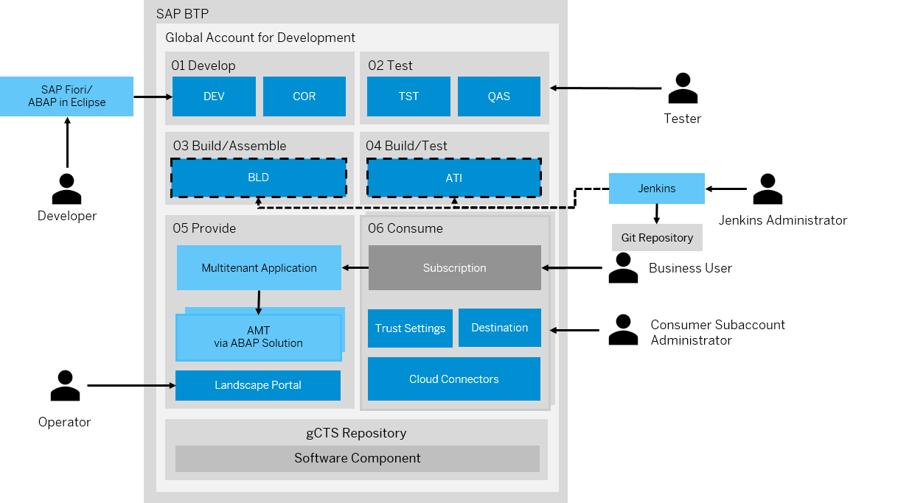
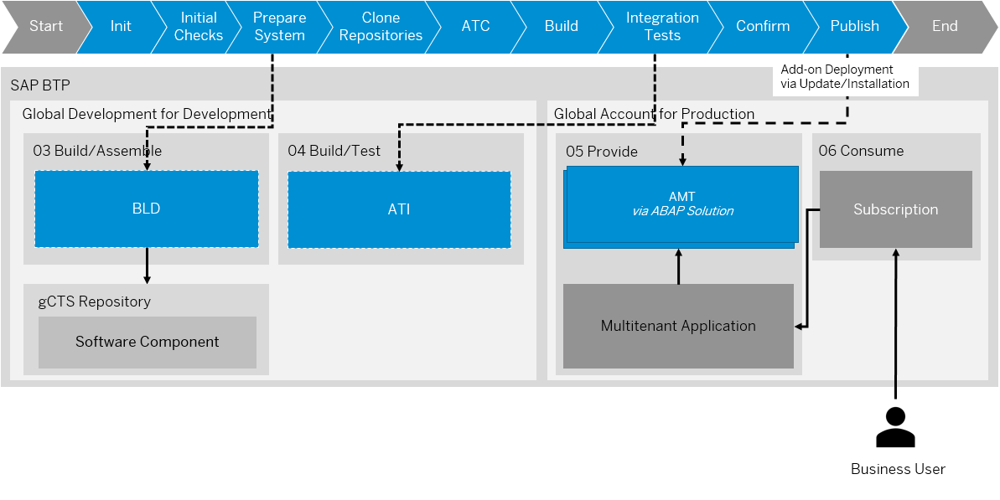

<!-- loio9482e7eef4634cb993a4ae296b2029fa -->

# Concepts

Learn more about the system landscape/account model, ABAP environment pipeline, as well as versioning and branches.

 <a name="loio4ca756395fc24e56a42b77632a6bd862"/>

<!-- loio4ca756395fc24e56a42b77632a6bd862 -->

## System Landscape/Account Model

> ### gCTS Delivery:  
> If you use gCTS transport delivery instead of add-on delivery, no discounted development licenses are available: ABAP systems created for development purposes \(development, test, demo\) cost the same as ABAP systems created for production purpose.
> 
> Additionally, the same global account is used for development/production purposes because gCTS repositories are only available across the same global account.

ABAP systems for development and for production purposes are created based on different partner contracts and licenses.

Discounted development licenses can be used for development, test, and demo purposes.

> ### Note:  
> You have to acquire a development license for partners. See [SAP PartnerEdge Test, Demo & Development Price List](http://help.sap.com/disclaimer?site=https://partneredge.sap.com/en/library/assets/partnership/sales/order_license/pl_pl_part_price_list.html).

Production licenses are used whenever one of your customers is consuming the solution provided by you in one of your systems.

> ### Note:  
> You have to acquire a production license for partners. See [Resources for OEM Partners](http://help.sap.com/disclaimer?site=https://partneredge.sap.com/en/partnership/manage/op_resource/oem.html).

To separate development and production purposes, you have to create different global accounts:

-   **Global account for development**

    The global account for development is used for add-on/UI development and testing. Also, add-on assembly and add-on test installation triggered by the add-on build pipeline are performed in this global account.

    All ABAP systems created in this global account are used for development, test, or demo purposes.

-   **Global account for production**

    All ABAP systems created in this global account are used for production purposes. That means, the systems are used to provide the SaaS solution to your customers. Consumer subaccounts are also created in the global account for production.

> ### Recommendation:  
> We recommend creating subaccounts for the different stages of the SaaS solution enablement.
> 
> Using different subaccounts for the different phases has multiple advantages: Trust settings and destination/connectivity settings can be adjusted for each subaccount. That means, you can connect the development subaccount to the developer user identity provider and the test subaccount to the tester user identity provider. In terms of connectivity, the development subaccount can be connected to the development on-premise system and the test subaccount can be connected to the test on-premise system.

<a name="loio4ca756395fc24e56a42b77632a6bd862__section_wtx_qvj_xnb"/>

## Global Account for Development

1.  **01 Develop: Development subaccount including development space**

    ABAP development system DEV and correction system COR are created in this subaccount. You need to subscribe to SAP Business Application Studio to develop SAP Fiori UIs and implement multitenant applications.

2.  **02 Test: Test subaccount including test space**

    ABAP test system TST and quality assurance system QAS are created in this subaccount. See [Use Case 2: One Development and Correction Codeline in a 5-ABAP-System Landscape](use-case-2-one-development-and-correction-codeline-in-a-5-abap-system-landscape-4e53874.md). Since development is structured with software components that are stored in a repository for each global account, these software components can automatically be imported to the test system on a regular basis automated by the CI/CD server. See [Test Integration \(SAP\_COM\_0510\)](test-integration-sap-com-0510-b04a9ae.md). The CI/CD server uses a Git repository to read the pipeline definition and configuration.

3.  **03 Build/Assemble: Subaccount for add-on assembly including build/assemble space**

    > ### Note:  
    > The ABAP environment platform version of the assembly system is used to determine the minimum platform version for the add-on product version that is created.
    > 
    > Such a system should not be nominated for the pre-upgrade option of the ABAP environment because this would lead to the add-on product only being able to installed in systems with the pre-upgrade release.

    For the add-on build process, an assembly system \(BLD\) is provisioned in this subaccount by the CI/CD server. See [Software Assembly Integration \(SAP\_COM\_0582\)](software-assembly-integration-sap-com-0582-26b8df5.md). After the add-on has been successfully built, the system is deleted. In this case, the CI/CD server reads the add-on definition from a Git repository \(add-on descriptor\).

4.  **04 Build/Test: Subaccount for add-on installation test including build/test space**

    After the add-on has been assembled during the build of an add-on version, an installation test is required to verify that the add-on can be installed without errors into a system. As part of the add-on build pipeline, an `abap/saas_oem` system \(ATI\) is provisioned in this subaccount and the add-on is installed. In this case, the CI/CD server reads the add-on definition \(add-on descriptor\) and the provisioning parameters for the add-on installation test system from a Git repository.

5.  **05 Provide: Provider subaccount including provider space**

    During the development phase, the multitenant application is deployed to this space for testing purposes. The ABAP solution service can then provision `abap/saas_oem` systems \(AMT\), tenants, and users in this account, once a consumer subscribes to the provided SaaS solution.

6.  **06 Consume: Consumer subaccount**

    To test the subscription to the SaaS solution during the development phase of the multitenant application, a consumer subaccount is created in the global account for development. This allows your consumers to have their own configuration of:

    -   Trust settings \(custom identity provider\)

        > ### Note:  
        > If you want to integrate an existing corporate identity provider for authentication/authorization in subaccounts of the global account for development, see [Trust and Federation with Identity Providers](https://help.sap.com/products/BTP/65de2977205c403bbc107264b8eccf4b/cb1bc8f1bd5c482e891063960d7acd78.html?version=Cloud). To restrict access based on certain criteria, such as the IP address, you need to use the Identity Authentication service. See [Identity Authentication Service.](https://help.sap.com/viewer/6d6d63354d1242d185ab4830fc04feb1/Cloud/en-US/d17a116432d24470930ebea41977a888.html) 

    -   Connectivity via SAP Cloud Connector. See [Connectivity in the Cloud Foundry Environment](https://help.sap.com/viewer/cca91383641e40ffbe03bdc78f00f681/Cloud/en-US/34010ace6ac84574a4ad02f5055d3597.html).
    -   Destinations. See [Managing Destinations](https://help.sap.com/viewer/cca91383641e40ffbe03bdc78f00f681/Cloud/en-US/84e45e071c7646c88027fffc6a7bb787.html).
    -   Subscriptions

### Development Flow

For development and maintenance processes, the steps mentioned below, that are similar to the ones described in [Use Case 2: One Development and Correction Codeline in a 5-ABAP-System Landscape](use-case-2-one-development-and-correction-codeline-in-a-5-abap-system-landscape-4e53874.md), are performed.

  

-   ABAP system COR and QAS have the same software state, unless a new change is tested and released. This means, transport requests are released in ABAP system DEV only if development is completed and it’s planned to import the changes to the production ABAP system.
-   Upon cutoff date, development is finished. All development that is released at this time must be tested and be of good quality. From then on, you must fix defects in the COR system and maintain them in parallel in the DEV system.
-   Upon release date, all defects must be fixed. If, during testing in the QAS system, you make the decision that a complete functionality isn’t delivered, developers must delete, revert, or disable the functionality in the COR system and release the corresponding transport requests. You can't remove objects from the release branch, e.g. by deselecting transport requests. To revert objects to a previous transported state, use the Compare editor of the Eclipse History view. If you want to withdraw the functionality in the DEV system as well, it’s considered a correction and you have to perform double maintenance of corrections into the DEV system. See [Double Maintenance of Corrections into Development](double-maintenance-of-corrections-into-development-1241b14.md).
-   Users in ABAP system COR are locked during ongoing development and only unlocked when a correction has to be implemented
-   For the consumption as a SaaS solution, instead of importing a release branch into a productive system, software components are installed via add-on delivery packages into multitenancy-enabled production systems \(AMT\) provisioned via the ABAP Solution service. See [Define Your ABAP Solution](define-your-abap-solution-1697387.md).

<a name="loio4ca756395fc24e56a42b77632a6bd862__section_mbj_tvj_xnb"/>

## Global Account for Production

1.  **05 Provide: Provider subaccount including provider space**

    The multitenant application is deployed to the provider subaccount in the global account for production.

    The ABAP solution service can then provision `abap/saas_oem` systems \(AMT\), tenants, and users in this account once a consumer subscribes to the provided SaaS solution.

2.  **06 Consume: Consumer subaccount**

    For each customer, a consumer subaccount is created in the global account for production.

    

    This allows consumers to have their own configuration of:

    -   Trust settings \(custom identity provider\).

        > ### Note:  
        > If you want to integrate an existing corporate identity provider for authentication/authorization in subaccounts of the global account for production, see [Trust and Federation with Identity Providers](../50-administration-and-ops/trust-and-federation-with-identity-providers-cb1bc8f.md). To restrict access based on certain criteria such as the IP address you need to use the Identity Authentication service . See [Identity Authentication Service](https://help.sap.com/viewer/6d6d63354d1242d185ab4830fc04feb1/Cloud/en-US/d17a116432d24470930ebea41977a888.html).

    -   Connectivity via SAP Cloud Connector. See [Connectivity in the Cloud Foundry Environment](https://help.sap.com/viewer/cca91383641e40ffbe03bdc78f00f681/Cloud/en-US/34010ace6ac84574a4ad02f5055d3597.html).

    -   Destinations. See [Managing Destinations](https://help.sap.com/viewer/cca91383641e40ffbe03bdc78f00f681/Cloud/en-US/84e45e071c7646c88027fffc6a7bb787.html).

    -   Subscriptions

        > ### Restriction:  
        > As of now, you can only expose SaaS applications for subscription from consumer subaccounts in the provider global accounts.

 <a name="loio2398b874f7c5445db188b780ff0cef89"/>

<!-- loio2398b874f7c5445db188b780ff0cef89 -->

## ABAP Environment Pipeline

-   [https://www.project-piper.io/pipelines/abapEnvironment/stages/initialChecks/](https://www.project-piper.io/pipelines/abapEnvironment/stages/initialChecks/)
-   [https://www.project-piper.io/pipelines/abapEnvironment/stages/prepareSystem/](https://www.project-piper.io/pipelines/abapEnvironment/stages/prepareSystem/)
-   [https://www.project-piper.io/pipelines/abapEnvironment/stages/cloneRepositories/](https://www.project-piper.io/pipelines/abapEnvironment/stages/cloneRepositories/)
-   [https://www.project-piper.io/pipelines/abapEnvironment/stages/ATC/](https://www.project-piper.io/pipelines/abapEnvironment/stages/ATC/)
-   [https://www.project-piper.io/pipelines/abapEnvironment/stages/build/](https://www.project-piper.io/pipelines/abapEnvironment/stages/build/)
-   [https://www.project-piper.io/pipelines/abapEnvironment/stages/integrationTest/](https://www.project-piper.io/pipelines/abapEnvironment/stages/integrationTest/)
-   [https://www.project-piper.io/pipelines/abapEnvironment/stages/confirm/](https://www.project-piper.io/pipelines/abapEnvironment/stages/confirm/)
-   [https://www.project-piper.io/pipelines/abapEnvironment/stages/publish/](https://www.project-piper.io/pipelines/abapEnvironment/stages/publish/)

For the consumption of the add-on as a SaaS solution, software components are installed via add-on delivery packages into multitenancy-enabled production systems \(AMT\) provisioned via the ABAP Solution service. See [Define Your ABAP Solution](define-your-abap-solution-1697387.md).

The add-on build is one possible scenario for usage of the ABAP environment pipeline. See [ABAP Environment Pipeline](https://sap.github.io/jenkins-library/pipelines/abapEnvironment/introduction/). However, you can configure the ABAP environment for different scenarios by enabling different pipeline stages.

The configuration of the ABAP environment pipeline follows the same approach regardless of the scenario that you want to configure:

1.  **Prepare Git Repository**

    As a DevOps engineer, you need to prepare a Git repository by including the Jenkins file, initializing the pipeline, and the pipeline configuration file `.pipeline/config.yml`. See [Jenkins File](https://sap.github.io/jenkins-library/pipelines/abapEnvironment/configuration/#2-jenkinsfile) and [Technical Pipeline Configuration](https://sap.github.io/jenkins-library/pipelines/abapEnvironment/configuration/#6-technical-pipeline-configuration).

2.  **Create Service User for Git Repository**

    To enable read access to the Git repository, you have to create a service user and assign it to the repository. Later, this user’s access credentials are stored in the Jenkins credentials by the Jenkins administrator. See [Using Credentials](https://www.jenkins.io/doc/book/using/using-credentials/).

3.  **Create Jenkins Instance via Cx Server**

    As a Jenkins administrator, you need to set up a new Jenkins instance using Cx Server Lifecycle Management. After initializing the Cx server that is based on a set of docker images, you can start the Jenkins server with `./cx-server start`. See [Cx Server](https://sap.github.io/jenkins-library/infrastructure/overview/#cx-server-recommended) and [Docker Hub](https://hub.docker.com/u/ppiper).

4.  **Configure Jenkins Instance**

    As a Jenkins administrator, you need to add technical Git user credentials and platform user credentials to the integrated secure store. Make sure that a shared library piper-lib-os is configured pointing to the project "Piper" library. See [Piper Library](https://github.com/SAP/jenkins-library.git).

For more information on how to configure the ABAP environment steps and stages, see [Configuration](https://sap.github.io/jenkins-library/pipelines/abapEnvironment/configuration/).

**Transport from dev to test system via gCTS**

The development and test system stay on the same development branch. To provide the latest implementations for testing in the test system, the developed software components are imported on a regular basis to the test system and tested using the ABAP Test Cockpit. See [ABAP Test Cockpit Configurator](../50-administration-and-ops/abap-test-cockpit-configurator-22c26ff.md) and [Continuous Testing on SAP BTP ABAP Environment](https://www.project-piper.io/scenarios/abapEnvironmentTest/).

As part of this pipeline scenario, a test system including an instance of communication scenario `SAP_COM_0510` is used. See [Test Integration \(SAP\_COM\_0510\)](test-integration-sap-com-0510-b04a9ae.md).

**Build add-on version**

The add-on build and assembly process are automated in a different pipeline scenario. From creating a combined data file in the assembly system to publishing the add-on release, all steps are part of this pipeline that has to be triggered by you as an add-on admin. See [Build and Publish Add-on Products on SAP BTP ABAP Environment](https://www.project-piper.io/scenarios/abapEnvironmentAddons/).

The ABAP environment  pipeline is executed in a Jenkins server that is connected to subaccount *03 Build/Assemble* and *04 Build/Test* by authenticating via a technical Cloud Foundry platform user. Transient systems are used for add-on assembly \(BLD\) and installation tests \(ATI\).

The add-on product that you want to build is defined in an `addon.yml` configuration file that is checked into the pipeline repository.

> ### Note:  
> To define the add-on descriptor file, follow the best practices mentioned in [Add-On Descriptor File](https://www.project-piper.io/scenarios/abapEnvironmentAddons/#add-on-descriptor-file).

As part of this pipeline scenario, the following systems and services are being used:

-   Provisioned by you, as the provider, via the add-on build pipeline

    -   ABAP environment system for assembly including an instance of communication scenario `SAP_COM_0510` and an instance of communication scenario `SAP_COM_0582`. See [Test Integration \(SAP\_COM\_0510\)](test-integration-sap-com-0510-b04a9ae.md) and [Software Assembly Integration \(SAP\_COM\_0582\)](software-assembly-integration-sap-com-0582-26b8df5.md).

    -   Add-on Installation test system

-   Provided as part of SAP support backbone

    -   Add-on Assembly Kit as a Service \(AAKaaS\) for registering and publishing the software product.

        AAKaaS is a service offered in the SAP Service and Support systems, which means that access is granted via a technical communication user that packs the delivery into an importable package format. It is similar to the Software Delivery Assembler \(SDA, transaction SSDA\) as a part of the [SAP Add-On Assembly Kit](https://help.sap.com/viewer/product/SAP_ADD-ON_ASSEMBLY_KIT/).

        See [Add-On Assembly Kit as a Service](https://sap.github.io/jenkins-library/scenarios/abapEnvironmentAddons/#add-on-assembly-kit-as-a-service-aakaas).

> ### Note:  
> If you need support or experience issues during the add-on build, see [Troubleshooting](troubleshooting-3687b52.md).

 <a name="loio52fb6a9e22714843b6e83b7f333b184b"/>

<!-- loio52fb6a9e22714843b6e83b7f333b184b -->

### Permanent or Transient ABAP Systems

The add-on build process requires an add-on assembly system \(BLD\). We recommend creating the system from scratch for each new add-on version.

However, for certain scenarios, it is advisable to reuse a permanent system instead:

-   **Build Cost**: The costs of an ABAP system relate to the creation of a service instance. See [Create an ABAP System](https://help.sap.com/viewer/65de2977205c403bbc107264b8eccf4b/Cloud/en-US/50b32f144e184154987a06e4b55ce447.html).

-   **Build Time**: Provisioning an ABAP system takes some time. The time it takes to complete the add-on build process mostly depends on the creation of the BLD and ATI system. Additionally, importing a software component that has not been cloned yet to the system takes longer than importing a software component that has already been checked out.

    See [Cloning Git Repositories to an ABAP Environment System](cloning-git-repositories-to-an-abap-environment-system-0552763.md) and [Pulling Git Repositories to an ABAP Environment System](pulling-git-repositories-to-an-abap-environment-system-80a8d52.md).

<table>
<tr>
<td valign="top">

 

</td>
<td valign="top">

**Transient System**

</td>
<td valign="top">

**Permanent System**

</td>
</tr>
<tr>
<td valign="top">

**Build Costs**

</td>
<td valign="top">

A transient system is more cost-efficient as the system only exists during the ongoing pipeline execution.

</td>
<td valign="top">

A permanent system results in higher costs as the system is not used during periods where no add-on build is executed \(idle time\)

</td>
</tr>
<tr>
<td valign="top">

**Build Time**

</td>
<td valign="top">

A transient system has a negative impact on build performance as a new system is provisioned from scratch and a software component must be cloned \(duration depending on size of software component\). See [Software Components](software-components-58480f4.md).

</td>
<td valign="top">

Reusing a system results in a shorter build time as no system provisioning is required and only the latest changes are imported into software components via software component pull or add-on update.

</td>
</tr>
</table>

The configuration of the add-on build pipeline depends on the use of a transient or permanent system: For a pipeline configuration using a transient system, see [Example Build Add-Ons on a Transient System](https://github.com/SAP-samples/abap-platform-ci-cd-samples/tree/addon-build). When using a permanent system, see [Example Build Add-Ons on a Permanent System](https://github.com/SAP-samples/abap-platform-ci-cd-samples/tree/addon-build-static).

<a name="loio52fb6a9e22714843b6e83b7f333b184b__section_mnd_32z_cpb"/>

## Add-On Assembly System

In the *Prepare System* pipeline stage, a new system is provisioned for the add-on assembly. See [Prepare System](https://www.project-piper.io/pipelines/abapEnvironment/stages/prepareSystem/). ATC checks, software component imports, and the local build of deliveries are performed in this stage. In the *Post* pipeline stage, the system is deleted afterwards. See [Post](https://www.project-piper.io/pipelines/abapEnvironment/stages/post/).

However, you have the option to use a permanent add-on assembly system instead to save build time at the expense of build cost:

System provisioning is one of the most time consuming tasks performed by the pipeline, therefore, reusing an existing system leads to improved build time.

> ### Recommendation:  
> Whenever you create a new maintenance branch \(e.g. v1.0.0\), you should also create a new add-on assembly system. To do so, use the pipeline configuration for using a permanent ABAP system. See [Build Add-Ons on a Permanent ABAP Environment System](https://github.com/SAP-samples/abap-platform-ci-cd-samples/tree/addon-build-static). This system is used for the duration of a maintenance branch and gets deleted afterwards:
> 
> 1.  Maintenance branch v1.0.0 is created before the build of the initial add-on version 1.0.0
> 2.  For the add-on build of product version 1.0.0, a new add-on assembly system is created. Software components are imported via the *Manage Software Components* app. See [Manage Software Components](../50-administration-and-ops/manage-software-components-3dcf76a.md).
> 3.  A new patch version 1.0.1 of the add-on is being built in the same add-on assembly system.
> 4.  A new maintenance branch v1.1.0 is created before build of a new add-on version 1.1.0.
> 5.  The previous add-on assembly system is deleted and a new add-on assembly system is created.

 <a name="loioc8730736a52645b49ca76c08214bf181"/>

<!-- loioc8730736a52645b49ca76c08214bf181 -->

## Multitenancy

Multitenancy defines the capability to host different customers \(tenants\) on a single, shared computing infrastructure to optimize administration and significantly reduce TCO. A tenant is an organizationally independent unit whose IT business or parts of it are operated together with the businesses of other tenants by a hosting provider. Multitenancy is especially relevant in a software as a service \(SaaS\) business model, where customers subscribe to hosted software solutions rather than buying and installing them.

The way ABAP service instances and tenants are used for consumer subscriptions application can be configured via parameter `tenant_mode` of the ABAP Solution service, see [Define Your ABAP Solution](define-your-abap-solution-1697387.md):

-   **Single**: With each new consumer, a new ABAP service instance is created.

-   **Multi**: For multiple consumers, the same ABAP service instance is used.

    In case of a multitenancy-enabled solution, with another parameter `consumer_tenant_limit`, you can define the maximum number of tenants per system until a new ABAP system is created.

> ### Tip:  
> You should align your decision whether to enable multitenancy mode for your solution based on the [Development Guideline to Enable Multitenancy of Products Built on the ABAP Environment](development-guideline-to-enable-multitenancy-of-products-built-on-the-abap-environment-9d994c8.md).

