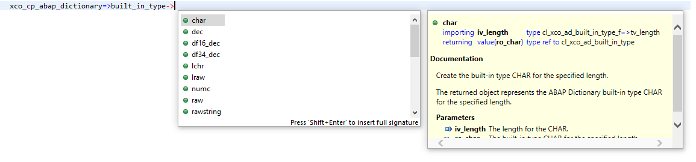

<!-- loio67dff4d26a444fe88d6471dee3532058 -->

# Core Principles

The design of the XCO library is based on the following core principles:

-   **Modules**

    The XCO library is organized as a collection of \(largely\) independent modules \(corresponding to ABAP packages\). The public API of each module is exposed via a special class, called the API “class” of the module. It is distinguished from all other XCO classes and interfaces in that it starts with “XCO\_CP\_”. The API class acts as the single point of entry for the functionality offered by a given module.

    Starting with the API class, code completion can be used to easily discover the scope of a given module.

    

-   **Enumerated Values**

    In the XCO library enumerated values are represented by pre-created objects which can be accessed via the API class of the module they belong to. Besides offering a strongly typed way to work with fixed values they also provide additional properties specific to the enumeration as well as access to the underlying primitive value.

    

-   **Exception Handling**

    All XCO modules follow a uniform error propagation strategy. Unless the caller of an API can be expected to recover from an error situation \(e.g. when attempting to acquire an exclusive lock\), all error situations are handled through no\_check exceptions.

    Any runtime exception that is raised explicitly by the XCO library is a subclass of CX\_XCO\_RUNTIME\_EXCEPTION \(cf. section Exception philosophy in [Standard Library](standard-library-b5ceba7.md)\).

