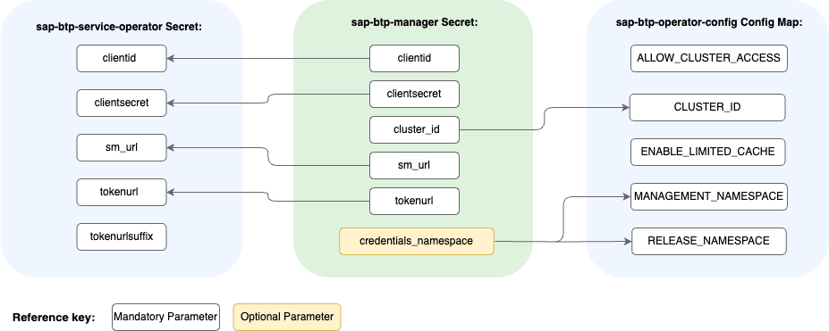

<!-- loio15f22d59da1d4c6896fcc9bf1d7ea5ce -->

# Customizing the Default Credentials and Access

You can customize the `sap-btp-manager` Secret and manage your own default configuration of the SAP BTP Operator module.


<a name="loio15f22d59da1d4c6896fcc9bf1d7ea5ce__prereq_d1q_q1d_32c"/>

## Prerequisites

You have the SAP BTP Operator module added. See [Add and Delete a Kyma Module](../50-administration-and-ops/add-and-delete-a-kyma-module-1b548e9.md#loio1b548e9ad4744b978b8b595288b0cb5c).


## Context

When you create SAP BTP, Kyma runtime, the `sap-btp-manager` Secret is automatically created as the default Secret managing the SAP BTP Operator's resources. Because of Kyma's automatic reconciliation, any changes to the Secret are reverted, and the previous settings are restored within 24 hours. See [Preconfigured Credentials and Access](preconfigured-credentials-and-access-ab106d7.md).

To customize the `sap-btp-manager` Secret and prevent your changes from being reverted, you must stop the Secret's reconciliation. With the customized Secret, you can perform the following actions:

-   Manage your own default configuration of SAP BTP Operator
-   Migrate the service instances you created outside of the Kyma environment to your Kyma cluster


## Procedure

To customize the `sap-btp-manager` Secret, modify the credentials in the following way:

-   Label the Secret with `kyma-project.io/skip-reconciliation: 'true'`.
-   Provide the following credentials from your SAP Service Manager instance: `clientid`, `clientsecret`, `sm_url`, and `tokenurl`.
-   Optionally, provide your `cluster_id`. Otherwise, the default generated one is used.
-   Optionally, add the `credentials_namespace` parameter and provide the name of your existing custom namespace for Secrets with credentials to communicate with the SAP Service Manager.

    > ### Note:  
    > Setting the `credentials_namespace` parameter changes the values of `MANAGEMENT_NAMESPACE` and `RELEASE_NAMESPACE` keys in the `sap-btp-operator-config` ConfigMap. The custom namespace replaces the default `kyma-system` namespace for `sap-btp-service-operator` and `sap-btp-operator-clusterid` Secrets. BTP Manager deletes the Secrets from the default `kyma-system` namespace and creates them in the custom namespace.


See the following example:

```
apiVersion: v1
kind: Secret
type: Opaque
metadata:
  name: sap-btp-manager
  namespace: kyma-system
  labels:
    app.kubernetes.io/managed-by: kcp-kyma-environment-broker
    kyma-project.io/skip-reconciliation: "true"
data:
  clientid: {CLIENT_ID}
  clientsecret: {CLIENT_SECRET}
  sm_url: {SM_URL}
  tokenurl: {AUTH_URL}
  cluster_id: {CLUSTER_ID}
  credentials_namespace: {CREDENTIALS_NAMESPACE}
```


<a name="loio15f22d59da1d4c6896fcc9bf1d7ea5ce__result_l2k_zkj_tdc"/>

## Results

Your customized `sap-btp-manager` Secret is now the default Secret of the SAP BTP Operator module. It generates the SAP BTP service operator's resources, as shown in the following diagram:

The reconciliation of the Secret stops and your changes are not reverted.

> ### Caution:  
> If you delete the customized `sap-btp-manager` Secret or remove the `kyma-project.io/skip-reconciliation: 'true'` label from it, the reconciliation starts again, and the preconfigured default `sap-btp-manager` Secret is recreated for your Kyma instance within 24 hours. See [Preconfigured Credentials and Access](preconfigured-credentials-and-access-ab106d7.md).

