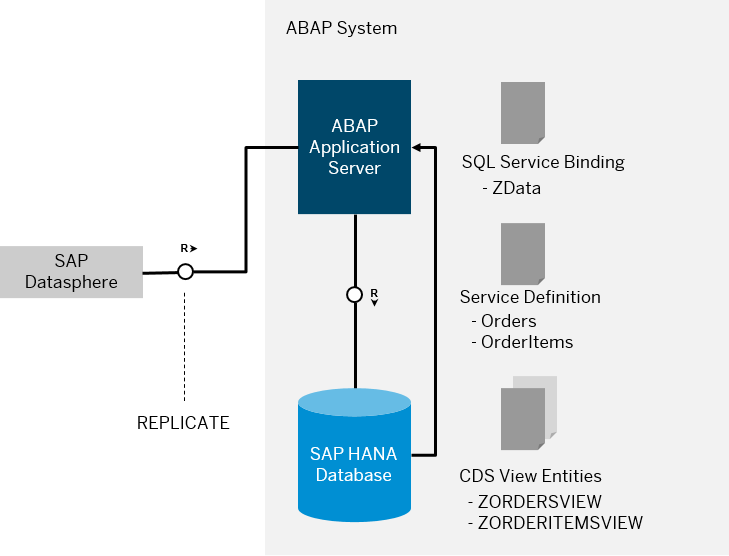

<!-- loioec312dd3e39f401b84681c53adc08ad8 -->

# Data Consumption Using SAP Datasphere

You can consume ABAP-managed data using SAP clients such as SAP Datasphere.

<a name="loioec312dd3e39f401b84681c53adc08ad8__section_yc3_twz_vqb"/>

## Architecture

In this scenario, you use SAP Datasphere to retrieve data from your ABAP system. From a technical perspective, SAP Datasphere plays the role of a client and triggers replication of data from the ABAP system to your SAP Datasphere instance. The replicated data then forms the basis for analytical scenarios inside SAP Datasphere.

To access data from your ABAP system in SAP Datasphere, you use SQL service bindings in the ABAP systems for the data exposure and the replication flows provided by SAP Datasphere:

-   You create CDS view entities on top of the tables or CDS views that you want to expose.

-   The SQL service binding type serves to expose CDS view entities. With the SQL service, you can use an access mechanism of the ABAP application server that provides SQL-level access to published ABAP-managed database API objects like tables and CDS views via CDS view entities for replication.

-   The replication management service of SAP Datasphere is used to replicate selected CDS view entities to SAP Datasphere.

In the replication scenario, the use of a communication user in the ABAP system with privileged access is supported \(no access controls applied\). Only read access to the exposed CDS view entities is allowed.

