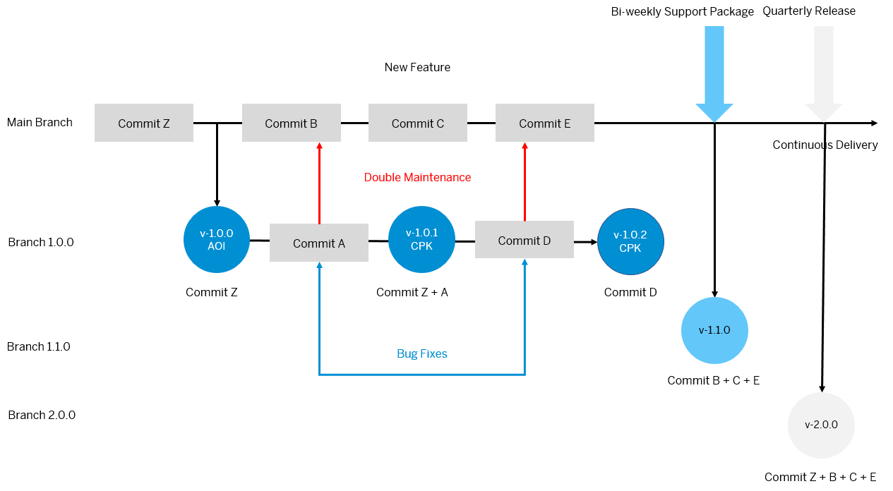
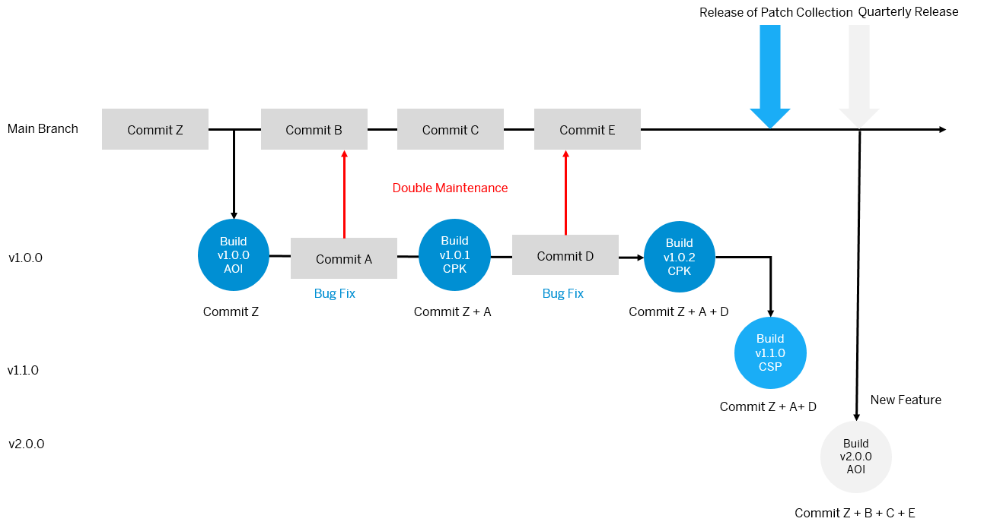

<!-- loio326508756a144c49b98e5fcf442cce40 -->

# Delivery Models

Based on the mentioned software component versioning principles, the add-on package types, and branching approach, you can use different delivery models.

> ### Recommendation:  
> You should choose the delivery model based on the existing processes in your development/shipment environment. Shorter delivery cycles have the advantage that new features are delivered more frequently. Therefore, we recommend following the continuous delivery approach whenever possible.

### Continuous Delivery

With the continuous delivery approach, new features should be delivered as soon as possible: In this case, new features can be shipped with support packages more often than new releases of a software component. These short development cycles ensure that changes can be deployed on short notice and in smaller increments. See [Continuous Integration and Delivery \(CI/CD\)](https://help.sap.com/viewer/65de2977205c403bbc107264b8eccf4b/Cloud/en-US/fe74df55b0f54e99bf6e13a3b53e1db0.html).

In this example, commit Z represents all the commits prior to the first build.

The maintenance branch v1.0.0 is used for bug fixes that must be manually maintained in the main branch, which requires double maintenance to make sure that the development code line is up to date.

Commit Z and commit C are new features implemented in the development code line on the main branch. Development of these features is done in the DEV system, testing in the TST system.

Commit A and commit D are small corrections that are implemented in the correction code line on the maintenance branch for support package level zero of software component release one.

Development of these bug fixes is done in the COR system, testing in the QAS system.

After releasing these corrections in the maintenance branch, you have to maintain them as well in the main branch in the DEV system to secure consistency of changes in the correction and development code lines. As a result, commit B and E are created in the main branch to reflect the corrections made in the maintenance branch \(commit A and commit D\).

The new support package build for version 1.1.0 is derived from the main branch and includes new features and bug fixes since the last support package level 1.0.0 has been released. With the new support package build for version 1.1.0 of the software component, a new maintenance branch v1.1.0 is created. All corrections for this support package level are developed on this branch.

For a new release, add-on version 2.0.0 is released. The resulting AOI package includes all features and bug fixes since the last AOI build for version 1.0.0 has been released.

Branch v1.1.0, that is based on the main branch, includes same commits as the main branch \(Z, B, C, and E\). For the build of CPK v1.0.2 and CSP v1.1.0, however, only the objects that have been changed since the previous CSP/AOI are included in the object list.

> ### Note:  
> With this delivery model, support packages not only include the corrections for the current support package level but also new features allowing shorter development cycles.

> ### Recommendation:  
> In a continuous delivery model, we recommend:
> 
> -   Building and deploying a new CSP on a weekly or biweekly basis.
> -   Shipping new software component releases on a quarterly basis. These AOI packages contain every object that has been built and delivered with the support packages, including all the patches.

### Quarterly Shipment

The quarterly delivery approach is recommended whenever longer test cycles are necessary and faster incremental development is not feasible. This might be required due to industry requirements, legal requirement etc.

Compared to the continuous delivery model, the maintenance branches for each support package level are not created based on the main branch but on the previous maintenance branch: e.g. branch v1.1.0 is based on v1.0.0.

That way, support packages are only used for the purpose of patch collections: only the corrections in commit A and D that were already delivered as patches in version 1.0.1 and 1.0.2 are included in support package 1.1.0.

> ### Note:  
> With this delivery model, new features are only delivered with new release versions \(AOI packages\). The build for version 1.1.0 does not include commit C. As late as with the build for version 2.0.0, this feature is shipped. Consequently, new features take longer until they are available in production systems.

This delivery model is similar to processes commonly used to ship on-premise solutions where upgrades are much more complex and usually performed on a quarterly basis. Instead of shipping more often but in smaller packages, this approach promotes building larger shipment packages with a lot of new features.

Branch v1.1.0, that is based on branch v1.0.0, includes the same commits as branch v1.0.0 \(Z, A, and D\). For the build of CPK v1.0.2 and CSP v1.1.0, however, only the objects that have been changed since the previous CSP/AOI are included in the object list.

