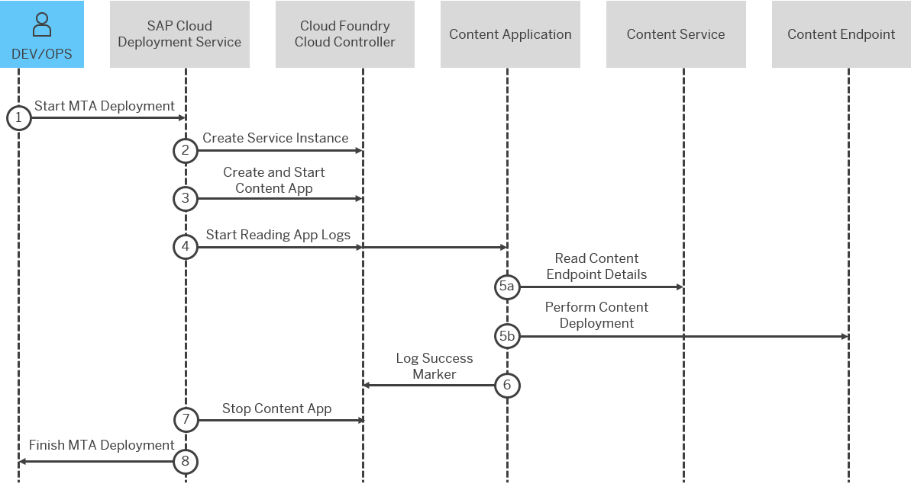

<!-- loio9454b1ff08484b5d97f9bea20e354db3 -->

# Deploying Content with Simulated App Execution

This approach for content deployment relies on an intermediate Cloud Foundry application that communicates with the content backend. This application includes both the content and the content specific deployer.

The content specific deployer is defined as an application dependency during design time. It is then included in the MTA archive. During deployment it serves as a client for the actual content deployment to the content backend.

> ### Note:  
> This approach is a legacy one. Over time it has proven to have some major drawbacks. If possible, migrate to [Deploying Content with Generic Application Content Deployment](deploying-content-with-generic-application-content-deployment-d3e2319.md) or at least to [Deploying Content with CF Task Execution](deploying-content-with-cf-task-execution-98b1bf5.md) of the corresponding module type.

> ### Note:  
> All supported MTA module types for this approach will either be discontinued or will be transformed to use [CF Task Execution](deploying-content-with-cf-task-execution-98b1bf5.md).


<a name="loio9454b1ff08484b5d97f9bea20e354db3__section_yqk_3mx_wxb"/>

## Supported Content Types

Supported content types that currently allow deployment with simulated app execution:

-   FLP content - MTA module type `com.sap.portal.site-content`

-   Business Logging - MTA module type `business-logging`. For more information see [Using the Content Deployer](https://help.sap.com/docs/SAP_CP_BUS_REUSE_SERVICE_BL/9d9c6578dd284b7491e2b6ceb1395329/626b5511d7924ace8b6ae912e8ff3447.html?locale=en-US).

-   HTML5 Application Content – MTA module type `com.sap.html5.application-content`. For more information see [Deploy Content Using HTML5 Application Deployer](https://help.sap.com/docs/btp/sap-business-technology-platform/deploy-content-using-html5-application-deployer?version=Cloud).


<a name="loio9454b1ff08484b5d97f9bea20e354db3__section_emm_vnx_wxb"/>

## How Content is Deployed with Simulated App Execution

The following diagram illustrates the steps and BTP components involved in the process of content deployment with simulated app execution:



The steps below describe the process of content deployment with simulated app execution:

1.  A developer/operator runs MTA deployment.

2.  SAP Cloud Deployment service creates or reuses a service instance provided by an SAP application.

3.  The third step includes:

    1.  SAP Cloud Deployment service creates a Cloud Foundry application that serves as a content application.

    2.  SAP Cloud Deployment service binds the service instance to the content application.

    3.  SAP Cloud Deployment service uploads the combination of content and content deployer as application bits.

    4.  SAP Cloud Deployment service starts the application, which in turn starts the content deployer.


4.  SAP Cloud Deployment service starts to read the application logs and searches for the success-marker and/or failure-marker values.

5.  Content deployer performs the actual content deployment. This step includes:

    1.  Content deployer reads content details from the bound service instance and identifies the content endpoint and required authentication.

    2.  Content deployer executes the content deployment to content endpoint.


6.  Via certain success-marker or failure-marker, content deployer reports the status as application logs.

7.  SAP Cloud Deployment service stops the content application.

8.  MTA deployment completes and SAP Cloud Deployment service reports the status to the developer/operator.


<a name="loio9454b1ff08484b5d97f9bea20e354db3__section_alm_qqx_wxb"/>

## Content Deployer and Service Instance

The content deployer and service instance are provided by the SAP business application that uses the business content. This way, the content deployer will know how to communicate to the backend on which the content will be deployed. Thus the SAP Cloud Deployment service is isolated from the actual content deployment protocol and implementation.

Normally, the content deployers are simple clients that implement specific REST APIs to pass the content. When the content application is started it invokes a content deployer which calls certain endpoints and executes the actual content deployment.

The content deployer identifies the content endpoint based on the service binding. Content endpoint could be any URL either provided by an application in BTP Cloud Foundry or one outside of the BTP entirely.

It is possible that a content application will have bindings to multiple service instances to complete the content deployment. For example, there could be a reference to an XSUAA service instance, which will ensure secure communication between the content deployer and content endpoint.


<a name="loio9454b1ff08484b5d97f9bea20e354db3__section_c3c_bsx_wxb"/>

## Success Marker and Failure Marker

Success and failure markers are part of the protocol between SAP Cloud Deployment service and the content deployers.

They are used to indicate when the content deployment has reached a final state. Content deployers must include the markers in its logs. Then SAP Cloud Deployment service observes the application logs \(STDOUT or STDERR\) and decides if the content deployment has finished successfully or failed.

Success and failure markers are predefined and must not be changed by the end customer. They are represented by the module level parameters `success-marker` and `failure-marker`.

For instance, module type `com.sap.portal.site-content` has a success-marker `STDOUT:Deployment of site content to .* done.*`


<a name="loio9454b1ff08484b5d97f9bea20e354db3__section_wzx_m4d_xxb"/>

## MTA Modelling

Below you can find the modelling for supporting the content deployment scenario for MTA module type `com.sap.portal.site-content`:

> ### Sample Code:  
> ```
> _schema-version: "3.1" 
> ID: my-portal 
> version: "1.1" 
> modules: 
>    - name: site-content 
>     type: com.sap.portal.site-content 
>     path: site-content/ 
>     parameters: 
>       buildpack: nodejs_buildpack // Predefined parameter 
>       no-route: true // Predefined parameter - avoid route mapping to the content app. It will not serve any HTTP requests 
>       memory: 256M // Predefined parameter – used memory 
>       execute-app: true // Predefined parameter – flag that marks the app to be used for simulated app execution 
>       success-marker: STDOUT:Deployment of site content to .* done.* // Predefined parameter – marker for success 
>       failure-marker: STDERR:Deployment of site content to .* failed.* // Predefined parameter – marker for failure 
>       stop-app: true // Predefined parameter – flag that specifies if the app will be stopped after the actual deployment 
>       check-deploy-id: true // Predefined parameter – flag that specifies that certain and unique id will be checked for that content deployment 
>       dependency-type: hard 
>       health-check-type: none // Predefined parameter – skips the CF health-check, so content app will not implement specific endpoint 
>     requires: 
>        - name: sap-portal-services-client 
>        - name: portal-uaa 
>  
>  
> resources: 
>     - name: sap-portal-services-client // Provides content endpoint for the actual content deployment. Content endpoint could be different based on the account 
>     type: com.sap.portal.site-content 
>     parameters: 
>       config: 
>         siteId : 1234 
>  
>   - name: portal-uaa // Used for secure communication between content app and content endpoint 
>     type: com.sap.xs.uaa-space 
>     parameters: 
>       config-path: security/xs-security.json
> 
> ```

