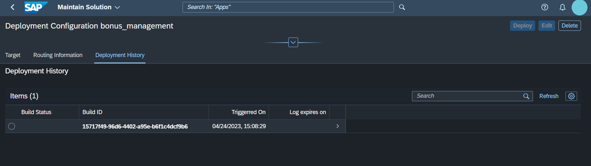
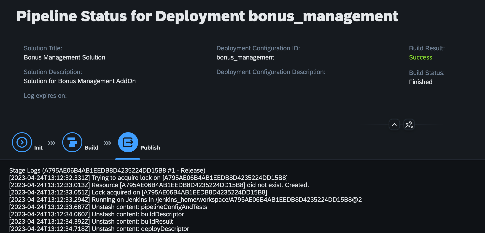

<!-- loio58b90eccb5c54952bebc2ed6017ffd37 -->

# Deployment Process

<a name="loio58b90eccb5c54952bebc2ed6017ffd37__section_c3k_nyj_wwb"/>

## Deployment Configurations

After creating a solution and a plan, you can maintain deployment configurations. Deployment is the activity responsible to make new solutions available in your subaccount.

The deployment status can be shown as Not Deployed, Initial, Deployed or Error. If the status shows Initial, the deployment is still editable and not yet implemented.

### Trigger

Navigate to the *Solutions* tab. By choosing a solution out of the list, the solutions overview page will display. Here, you can scroll down to the *Deployment Configurations* section. To trigger the deployment of a solution, select a deployment configuration by clicking the radio button on the left side. Now when you click onto the deployment configuration, a new window opens where you can deploy the configuration and see the so far occurring *Deployment History*.

Clicking this for the first time will set the deployment configurations status on Initial \(if the pipeline runs without errors\).

Back in the solutions overview page, you can choose one of the *Items* listed.

Now if your deployment status shows Error or Not Deployed, the *Deploy* button on the right top side of the Items list will be activated.

If the button isn’t active, the deployment is permitted by the system. This will be the case with status Initial and Deployed.

The deployment can also be triggered by navigating into the object page of the deployment configuration. There, on the top right you will find the *Deploy* button.

### Monitor

Clicking on the Items in the *Deployment History* will show you the according pipeline status. The three steps Init, Build and Publish are shown. When selecting one of the corresponding steps to these icons, the matching section of the log will be displayed. When a step icon is marked in grey, no information is available. A step icon in yellow represents the current step being processed. Lastly, a step icon in red informs you about an error. In this case you need to scan the log to find the source of this error.

Here, errors may occur that will trigger the status *Error* to be shown. With the status *Error*, the *Deploy* button on the solution’s overview page will be activated again to be clicked.

> ### Note:  
> Please distinguish between the build result and the build state. The built result can show an error, program termination or success once the pipeline has run. The build state will show in progress, finished, success or error.

