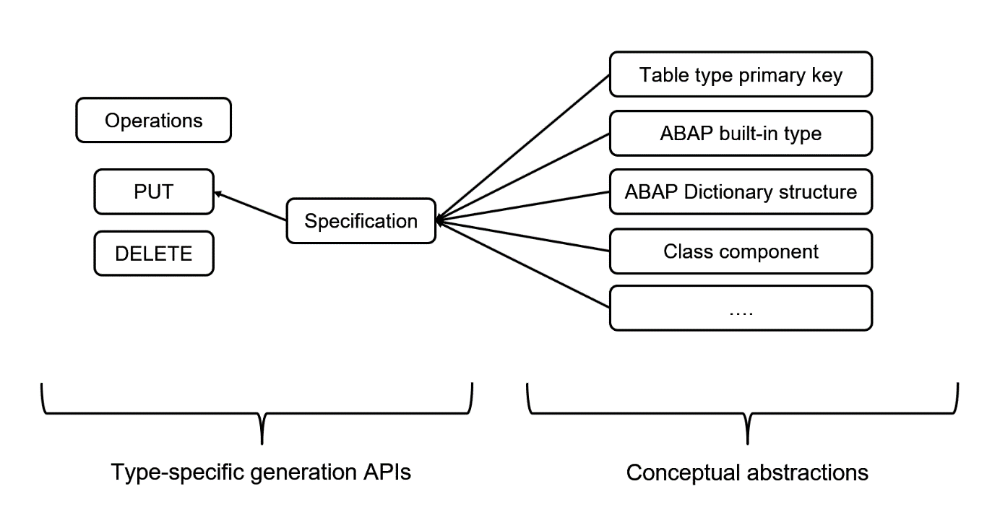

<!-- loiod01859f0293648bfb3af580b871222e2 -->

# Design of the XCO Generation APIs

As with the whole XCO library, the design of the XCO Generation APIs is governed by core principles:

-   **Environment**

    The prerequisite for building and executing operations is a generation environment. A generation environment is backed by a transport which must be in status ‘Modifiable’ and is obtained via the XCO\_CP\_GENERATION API.

     

    > ### Sample Code:  
    > ```abap
    > " In this example, X08K123456 would need to be a modifiable Workbench
    > " transport.
    > DATA(lo_environment) = xco_cp_generation=>environment->dev_system( 'X08K123456' ).
    > 
    > DATA(lo_put_operation) = lo_environment->create_put_operation( ).
    > lo_put_operation->for-dtel->add_object( '...' ).
    > " ...
    > ```

    The environment acts as the entry point to the type-specific Generation APIs which allow to build and successively execute PUT and DELETE operations. All system changes caused by an operation created for an environment will be written to the environment’s transport.

    

-   **Operations**

    Operations consist of a set of objects \(identified by their type and name\) and allow to perform an action for these objects \(determined by the kind of operation\).

    *PUT operations*

    Upon execution, a PUT operation either creates or updates its objects according to provided specifications \(depending on whether the object already exists in the system\). Each object type defines a form-based specification tailored to the specific attributes of the object type which is used to describe the content of each object of the PUT operation. As a PUT operation potentially creates new objects a valid package must be provided for all non-package objects. This package is used when the object is newly created but is ignored when the object already exists and is only updated.

     

    > ### Sample Code:  
    > ```abap
    > DATA(lo_put_operation) = lo_environment->create_put_operation( ).
    > 
    > DATA(lo_specification) = lo_put_operation->for-dtel->add_object( 'ZDATA_ELEMENT'
    >   )->set_package( 'ZPACKAGE'
    >   )->create_form_specification( ).
    > lo_specification->set_short_description( 'My generated data element' ).
    > 
    > lo_specification->set_data_type( xco_cp_abap_dictionary=>built_in_type->char( 10 ) ).
    > 
    > lo_specification->field_label-short->set_text( 'ID' ).
    > lo_specification->field_label-medium->set_text( 'Identifier' ).
    > lo_specification->field_label-long->set_text( 'User identifier' ).
    > lo_specification->field_label-heading->set_text( 'User identifier' ).
    > 
    > lo_put_operation->execute( ).
    > ```

    Object types that support inactive versions can be combined into a single PUT operation. Once the objects have either been created or updated \(in inactive version\) all the objects of the PUT operation will be activated together in a single mass activation. This provides support for interdependencies \(even circular ones\) between the objects of a PUT operation.

    It is furthermore possible to influence the execution of a PUT operation with so-called options. Currently the following options are offered:

    -   Skip activation: Create or update the objects of the PUT operation but do not perform a mass activation afterwards


    Using an option is as simple as supplying it to the EXECUTE method invocation of the corresponding PUT operation:

    > ### Sample Code:  
    > ```abap
    > lo_put_operation->execute( VALUE #( ( xco_cp_generation=>put_operation_option->skip_activation ) ) ).
    > ```

    *POST operations*

    The objects on a POST operation consist of a name choice \(IF\_XCO\_NAME\_CHOICE\) and a specification. In contract to PUT operations, objects are not explicitly identified by their name, but instead a name choice is provided which will be evaluated upon execution of the POST operation.

    By providing a name choice instead of a fixed name it is possible to potentially pick a fallback name in case the preferred name is already taken. However, this is not mandatory and it is also possible to provide a fixed name, e.g. for the creation of function group:

    ```abap
    DATA(lo_post_operation) = lo_environment->for-fugr->create_post_operation( ).
    
    DATA(lo_fixed_name_choice) = xco_cp_name=>choice->fixed( 'ZMY_FNCTN_GRP' ).
    lo_post_operation->add_object( lo_fixed_name_choice
      )->set_package( 'ZLOCAL'
      )->create_form_specification( ).
    
    " ...
    
    lo_post_operation->execute( ).
    ```

    In any case, upon execution the name choices for all the objects on the POST operation are resolved. The operation will only proceed if all name choices can be resolved, i.e. a name can be determined for which no object already exists in the ABAP repository. If all name choices were resolved successfully the semantics of a POST operation are those of a PUT operation where the objects do not exist prior to the execution.

    *PATCH operations*

    Upon execution, a PATCH operation will update its objects according to the changes provided in the specifications. The available changes depend on the object type.

    For message classes \(MSAG\) it is e.g. possible to insert, update, modify or delete messages of the message class. The semantics are as follows:

    -   INSERT Add a new part to the object if it does not exist yet. If it already exists, no action will be performed.

    -   UPDATE Update an existing part of the object. If the part does not exist, no action will be performed.

    -   MODIFY Modify the specified part of the object. If the part does not exist, it will be created according to the specification, otherwise it will be updated.

    -   DELETE Delete the specified part of the object. If the specified part does not exist no action will be performed


    *DELETE operations*

    Upon execution, a DELETE operation will delete all its objects \(in case they exist in the system\). DELETE operations are always built and executed for a given type and it is the responsibility of the caller to ensure that objects of different types are deleted in the correct order \(e.g. a domain still in use by a data element cannot be deleted; the data element must be deleted first\).

    *COMMIT behavior of operations*

    The execution of an operation will always execute a COMMIT WORK.

    *Errors during operation execution*

    If the execution of an operation fails, the following exceptions are used to communicate the failure:

    -   CX\_XCO\_GEN\_PUT\_EXCEPTION for a failed PUT operation

    -   CX\_XCO\_GEN\_DELETE\_EXCEPTION for a failed DELETE operation

    -   CX\_XCO\_GEN\_PATCH\_EXCEPTION for a failed PATCH operation


    Each exception provides access to the findings, i.e. all the messages and which object they belong to, that were encountered when attempting to execute the operation.

    In case the mass activation of a PUT operation fails, the already existing inactive versions will not be deleted.

-   **Conceptual Abstractions**

    The overall design and architecture of the XCO Generation functionality is based on the differentiation between conceptual abstractions and type-specific generation APIs.

    

    Conceptual abstractions represent entities in the ABAP system which can be used in conjunction with different object types. For example, a built-in type of the ABAP Dictionary may be used as the format for a domain \(DOMA\), the data type of a data element \(DTEL\) or the row type of a table type \(TTYP\). Conceptual abstractions create a common language which can be used across different object types in the context of generation.

     

    > ### Sample Code:  
    > ```abap
    > DATA(lo_char_10) = xco_cp_abap_dictionary=>built_in_type->char( 10 ).
    > 
    > lo_doma_specification->set_format( lo_char_10 ).
    > lo_dtel_specification->set_data_type( lo_char_10 ).
    > lo_ttyp_specification->set_row_type( lo_char_10 ).
    > ```

-   **4. Templates**

    Instead of manually filling a form specification, templates can be used to prefill an empty form specification from an existing ABAP Repository object. Currently the following object types support templates:

    -   DOMA \(Domain\)

    -   DTEL \(Data element\)

    -   TABL \(Database tables and structures\)

    -   TTYP \(Table types\)


    Using templates, it is e.g. possible to easily copy an existing object. The following code sample uses the active version of domain ZSOURCE\_DOMAIN as a template and will create \(resp. update\) domain ZCOPIED\_DOMAIN to reflect the content of ZSOURCE\_DOMAIN:

    > ### Sample Code:  
    > ```abap
    > DATA(lo_template) = xco_cp_generation_doma=>template->for_domain(
    >   iv_name       = 'ZSOURCE_DOMAIN'
    >   io_read_state = xco_cp_abap_dictionary=>object_read_state->active_version
    > ).
    > 
    > DATA(lo_put_operation) = lo_environment->create_put_operation( ).
    > lo_put_operation->for-doma->add_object( 'ZCOPIED_DOMAIN'
    >   )->set_package( 'ZPACKAGE'
    >   )->set_template( lo_template ).
    > lo_put_operation->execute( ).
    > ```


