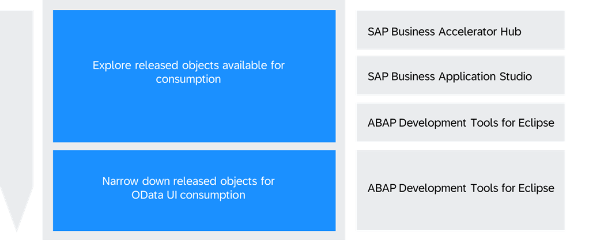
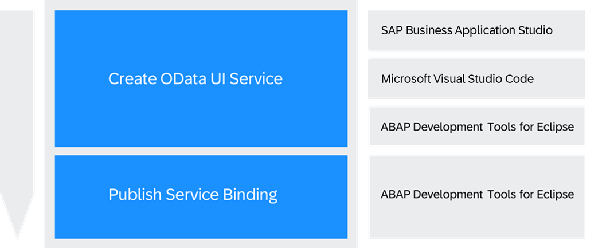

<!-- loio5717c0a1dafc4335add0207b81c39cef -->

# Develop an OData UI Service Against a Released BO Interface or CDS View

Get an overview about how to create an OData UI service based on a released business object interface or CDS view using ABAP development tools for Eclipse, SAP Business Application Studio or Microsoft Visual Studio Code.

<a name="loio5717c0a1dafc4335add0207b81c39cef__section_zhf_y4d_r2c"/>

## Prerequisites

-   If you are using SAP Business Application Studio...
    -   You have set up SAP Business Application Studio. See [Setup of UI Development in SAP Business Application Studio](https://help.sap.com/docs/sap-btp-abap-environment/abap-environment/setup-of-ui-development-in-sap-business-application-studio-optional?version=Cloud) 
    -   You have established trust by setting up a custom Identity service. See [Setup of a Custom Identity Service](https://help.sap.com/docs/btp/sap-business-technology-platform/setup-of-custom-identity-service?version=Cloud).

-   If you are using Visual Studio Code
    -   You have installed and set up Visual Studio Code including the SAP Fiori tools extensions. See [Visual Studio Code](https://help.sap.com/docs/SAP_FIORI_tools/17d50220bcd848aa854c9c182d65b699/17efa217f7f34a9eba53d7b209ca4280.html)
    -   To establish a connection with your ABAP environment system, you either have to be a space developer in the ABAP environment instance or have access to a service key in the ABAP environment instance. See [Add Space Members Using the Cockpit](https://help.sap.com/docs/btp/sap-business-technology-platform/add-space-members-using-cockpit?version=Cloud) and [Creating Service Keys in the ABAP service instance](https://help.sap.com/docs/btp/sap-business-technology-platform/creating-service-keys?version=Cloud).
    -   You have established trust by setting up a custom Identity service. See [Setup of a Custom Identity Service](https://help.sap.com/docs/btp/sap-business-technology-platform/setup-of-custom-identity-service?version=Cloud).

-   If you are using ABAP development tools for Eclipse...
    -   You have installed and set up ABAP development tools for Eclipse. See[Download the Eclipse IDE and add the ABAP development Tools \(ADT\) Plugin](https://developers.sap.com/tutorials/abap-install-adt..html) .

<a name="loio5717c0a1dafc4335add0207b81c39cef__section_bfz_4pd_r2c"/>

## 1. Explore Business Object Interfaces and CDS Views suitable for UI Consumption

> ### Prerequisites:  
> -   Business Catalog SAP\_A4C\_BC\_DEV\_OBJ\_DIS\_PC, which allows you to discover released objects. See [Business Catalogs for Development Tasks](https://help.sap.com/docs/btp/sap-business-technology-platform/business-catalogs-for-development-tasks?version=Cloud).

### Steps

1.  As a developer user, explore business object interfaces as well as CDS views that are released with Contract C1: Use System-Internally
    1.  Business Object Interfaces and CDS views listed in SAP System Service Provider in the **Service Center** within SAP Business Application Studio. See [SAP System Service Provider](https://help.sap.com/docs/bas/sap-business-application-studio/sap-system-service-provider?version=Cloud).
    2.  Core Data Services listed under the released objects tree in ABAP development tools for Eclipse, look for behavior definitions and data definitions. See [ABAP Repository Trees](https://help.sap.com/docs/abap-cloud/abap-development-tools-user-guide/abap-repository-trees-concept?version=sap_btp#overview).

        > ### Note:  
        > Customer-owned business object interfaces and CDS views are only visible in ABAP development tools for Eclipse as well as in the UI Service Generator. The SAP System Service Provider in Service Center within SAP Business Application only shows SAP-provided objects.

2.  On top of finding released objects for consumption, you can further narrow down the selection to only those objects that support OData UI consumption.
    1.  In the **Project Explorer** of ABAP development tools for Eclipse, open a released core data service or the root view entity of a released business object interface.
    2.  Check the header annotations of the corresponding object. If the annotation and enumeration `@ObjectModel.supportedCapabilities: [#UI_PROVIDER_PROJECTION_SOURCE]` are included, the OData UI consumption is supported.

        > ### Note:  
        > To open the root view entity for a business object interface, navigate from the released behaviour definition object to the corresponding data definition via the name of the root view entity in the behaviour definition.

<a name="loio5717c0a1dafc4335add0207b81c39cef__section_y52_bwx_r2c"/>

## 2. Creating and publishing an OData UI service based on BO interface or CDS View

> ### Prerequisites:  
> -   Business Catalog SAP\_A4C\_BC\_DEV\_PC is assigned to your user, which allows you to create and publish OData UI services. See [Business Catalogs for Development Tasks](https://help.sap.com/docs/btp/sap-business-technology-platform/business-catalogs-for-development-tasks?version=Cloud).

### Steps

1.  As developer user, create an OData UI Service based on the business object interface or CDS view suitable for UI consumption:
    1.  In SAP Business Application Studio and Microsoft Visual Studio Code you can use the **UI Service Generator** to generate an OData UI Service. See [UI Service Generation](https://help.sap.com/docs/SAP_FIORI_tools/17d50220bcd848aa854c9c182d65b699/1a7aad346618443a86ebd7250bac0ef0.html).

        > ### Note:  
        > When using the OData UI service generator in SAP Business Application Studio, communication with the ABAP environment is established via destinations \(see [Creating a Destination to the ABAP System for SAP Business Application Studio or Creating a Destination for Cross-Subaccount Communication](https://help.sap.com/docs/btp/sap-business-technology-platform/creating-destination-to-abap-system-for-sap-business-application-studio?version=Cloud)\). As part of this destination for backend connectivity, you must define an additional property, `HTML5.Timeout`. This value represents the maximum time to wait for a response \(in milliseconds\) from the destination \(refer to [Additional Properties of a Destination](https://help.sap.com/docs/build-work-zone-standard-edition/sap-build-work-zone-standard-edition/html5-configure-destinations)\). Given the complexity and time-consuming nature of creating an OData UI service, it is recommended to configure a destination timeout of at least 300000 milliseconds to avoid potential timeouts.

    2.  In SAP Business Application Studio, utilize the SAP system service provider as part of the Service Center view to explore business objects or CDS views and their properties, then generate an OData UI service from an ABAP business object interface or CDS view. For more details, refer to[Explore SAP System Business Objects and ABAP CDS Views](https://help.sap.com/docs/bas/sap-business-application-studio/sap-system-service-provider?version=Cloud#explore-sap-system-business-objects-and-abap-cds-views). While creating an OData UI service from the Service Center view, the **UI Service Generator** will be opened for the actual generation of the service.

        > ### Note:  
        > If the underlying business object interface/CDS view does not support UI consumption, a corresponding warning will appear before adding an OData UI service from the SAP system service provider to the project.
        > 
        > This method currently only supports the creation based on SAP-provided business object interfaces and CDS views.

    3.  OData UI services can be created in ABAP development tools for Eclipse either manually by creating an OData UI service binding or by utilizing the **Generate ABAP Repository Objects** wizard. See [Creating Service Binding](https://help.sap.com/docs/abap-cloud/abap-cds-tools-user-guide/creating-service-binding?version=sap_btp) and [Generating ABAP Repository Objects](https://help.sap.com/docs/abap-cloud/abap-development-tools-user-guide/generating-abap-repository-objects).

        > ### Note:  
        > If the underlying business object interface/CDS view is not suitable for UI consumption, the **Generate ABAP Repository Objects** wizard will display a relevant warning.

2.  When using the UI Service Generator in Business Application Studio or Visual Studio Code \(directly or opened via the Service Center view\), the service binding for the OData UI service is automatically published. This allows you to continue with the SAP Fiori application implementation without additional steps.

    While creating the OData UI service in ABAP development tools for Eclipse, you have to publish the corresponding service binding so it will be available in the service catalog. For more information, see [Using Service Binding Editor for OData V4 Service](https://help.sap.com/docs/abap-cloud/abap-cds-tools-user-guide/using-service-binding-editor-for-odata-v4-service) .

### Next Step

Develop an SAP Fiori Application UI based on the OData UI Service. See [Develop an SAP Fiori Application UI and Deploy it to ABAP Using SAP Business Application Studio](https://help.sap.com/docs/sap-btp-abap-environment/abap-environment/develop-sap-fiori-application-ui-and-deploy-it-to-abap-using-sap-business-application-studio?version=Cloud) and Develop an [SAP Fiori Application UI and Deploy it to ABAP Using Visual Studio Code](https://help.sap.com/docs/sap-btp-abap-environment/abap-environment/develop-sap-fiori-application-ui-and-deploy-it-to-abap-using-visual-studio-code?version=Cloud).

**Related Information**  

[Generate your own custom UI Service based on a Business Object Interface](https://developers.sap.com/tutorials/abap-cloud-ui-from-interface.html)

[Video: Create an SAP Fiori Application Based on an ABAP Business Object \(BO\) with SAP Build](https://www.youtube.com/watch?v=mTMZgWPDzrk)

