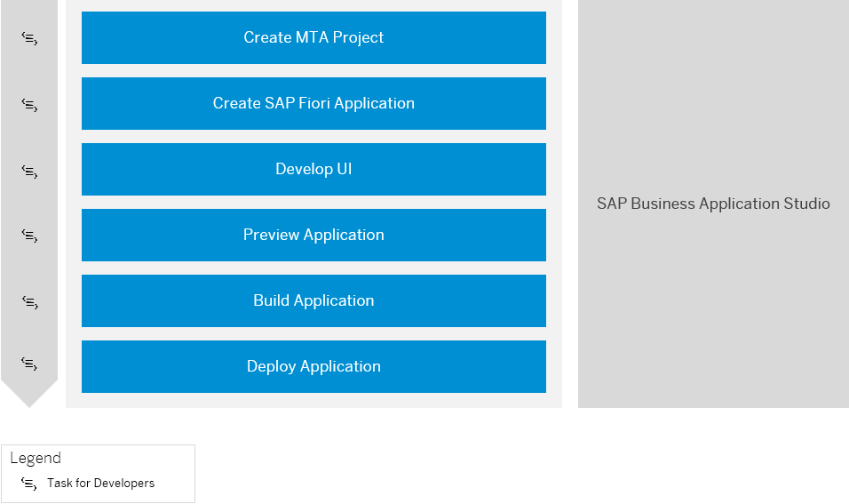

<!-- loio2498cbfce1b14f3b9f62fab9fa4407f7 -->

# Develop an SAP Fiori Application and Deploy it to Cloud Foundry Using SAP Business Application Studio

Get an overview about how to create and deploy an SAP Fiori application to Cloud Foundry using SAP Business Application Studio.

<a name="loio2498cbfce1b14f3b9f62fab9fa4407f7__section_vrs_rsc_jsb"/>

## Prerequisites

-   A subaccount administrator has provided access to SAP Business Application Studio. See [Setup of UI Development in SAP Business Application Studio \(Optional\)](../20-getting-started/setup-of-ui-development-in-sap-business-application-studio-optional-37a896b.md).
-   A subaccount administrator has created a destination to the ABAP system to integrate SAP Business Application Studio. See [Creating a Destination to the ABAP System for SAP Business Application Studio](../20-getting-started/creating-a-destination-to-the-abap-system-for-sap-business-application-studio-e597948.md).
-   You have created a dev space of type SAP Fiori. See [SAP Business Application Studio](https://help.sap.com/viewer/17d50220bcd848aa854c9c182d65b699/Latest/en-US/b0110400b44748d7b844bb5977a657fa.html).

-   You have access to a RAP business service that has been exposed as an OData service. See [Using Service Binding Editor for OData V2 Service](https://help.sap.com/docs/btp/sap-abap-cds-development-user-guide/using-service-binding-editor-for-odata-v2-service?version=Cloud).

<a name="loio2498cbfce1b14f3b9f62fab9fa4407f7__section_dvd_t3k_hmb"/>

## Generating and Deploying Your Application

1.  Create an MTA project with approuter configuration.

    To do so, use the *Fiori CF Application Router Generator*. See [Generate an MTA Deployment File](https://help.sap.com/viewer/17d50220bcd848aa854c9c182d65b699/Latest/en-US/9c41152c5b8d4a658d7ef9f318b28917.html).

    This generates an MTA project and the corresponding application router configuration.

2.  With the *SAP Fiori Generator*, create an SAP Fiori application in the subfolder of the MTA file location by selecting *Fiori: Open Application Generator* from the command palette. See [Generate an Application](https://help.sap.com/viewer/17d50220bcd848aa854c9c182d65b699/Latest/en-US/db44d45051794d778f1dd50def0fa267.html) and [Add a Fiori Application to an MTA Deployment File with the Fiori Generator](https://help.sap.com/viewer/17d50220bcd848aa854c9c182d65b699/Latest/en-US/5a17ba6b62b2462aa0e25ffae7b8d728.html).

    -   As a data source, select *Connect to a System*.
    -   As a system, choose the destination to the ABAP system that has been created to integrate SAP Business Application Studio.
    -   As a service, select your RAP business service that has been exposed as an OData service

    In the *Project Attributes* section, add an SAP Fiori launchpad configuration for your UI project. See section *Add FLP configuration* in [Additional Configuration](https://help.sap.com/viewer/17d50220bcd848aa854c9c182d65b699/Latest/en-US/9bea64e63b824261932d90037ce3c5ae.html).

    If you want to create you FLP configuration later, see [SAP Fiori Launchpad Configuration](https://help.sap.com/viewer/17d50220bcd848aa854c9c182d65b699/Latest/en-US/bc3cb890dbb84d51ae80394821ce4990.html).

3.  Continue with the development of the UI, for example, with the help of guided development. See [Implement Features using Guided Development](https://help.sap.com/viewer/17d50220bcd848aa854c9c182d65b699/Latest/en-US/0c9e518ecf704b2f80a2bed0eaca60ae.html).
4.  Now you can preview the generated SAP Fiori application. See [Preview an Application](https://help.sap.com/viewer/17d50220bcd848aa854c9c182d65b699/Latest/en-US/b962685bdf9246f6bced1d1cc1d9ba1c.html).
5.  Build the application by executing command `npm run build` in the terminal of your project. See [Deployment to Cloud Foundry](https://help.sap.com/docs/SAP_FIORI_tools/17d50220bcd848aa854c9c182d65b699/607014e278d941fda4440f92f4a324a6.html#deployment-to-cloud-foundry).

    This generates an `*.mtar` file and `mta_archives` folder.

6.  Log on to Cloud Foundry and deploy the SAP Fiori UI to your development space by executing command `npm run deploy`. See [Deployment to Cloud Foundry](https://help.sap.com/docs/SAP_FIORI_tools/17d50220bcd848aa854c9c182d65b699/607014e278d941fda4440f92f4a324a6.html#deployment-to-cloud-foundry).

> ### Tip:  
> If you can't discover an available OData service in the generator, or preview your application, check if you user is assigned to business catalog `SAP_CORE_BC_EXT_TST`. If you aren't authorized to deploy the application, check if business catalog `SAP_A4C_BC_DEV_UID_PC` is assigned to your user.

**Related Information**  

[SAP Business Application Studio](https://help.sap.com/viewer/product/SAP%20Business%20Application%20Studio/Cloud/en-US)

[SAP Fiori Tools](https://help.sap.com/viewer/product/SAP_FIORI_tools/Latest/en-US)

[SAP Fiori Overview](https://help.sap.com/viewer/product/SAP_FIORI_OVERVIEW/5_OVERVIEW/en-US?task=discover_task)

[Tutorial: Create an SAP Fiori App and Deploy it to SAP BTP, Cloud Foundry environment](https://developers.sap.com/tutorials/abap-environment-deploy-cf.html)

