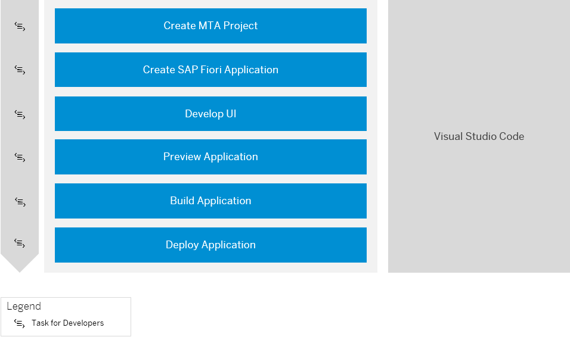

<!-- loioa0646409cc19487bbfa6f2af7d558449 -->

# Develop an SAP Fiori Application and Deploy it to Cloud Foundry Using Visual Studio Code

Get an overview about how to create and deploy an SAP Fiori application to Cloud Foundry using Visual Studio Code \(VS Code\).

<a name="loioa0646409cc19487bbfa6f2af7d558449__section_rsw_ntc_jsb"/>

## Prerequisites

-   You have installed and set up Visual Studio Code including the SAP Fiori tools extensions. See [Visual Studio Code](https://help.sap.com/viewer/17d50220bcd848aa854c9c182d65b699/Latest/en-US/17efa217f7f34a9eba53d7b209ca4280.html).
-   You have access to a RAP business service that has been exposed as an OData service. See [Using Service Binding Editor for OData V2 Service](https://help.sap.com/viewer/923180ddb98240829d935862025004d6/Cloud/en-US/81dc788fbda74883bd775a4036fa4b67.html).
-   To establish a connection with your ABAP environment system, you either have to be a space developer in the ABAP environment instance or have access to a service key in the ABAP environment instance. See [Add Space Members Using the Cockpit](https://help.sap.com/viewer/65de2977205c403bbc107264b8eccf4b/Cloud/en-US/81d0b4dcfbc84016b6b3c1465d4272f4.html) and [Creating Service Keys](https://help.sap.com/products/BTP/65de2977205c403bbc107264b8eccf4b/4514a14ab6424d9f84f1b8650df609ce.html?version=Cloud) in the ABAP service instance.

<a name="loioa0646409cc19487bbfa6f2af7d558449__section_dvd_t3k_hmb"/>

## Generating and Deploying Your Application

1.  Create an MTA project with approuter configuration.

    To do so, use the *Fiori CF Application Router Generator*. See [Generate an MTA Deployment File](https://help.sap.com/viewer/17d50220bcd848aa854c9c182d65b699/Latest/en-US/9c41152c5b8d4a658d7ef9f318b28917.html).

    This generates an MTA project and the corresponding application router configuration.

2.  With the *Fiori Application Generator*, create an SAP Fiori application in the subfolder of the MTA file location by selecting *Fiori: Open Application Generator* from the command palette. See [Generate an Application](https://help.sap.com/viewer/17d50220bcd848aa854c9c182d65b699/Latest/en-US/db44d45051794d778f1dd50def0fa267.html) and [Add a Fiori Application to an MTA Deployment File with the Fiori Generator](https://help.sap.com/viewer/17d50220bcd848aa854c9c182d65b699/Latest/en-US/5a17ba6b62b2462aa0e25ffae7b8d728.html).

    In the *Data Source and Service Selection* section of the Template Wizard, select the following values:

    -   Data source: *Connect to a System*.
    -   System: *New System*
    -   System type: *ABAP Environment on SAP Business Technology Platform*
    -   ABAP environment definition source:
        -   \(Option 1\) **Discover a Cloud Foundry Service** 

            > ### Note:  
            > You have to log on to your Cloud Foundry space by executing command `cf login`. When you're prompted to enter the API endpoint and org name, you can navigate to your subaccount in the SAP BTP cockpit, where you can find this information.

        -   \(Option 2\) **Upload a Service Key File**

    -   Continue with choosing a system name and service.

    In the *Project Attributes section*, add an SAP Fiori launchpad configuration for your UI project. See [Add FLP Configuration](https://help.sap.com/docs/SAP_FIORI_tools/17d50220bcd848aa854c9c182d65b699/9bea64e63b824261932d90037ce3c5ae.html#add-flp-configuration).

    If you want to create you FLP configuration later, see [SAP Fiori Launchpad Configuration](https://help.sap.com/viewer/17d50220bcd848aa854c9c182d65b699/Latest/en-US/bc3cb890dbb84d51ae80394821ce4990.html).

3.  Continue with the development of the UI, for example, with the help of guided development. See [Implement Features using Guided Development](https://help.sap.com/viewer/17d50220bcd848aa854c9c182d65b699/Latest/en-US/0c9e518ecf704b2f80a2bed0eaca60ae.html).
4.  Now you can preview the generated SAP Fiori application. See [Preview an Application](https://help.sap.com/viewer/17d50220bcd848aa854c9c182d65b699/Latest/en-US/b962685bdf9246f6bced1d1cc1d9ba1c.html).
5.  Build the application by executing command ***npm run build*** in the terminal of your project. See [Deployment to Cloud Foundry](https://help.sap.com/docs/SAP_FIORI_tools/17d50220bcd848aa854c9c182d65b699/607014e278d941fda4440f92f4a324a6.html#deployment-to-cloud-foundry).

    This generates an `*.mtar` file and `mta_archives` folder.

6.  Log on to Cloud Foundry and deploy the SAP Fiori UI to your development space by executing command ***npm run deploy***. See [Deployment to Cloud Foundry](https://help.sap.com/docs/SAP_FIORI_tools/17d50220bcd848aa854c9c182d65b699/607014e278d941fda4440f92f4a324a6.html#deployment-to-cloud-foundry).

> ### Tip:  
> If you can't discover an available OData service in the generator, or preview your application, check if you user is assigned to business catalog `SAP_CORE_BC_EXT_TST`. If you aren't authorized to deploy the application, check if business catalog `SAP_A4C_BC_DEV_UID_PC` is assigned to your user.

**Related Information**  

[SAP Fiori Tools](https://help.sap.com/viewer/product/SAP_FIORI_tools/Latest/en-US)

[SAP Fiori Overview](https://help.sap.com/viewer/product/SAP_FIORI_OVERVIEW/5_OVERVIEW/en-US?task=discover_task)

