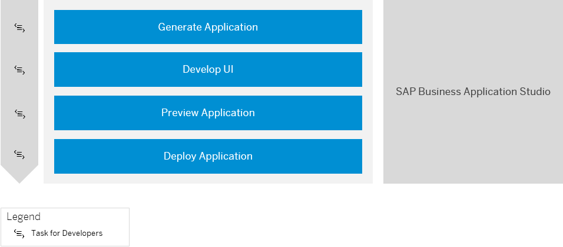
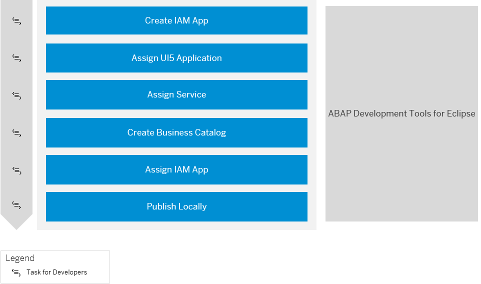

<!-- loioeaaeba48e5e04949855f2763477cd557 -->

# Develop an SAP Fiori Application UI and Deploy it to ABAP Using SAP Business Application Studio 

Get an overview about how to create and deploy an SAP Fiori application to ABAP using SAP Business Application Studio.

If you need further assistance with integrating an application into SAP Fiori launchpad, check out the tutorial [Integrate List Report into ABAP Fiori Launchpad](https://developers.sap.com/tutorials/abap-environment-abap-flp.html).

<a name="loioeaaeba48e5e04949855f2763477cd557__section_mlb_hzb_z4b"/>

## Prerequisites

-   You have set up SAP Business Application Studio. See [Setup of UI Development in SAP Business Application Studio](https://help.sap.com/viewer/65de2977205c403bbc107264b8eccf4b/Cloud/en-US/37a896bfac604076ae825a1d37b0bd0a.html).

-   You have established trust by setting up a custom Identity service. See [Setup of a Custom Identity Service](https://help.sap.com/viewer/65de2977205c403bbc107264b8eccf4b/Cloud/en-US/550251abaf49432bbaa65147b65a1f39.html).

<a name="loioeaaeba48e5e04949855f2763477cd557__section_dvd_t3k_hmb"/>

## 1. Generating and Deploying Your Application

> ### Prerequisites:  
> -   You have created a development package in ABAP Development Tools for Eclipse. See [Creating ABAP Packages](https://help.sap.com/viewer/5371047f1273405bb46725a417f95433/Cloud/en-US/d33ab697df394140874519c8c066ea82.html).
> -   You have exposed a RAP business service as an OData service. See [Using Service Binding Editor for OData V2 Service](https://help.sap.com/viewer/923180ddb98240829d935862025004d6/Cloud/en-US/81dc788fbda74883bd775a4036fa4b67.html).
> -   Business catalog `SAP_A4C_BC_DEV_UID_PC` is assigned to your user, which allows you to deploy your application.
> -   Business catalog `SAP_CORE_BC_EXT_TST` is assigned to your user, which allows you to preview your application and discover available OData services. See [Business Catalog for Key User Tasks](../50-administration-and-ops/business-catalog-for-key-user-tasks-65b70bf.md).
> -   You have an open transport request.

1.  As a developer user in SAP Business Application Studio, generate an SAP Fiori application. See [Generate an Application](https://help.sap.com/viewer/17d50220bcd848aa854c9c182d65b699/Latest/en-US/db44d45051794d778f1dd50def0fa267.html).
    1.  Use the destination that you have created for the SAP Business Application studio integration \(`SAP_Business_Application_Studio`\). See [Creating a Destination to the ABAP System for SAP Business Application Studio](../20-getting-started/creating-a-destination-to-the-abap-system-for-sap-business-application-studio-e597948.md).
    2.  Add a deployment configuration. See section *Add deployment configuration \> ABAP system* in [Additional Configuration](https://help.sap.com/viewer/17d50220bcd848aa854c9c182d65b699/Latest/en-US/9bea64e63b824261932d90037ce3c5ae.html).

        If you want to create your deployment configuration later, see [Generate Deployment Configuration ABAP](https://help.sap.com/viewer/17d50220bcd848aa854c9c182d65b699/Latest/en-US/c06b9cbb3f3641aabfe3a5d199e855a0.html).

    3.  Add an SAP Fiori launchpad configuration for your UI project. See section *Add FLP configuration* in [Additional Configuration](https://help.sap.com/viewer/17d50220bcd848aa854c9c182d65b699/Latest/en-US/9bea64e63b824261932d90037ce3c5ae.html).

        If you want to create you FLP configuration later, see [SAP Fiori Launchpad Configuration](https://help.sap.com/viewer/17d50220bcd848aa854c9c182d65b699/Latest/en-US/bc3cb890dbb84d51ae80394821ce4990.html).

2.  Continue with the development of the UI, for example, with the help of guided development. See [Implement Features using Guided Development](https://help.sap.com/viewer/17d50220bcd848aa854c9c182d65b699/Latest/en-US/0c9e518ecf704b2f80a2bed0eaca60ae.html).
3.  Now you can preview the generated SAP Fiori application. See [Preview an Application](https://help.sap.com/viewer/17d50220bcd848aa854c9c182d65b699/Latest/en-US/b962685bdf9246f6bced1d1cc1d9ba1c.html).
4.  Deploy the SAP Fiori UI by executing command ***npm run deploy*** in the terminal of your project. See [Deployment to ABAP](https://help.sap.com/docs/SAP_FIORI_tools/17d50220bcd848aa854c9c182d65b699/607014e278d941fda4440f92f4a324a6.html#deployment-to-abap).

<a name="loioeaaeba48e5e04949855f2763477cd557__section_ggf_mjk_hmb"/>

## 2. Creating and Publishing Your Identity and Access Management \(IAM\) App

> ### Prerequisite:  
> Business catalog `SAP_A4C_BC_DEV_PC` is assigned to your user, which is required for development with ABAP Development Tools. See [Business Catalogs for Development Tasks](../50-administration-and-ops/business-catalogs-for-development-tasks-a9f4278.md).

 

1.  To manage access to your SAP Fiori application, you have to log on as a developer in ABAP Development Tools for Eclipse to create an Identity and Access Management \(IAM\) application, assign a UI5 application and a service, and maintain authorizations \(steps 1-3 in the figure above\). See [Creating an IAM App for the Business Service \(Developer\)](https://help.sap.com/viewer/65de2977205c403bbc107264b8eccf4b/Cloud/en-US/2a2ddf967a704a878ee975f44630f71d.html).
2.  Once you have created your IAM app, you have to create a business catalog. See [Creating a Business Catalog \(Developer\)](https://help.sap.com/viewer/65de2977205c403bbc107264b8eccf4b/Cloud/en-US/42c6a55947fe4bc89bd63b0f50b54c8a.html).
3.  Assign your IAM app to the business catalog.
4.  Publish the IAM app and business catalog locally.

<a name="loioeaaeba48e5e04949855f2763477cd557__section_yhp_d4g_dqb"/>

## Next Step

Launch your app in SAP Fiori launchpad. See [Add Your App to SAP Fiori Launchpad](add-your-app-to-sap-fiori-launchpad-ea41912.md).

**Related Information**  

[SAP Business Application Studio](https://help.sap.com/viewer/product/SAP%20Business%20Application%20Studio/Cloud/en-US)

[SAP Fiori Tools](https://help.sap.com/viewer/product/SAP_FIORI_tools/Latest/en-US)

[SAP Fiori Overview](https://help.sap.com/viewer/product/SAP_FIORI_OVERVIEW/5_OVERVIEW/en-US?task=discover_task)

[Tutorial: Develop and Run SAP Fiori Application With SAP Business Application Studio](https://developers.sap.com/tutorials/abap-environment-deploy-cf-production.html)

[Tutorial: Integrate List Report into ABAP Fiori Launchpad](https://developers.sap.com/tutorials/abap-environment-abap-flp.html)

