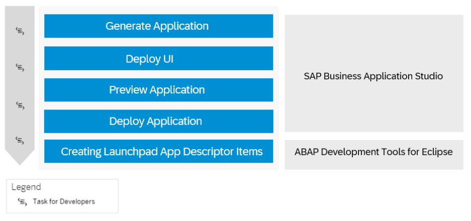
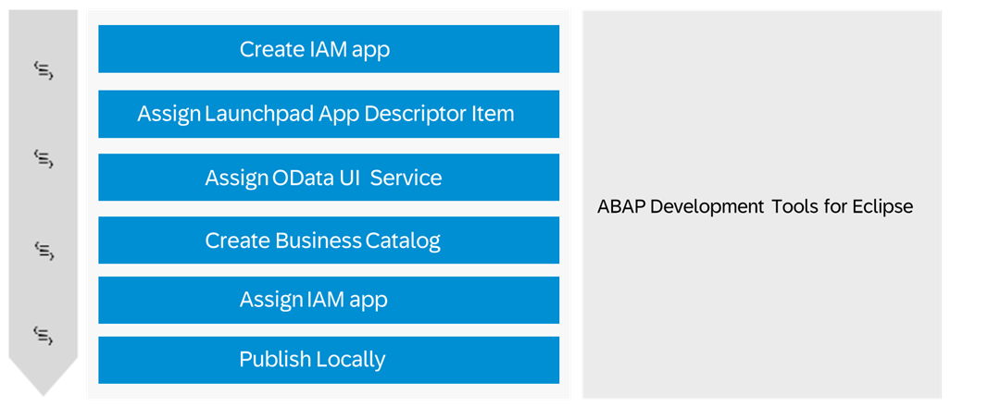

<!-- loioeaaeba48e5e04949855f2763477cd557 -->

# Develop an SAP Fiori Application UI and Deploy it to ABAP Using SAP Business Application Studio 

Get an overview about how to create and deploy an SAP Fiori application to ABAP using SAP Business Application Studio.

If you need further assistance with creating and deploying an application, check out the tutorial [Create an SAP Fiori App and Deploy it to SAP BTP ABAP Environment](https://developers.sap.com/tutorials/abap-environment-deploy-cf-production.html).

<a name="loioeaaeba48e5e04949855f2763477cd557__section_mlb_hzb_z4b"/>

## Prerequisites

-   You have set up SAP Business Application Studio. See [Setup of UI Development in SAP Business Application Studio](https://help.sap.com/docs/btp/sap-business-technology-platform/setup-of-ui-development-in-sap-business-application-studio-optional?version=Cloud).

-   You have established trust by setting up a custom Identity service. See [Setup of a Custom Identity Service](https://help.sap.com/docs/btp/sap-business-technology-platform/setup-of-custom-identity-service?version=Cloud).

<a name="loioeaaeba48e5e04949855f2763477cd557__section_dvd_t3k_hmb"/>

## 1. Generating and Deploying Your Application

> ### Prerequisites:  
> -   You have created a development package in ABAP Development Tools for Eclipse. See [Creating ABAP Packages](https://help.sap.com/docs/btp/sap-abap-development-user-guide/creating-abap-packages?version=Cloud).
> -   You have exposed a RAP business service as an OData service. See [Using Service Binding Editor for OData Service](https://help.sap.com/docs/abap-cloud/abap-cds-tools-user-guide/using-service-binding-editor-for-odata-v4-service?version=sap_btp). In case no suitable service is available yet, you may create one based on a released BO interface or CDS View. See[Develop an OData UI Service Against a Released BO Interface or CS View](https://help.sap.com/docs/btp/sap-business-technology-platform-internal/develop-odata-ui-service-against-released-bo-interface-or-cds-view?version=Cloud).
> -   Business catalog `SAP_A4C_BC_DEV_UID_PC` is assigned to your user, which allows you to discover available services and deploy your application.
> -   Business catalog `SAP_CORE_BC_EXT_TST` is assigned to your user, which allows you to preview your application. See [Business Catalogs for Development Tasks](https://help.sap.com/docs/sap-btp-abap-environment/abap-environment/business-catalogs-for-development-tasks?version=Cloud).
> -   You have an open transport request.

1.  As a developer user in SAP Business Application Studio, generate an SAP Fiori application. See [Generate an Application](https://help.sap.com/viewer/17d50220bcd848aa854c9c182d65b699/Latest/en-US/db44d45051794d778f1dd50def0fa267.html).
    1.  In the *Data Source and Service Selection* section of the Template Wizard, select the following values:

        -   Data source: *Connect to a System*.
        -   System:
            -   \(Option 1\) Select the destination that you have created for the SAP Business Application studio integration \(`SAP_Business_Application_Studio`\). See [Creating a Destination to the ABAP System for SAP Business Application Studio](https://help.sap.com/docs/btp/sap-business-technology-platform/creating-destination-to-abap-system-for-sap-business-application-studio?version=Cloud).
            -   \(Option 2\) Select *ABAP Environment on SAP Business Technology Platform*.

                From the ABAP environment drop-down menu, choose a service instance.

                > ### Note:  
                > You have to log on to your Cloud Foundry space by executing command `cf login` in the terminal or by navigating to *View* \> *Find Command* \> *CF: Login to Cloud Foundry*. When you're prompted to enter the API endpoint, org name, and space, you can navigate to your subaccount in the SAP BTP cockpit, where you can find this information.

        -   Continue with choosing a service.

    2.  Add a deployment configuration. See section *Add deployment configuration \> ABAP system* in [Additional Configuration](https://help.sap.com/viewer/17d50220bcd848aa854c9c182d65b699/Latest/en-US/9bea64e63b824261932d90037ce3c5ae.html).

        If you want to create your deployment configuration later, see [Generate Deployment Configuration ABAP](https://help.sap.com/viewer/17d50220bcd848aa854c9c182d65b699/Latest/en-US/c06b9cbb3f3641aabfe3a5d199e855a0.html).

    3.  Add an SAP Fiori launchpad configuration for your UI project. See section *Add FLP configuration* in [Additional Configuration](https://help.sap.com/viewer/17d50220bcd848aa854c9c182d65b699/Latest/en-US/9bea64e63b824261932d90037ce3c5ae.html).

        If you want to create you FLP configuration later, see [SAP Fiori Launchpad Configuration](https://help.sap.com/viewer/17d50220bcd848aa854c9c182d65b699/Latest/en-US/bc3cb890dbb84d51ae80394821ce4990.html).

2.  Continue with the development of the UI, for example, with the help of guided development. See [Implement Features using Guided Development](https://help.sap.com/viewer/17d50220bcd848aa854c9c182d65b699/Latest/en-US/0c9e518ecf704b2f80a2bed0eaca60ae.html).
3.  Now you can preview the generated SAP Fiori application. See [Preview an Application](https://help.sap.com/viewer/17d50220bcd848aa854c9c182d65b699/Latest/en-US/b962685bdf9246f6bced1d1cc1d9ba1c.html).
4.  Deploy the SAP Fiori UI by executing command `npm run deploy` in the terminal of your project. See [Deployment to ABAP](https://help.sap.com/docs/SAP_FIORI_tools/17d50220bcd848aa854c9c182d65b699/607014e278d941fda4440f92f4a324a6.html#deployment-to-abap).
5.  4. On top of these launchpad app descriptor items that are created automatically during app deployment, you may also create such objects manually in ABAP development tools for Eclipse. Refer to [Creating Launchpad App Descriptor Items](https://help.sap.com/docs/abap-cloud/abap-development-tools-user-guide/creating-launchpad-app-descriptor-items).

<a name="loioeaaeba48e5e04949855f2763477cd557__section_ggf_mjk_hmb"/>

## 2. Creating and Publishing Your Identity and Access Management \(IAM\) App

> ### Prerequisite:  
> Business catalog `SAP_A4C_BC_DEV_PC` is assigned to your user, which is required for development with ABAP Development Tools. See [Business Catalogs for Development Tasks](../50-administration-and-ops/business-catalogs-for-development-tasks-a9f4278.md).

1.  To manage access to your SAP Fiori application, you need to log on as a developer in ABAP development tools for Eclipse to create an Identity and Access Management \(IAM\) application, assign a launchpad app descriptor item for your UI5 application and a service, and maintain authorizations \(steps 1-3 in the figure above\). See [Creating an IAM App for the Business Service](https://help.sap.com/docs/btp/sap-business-technology-platform/creating-iam-app-for-business-service?version=Cloud).
2.  Once you have created your IAM app, you have to create a business catalog. See [Creating a Business Catalog](https://help.sap.com/docs/btp/sap-business-technology-platform/iam-creating-business-catalog?version=Cloud).
3.  Assign your IAM app to the business catalog.
4.  Publish the IAM app and business catalog locally.

<a name="loioeaaeba48e5e04949855f2763477cd557__section_yhp_d4g_dqb"/>

## Next Step

Launch your app in SAP Fiori launchpad. See [Add Your App to SAP Fiori Launchpad](https://help.sap.com/docs/btp/sap-business-technology-platform/add-your-app-to-sap-fiori-launchpad?version=Cloud).

**Related Information**  

[SAP Business Application Studio](https://help.sap.com/docs/bas)

[SAP Fiori Tools](https://help.sap.com/viewer/product/SAP_FIORI_tools/Latest/en-US)

[SAP Fiori Overview](https://help.sap.com/viewer/product/SAP_FIORI_OVERVIEW/5_OVERVIEW/en-US?task=discover_task)

[Tutorial: Develop and Run SAP Fiori Application With SAP Business Application Studio](https://developers.sap.com/tutorials/abap-environment-deploy-cf-production.html)

[https://developers.sap.com/tutorials/abap-environment-abap-flp.html](https://developers.sap.com/tutorials/abap-environment-abap-flp.html)

[Tutorial: Integrate List Report into ABAP Fiori Launchpad](https://developers.sap.com/tutorials/abap-environment-integrate-app-into-flp.html)

