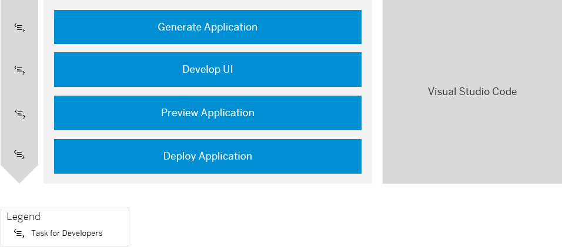

<!-- loio97df0a6022a14ce180440d6fae1dd3cd -->

# Develop an SAP Fiori Application UI and Deploy it to ABAP Using Visual Studio Code

Get an overview about how to create and deploy an SAP Fiori application to ABAP using Visual Studio Code.

For further assistance with creating and deploying an application into SAP Fiori launchpad, see [Create a SAP Fiori App in Visual Studio Code and Deploy it to SAP BTP, ABAP Environment](https://developers.sap.com/tutorials/abap-environment-vs-code.html).

<a name="loio97df0a6022a14ce180440d6fae1dd3cd__section_is5_ctb_b5b"/>

## Prerequisites

-   You have installed and set up Visual Studio Code including the SAP Fiori tools extensions. See [Visual Studio Code](https://help.sap.com/viewer/17d50220bcd848aa854c9c182d65b699/Latest/en-US/17efa217f7f34a9eba53d7b209ca4280.html).
-   You have access to a RAP business service that has been exposed as an OData service. See [Using Service Binding Editor for OData V2 Service](https://help.sap.com/docs/btp/sap-abap-cds-development-user-guide/using-service-binding-editor-for-odata-v2-service?version=Cloud).
-   To establish a connection with your ABAP environment system, you either have to be a space developer in the ABAP environment instance or have access to a service key in the ABAP environment instance. See [Add Space Members Using the Cockpit](https://help.sap.com/docs/btp/sap-business-technology-platform/add-space-members-using-cockpit?version=Cloud) and [Creating Service Keys](https://help.sap.com/docs/btp/sap-business-technology-platform/creating-service-keys?version=Cloud) in the ABAP service instance.
-   You have established trust by setting up a custom Identity service. See [Setup of a Custom Identity Service](https://help.sap.com/docs/btp/sap-business-technology-platform/setup-of-custom-identity-service?version=Cloud).

<a name="loio97df0a6022a14ce180440d6fae1dd3cd__section_dvd_t3k_hmb"/>

## 1. Generating and Deploying Your Application

> ### Prerequisites:  
> -   You have created a development package in ABAP Development Tools for Eclipse. See [Creating ABAP Packages](https://help.sap.com/docs/btp/sap-abap-development-user-guide/creating-abap-packages?version=Cloud).
> -   You have exposed a RAP business service as an OData service. See [Using Service Binding Editor for OData V2 Service](https://help.sap.com/docs/btp/sap-abap-cds-development-user-guide/using-service-binding-editor-for-odata-v2-service?version=Cloud).
> -   Business catalog `SAP_A4C_BC_DEV_UID_PC`Continue with the development of the UI, for example, with the help of guided is assigned to your user, which allows you to deploy your application.
> -   Business catalog `SAP_CORE_BC_EXT_TST` is assigned to your user, which allows you to preview your application and discover available OData services. See [Business Catalog for Key User Tasks](https://help.sap.com/docs/btp/sap-business-technology-platform/business-catalog-for-key-user-tasks?version=Cloud).
> -   You have an open transport request.

1.  As a developer user in Visual Studio Code, generate an SAP Fiori application. See [Generate an Application](https://help.sap.com/viewer/17d50220bcd848aa854c9c182d65b699/Latest/en-US/db44d45051794d778f1dd50def0fa267.html).

    In the *Data Source and Service Selection* section of the Template Wizard, select the following values:

    -   Data source: *Connect to a System*.
    -   System: *New System*
    -   System type: *ABAP Environment on SAP Business Technology Platform*
    -   ABAP environment definition source:
        -   \(Option 1\) **Discover a Cloud Foundry Service** 

            > ### Note:  
            > You have to log on to your Cloud Foundry space by executing command `cf login` in the terminal or by navigating to *View* \> *Find Command* \> *CF: Login to Cloud Foundry*. When you're prompted to enter the API endpoint, org name, and space, you can navigate to your subaccount in the SAP BTP cockpit, where you can find this information.

        -   \(Option 2\) **Upload a Service Key File**

    -   Continue with choosing a system name and service.

    In the *Project Attributes* section, add deployment configuration and FLP configuration to your UI project. See [Additional Configuration](https://help.sap.com/viewer/17d50220bcd848aa854c9c182d65b699/Latest/en-US/9bea64e63b824261932d90037ce3c5ae.html).

    If you want to create your deployment configuration later, see [Generate Deployment Configuration ABAP](https://help.sap.com/viewer/17d50220bcd848aa854c9c182d65b699/Latest/en-US/c06b9cbb3f3641aabfe3a5d199e855a0.html).

    If you want to create you FLP configuration later, see [SAP Fiori Launchpad Configuration](https://help.sap.com/viewer/17d50220bcd848aa854c9c182d65b699/Latest/en-US/bc3cb890dbb84d51ae80394821ce4990.html).

2.  Continue with the development of the UI, for example, with the help of guided development. See [Implement Features using Guided Development](https://help.sap.com/viewer/17d50220bcd848aa854c9c182d65b699/Latest/en-US/0c9e518ecf704b2f80a2bed0eaca60ae.html).
3.  Now you can preview the generated SAP Fiori application. See [Preview an Application](https://help.sap.com/viewer/17d50220bcd848aa854c9c182d65b699/Latest/en-US/b962685bdf9246f6bced1d1cc1d9ba1c.html).
4.  Deploy the SAP Fiori UI by executing command `npm run deploy` in the terminal of your project. See [Deployment to ABAP](https://help.sap.com/docs/SAP_FIORI_tools/17d50220bcd848aa854c9c182d65b699/607014e278d941fda4440f92f4a324a6.html#deployment-to-abap).

<a name="loio97df0a6022a14ce180440d6fae1dd3cd__section_ggf_mjk_hmb"/>

## 2. Creating and Publishing Your Identity and Access Management \(IAM\) App

> ### Prerequisite:  
> Business catalog `SAP_A4C_BC_DEV_PC` is assigned to your user, which is required for development with ABAP Development Tools. See [Business Catalogs for Development Tasks](../50-administration-and-ops/business-catalogs-for-development-tasks-a9f4278.md).

1.  To manage access to your SAP Fiori application, you have to log on as a developer in ABAP Development Tools for Eclipse to create an Identity and Access Management \(IAM\) application, assign a UI5 application and a service, and maintain authorizations \(steps 1-3 in the figure above\). See [Creating an IAM App for the Business Service](https://help.sap.com/docs/btp/sap-business-technology-platform/creating-iam-app-for-business-service?version=Cloud).
2.  Once you have created your IAM app, you have to create a business catalog. See [Creating a Business Catalog](https://help.sap.com/docs/btp/sap-business-technology-platform/iam-creating-business-catalog?version=Cloud).
3.  Assign your IAM app to the business catalog.
4.  Publish the IAM app and business catalog locally.

<a name="loio97df0a6022a14ce180440d6fae1dd3cd__section_yhp_d4g_dqb"/>

## Next Step

Launch your app in SAP Fiori launchpad. See [Add Your App to SAP Fiori Launchpad](add-your-app-to-sap-fiori-launchpad-ea41912.md).

**Related Information**  

[Visual Studio Code](https://help.sap.com/docs/SAP_FIORI_tools/17d50220bcd848aa854c9c182d65b699/17efa217f7f34a9eba53d7b209ca4280.html)

[SAP Fiori Tools](https://help.sap.com/viewer/product/SAP_FIORI_tools/Latest/en-US)

[SAP Fiori Overview](https://help.sap.com/viewer/product/SAP_FIORI_OVERVIEW/5_OVERVIEW/en-US?task=discover_task)

[Tutorial: Integrate List Report into ABAP Fiori Launchpad](https://developers.sap.com/tutorials/abap-environment-abap-flp.html)

[Tutorial: Create an SAP Fiori App in Visual Studio Code and Deploy it to SAP BTP, ABAP Environment](https://developers.sap.com/tutorials/abap-environment-vs-code.html)

