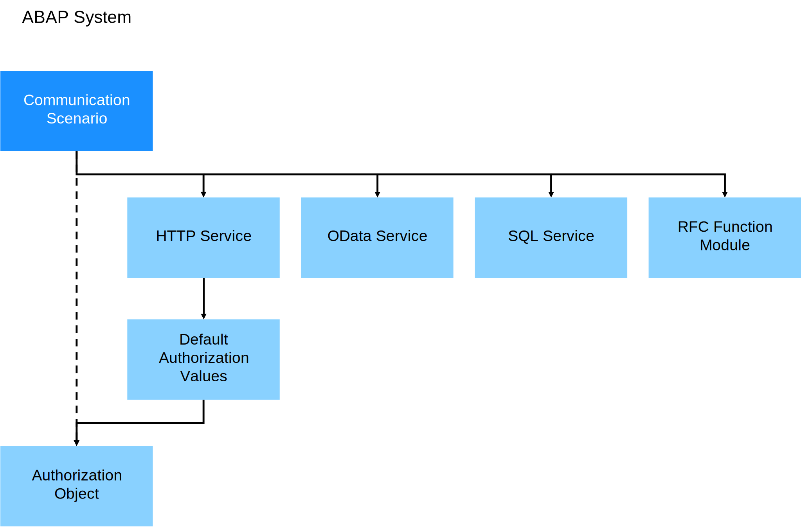

<!-- loio94ebfa045c75426ea32045f6bbba3be5 -->

# Developing APIs for Inbound Communication

Learn more about developing APIs for inbound communication.

You can create and expose services for external consumption to a communication partner. To create and expose services for external consumption, you create a communication scenario and assign the required services.

These inbound services can be:

-   HTTP services, see [HTTP Service Development](http-service-development-77c269b.md)
-   Remote-enabled function modules, see [Develop a Remote-Enabled Function Module \(RFM\)](develop-a-remote-enabled-function-module-rfm-abf7105.md)
-   Services published via service bindings, such as OData or SQL services, see [Developing and Exposing an SQL Service in the ABAP System](developing-and-exposing-an-sql-service-in-the-abap-system-76eeb8d.md)

See also [Supported Protocols and Authentication Methods](supported-protocols-and-authentication-methods-437e9d4.md).

Inbound services can be protected with an authorization object and protection against unauthorized activities. For each inbound service, authorization default values are defined that can later be used in the authorizations defined in the communication scenario. See [Granting Access Based on Activities for Communication Users](granting-access-based-on-activities-for-communication-users-bc9c2c9.md).

**Related Information**  

[Communication Management](communication-management-5b8ff39.md#loio5b8ff39ddb6741a29ddfcf587939e8f4 "Learn more about the basic principles of communication management when integrating your system or solution with other systems to enable data exchange in your ABAP environment.")

