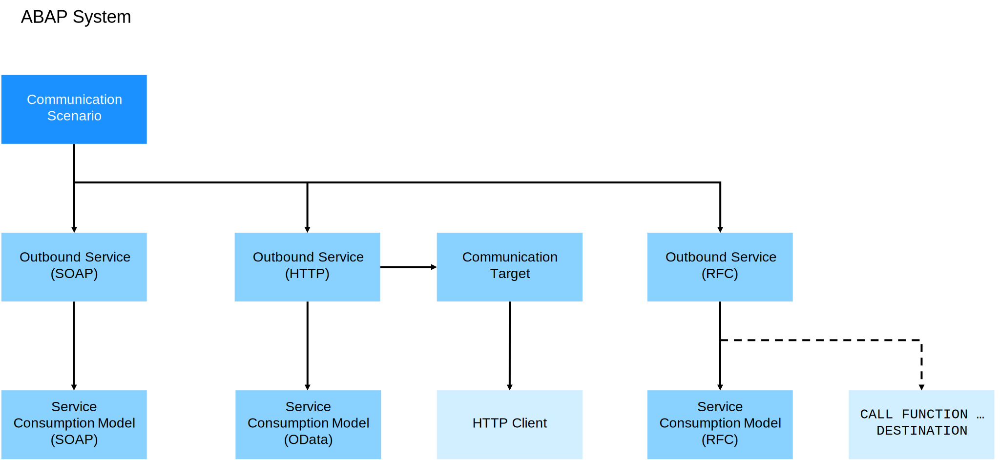

<!-- loiof871712b816943b0ab5e04b60799e518 -->

# Developing External Service Consumption \(Outbound Communication\)

Get more information about consuming external services.

To establish outbound communication between two communication partners, you have to implement the call of a service by doing the following:

-   Create an outbound service

    These outbound services can be HTTP \(see [Enable HTTP Communication in Your ABAP Code](enable-http-communication-in-your-abap-code-cef1ada.md)\), RFC \(see [Enable RFC Communication in Your ABAP Code](enable-rfc-communication-in-your-abap-code-bbbd142.md)\), or SOAP services \(see [Enable SOAP Communication in Your ABAP Code](enable-soap-communication-in-your-abap-code-6ab460e.md)\).

-   For HTTP communication, we recommend to create and use communication targets as described in [Communication Target](https://help.sap.com/docs/abap-cloud/abap-integration-connectivity/communication-target).
-   Create a communication scenario and assign it to the outbound service.

    If you enable multiple arrangements, you can add customer-specific properties to the scenario to enable a simple receiver determination.

-   

<a name="loiof871712b816943b0ab5e04b60799e518__section_m3y_rh4_y5b"/>

## Service Consumption Model

SAP supports various protocols and provides the corresponding clients and functions to handle requests and responses.

HTTP: `CL_WEB_HTTP_CLIENT_MANAGER`

RFC: `CALL FUNCTION`

To simplify the implementation of a remote call, you can create a service consumption model for the external service. The service consumption model creates proxies for the remote service. That way, you can access the service in a strictly typed manner without the need to compile requests and parse responses. The following consumption model types are supported:

-   OData
-   SOAP
-   RFC

**Related Information**  

[Service Consumption via Communication Arrangements](service-consumption-via-communication-arrangements-86aece6.md "")

